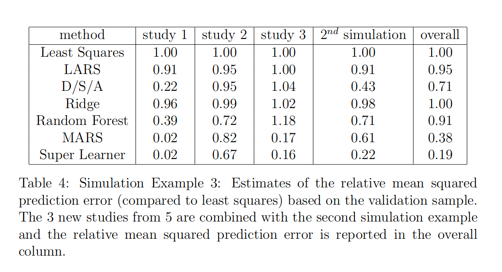

# Statistical Models Approximate Distributions

- Statistical models are approximations of joint or conditional probability distributions of observed data. 

--

- For example, if we have observations $(x_1, y_1), \dots, (x_N, y_N)$ and we fit a simple linear regression of $Y$ on $X$, we are using the model
$$y_i = \beta_0  + \beta_1 x_i + \epsilon_i\\\ \epsilon_i \sim N(0, \sigma_y^2)$$
  + We are approximating the conditional distribution of $Y \vert X$ as normal with mean $\beta_0 + \beta_1X$ and variance $\sigma_y^2$. 
 
--

- The linear model is a *class of distributions* parametrized by a finite set of parameters (three in our case).

- The OLS procedure identifies the single distribution within the model that best approximates the distribution of the observed data. 

$\newcommand{\ci}{\perp\!\!\!\perp}$
$\newcommand{\nci}{\not\!\perp\!\!\!\perp}$

```{r xaringan-tile-view, echo=FALSE}
xaringanExtra::use_tile_view()
xaringanExtra::use_search(show_icon = TRUE)
xaringanExtra::use_panelset()
```

---
# Machine Learning

- Machine learning methods allow us to search larger classes of models for good approximations. 

- ML methods are sometimes described as "learning models automatically" from data. 

- However, this is a bit hazy since a model is just a class of distributions. 

--

- What is unique about ML methods is the model space is often very large and sometimes allowed to expand as the number of observations increases. 

- ML methods typically privelage some type of smoothness. 
  + A common way to achieve this is to over-parameterize a model and then penalize some or all of the parameters.
  + The penalty, controlling the effective number of parameters and degree of smoothness, can be learned from the data via cross-validation. 


---
# Example: Splines

- As an alternative to the linear model, we can add a fixed number parameters to the regression, for example fitting piece-wise functions. 

<center> 
```{r, echo=FALSE, out.width="85%"}
knitr::include_graphics("img/11_spline1.png")
```
</center>

- With fixed knots, these models are only a little more flexible than the linear regression. 

---
# Example: Smoothing Splines

- An alternative is to approximate the conditional mean of $Y$ given $X$ as a smooth function of $X$. 

$$y_i = h(x_i) + \epsilon_i \qquad h \in \mathcal{H}\\\ \epsilon_i \sim N(0, \sigma_y^2)$$ where $\mathcal{H}$ is a class of "smooth" functions. 

--

- Smoothness could be defined by a restriction, for example on the second derivative
$$\int (h^{\prime \prime}(x))^2 dx < C$$
  
  
- This class of models does not have a finite parametrization
  - However, it is possible to approximate functions in $\mathcal{H}$ using a finite number of terms. 
  
---
# Example: Smoothing Splines

- We can define a spline basis, an infinite set of functions $g_1(x), g_2(x), \dots$ that allows us to approximate any smooth function well. 
  + Given any smooth $h$ and error tolerance $\varepsilon$, we can find a finite $K$ and a set of coefficients $\beta_1, \dots, \beta_{K}$ such that 

$$\vert h(x) - \sum_{k = 1}^K\beta_k g_k(x) \vert < \varepsilon \ \ \forall x$$

--

- Using our spline basis, we replace the previous model with
$$y_i = \sum_{k = 1}^{K(N)}\beta_k g_k(x_i) + \epsilon$$  
  + Often $K(N) = N$
  + We then estimate the coefficients $\beta_1, \dots, \beta_K$ via *penalized likelihood*. 
  + The penalty controls the degree of smoothness or the *effective number of parameters*. 
  

---
# Example: Smoothing Splines

<center> 
```{r, echo=FALSE, out.width="85%"}
knitr::include_graphics("img/11_spline2.png")
```
</center>

---
# Bias-Variance Trade-Off

- With no penalization, we could perfectly interpolate the data.

- With an infinite penalty, the problem reduces to simple linear regession. 

- Too little smoothing:
  + The estimate will have a high variance because very little data contributes to the estimate at each point.
  
  
- Too much smoothing: 
  + The estimate has low variance but high bias. 
  
- In practice, we try to learn the amount of smoothing that best fits the data via cross-validation. 

---
# Bias-Variance Trade-Off

<center> 
```{r, echo=FALSE, out.width="62%"}
knitr::include_graphics("img/11_splines.png")
```
</center>

---
# Example: Smoothing Splines

- Smoothing splines allow us to expand the class of models to we use to approximate the conditional distribution of $Y$ given $X$ compared to simple linear regression.

- Allowing the number of spline basis terms to increase as sample size increases provides "built-in" increasing model complexity. 


- When we fit a smoothing spline, we leverage having a lot of data in order to make weaker assumptions about the relationship between $E[Y \vert X]$ and $X$. 
  
  
---
# ML Methods are Good at Approximating Data

- There are numerous ML methods which allow us to approximate distributions which much higher complexity than "plain" regressions. 

- These include 
  + variable selection methods like LASSO or stepwise selection. 
  + random forests
  + neural networks
  + empirical Bayes methods (learn the prior from the data)
  
- These are often described as prediction methods but we can also think of them as methods for approximating the distributions of data.


---
# Causal Effects


- Early in this course we defined a causal effect as the average treatment effect
$$E[Y(1)] - E[Y(0)]$$
or possibly the causal risk ratio 
$$\frac{E[Y(1)]}{E[Y(0)]}$$

- The quantity $E[Y(1)]$ is a parameter of the counterfactual distribution of $Y$ under the action setting $A$ to 1. 

- Neither ML methods nor "standard" statistical methods can learn counterfactual distributions. They can only learn distributions of observed data. 

- We need to express our counterfactual quantity $E[Y(1)]$ in terms of the probability distribution of the observations.


---
# Return to the g-Formula

- To link the probability distribution of the observed data and the counterfactual parameters we are interested in we need a DAG and the g-formula

$$E[Y(a)] = \int E[Y \vert A = a, L = l]dF_l(l)$$

- The DAG is necessary to identify a sufficient set of confounding variables.
  + The data cannot tell us what the correct DAG is. 
  + In some cases it can help. 
  
  
- For this reason, there cannot be any purely automated causal inference. 
  + Job security for statisticians. 

---
# g-Formula Methods

- We saw two ways to use the g-formula. 

- Option 1: Estimate $E[Y \vert A = a, L = l]$
  - Outcome modeling, or plug-in g-formula. 
  - Let $b(a, l) = E[Y \vert A=a, L=l]$
  
- Option 2: Estimate $P[A = a \vert L = l]$
  - Inverse probability weighting or treatment modeling
  - Let $\pi_a(l) = P[A = a \vert L = l]$
  
- Combo: Double robust methods combine both options. 
  - The bias of DR methods is proportional to $\left(\frac{1}{\hat{\pi}}- \frac{1}{\pi}\right)\left(\hat{b}-b\right)$, so DR methods will be less biased than either of the other options. 

---
# Machine Learning in g-Formula Methods

- We can use ML methods to estimate $\pi$ or $b$. 

--

- **However**, we need to be careful!

--

- Neither outcome modeling alone or IP weighting will generally yield an asymptotically normal estimate for general ML methods. 
  + Both methods require that we pre-specify a parametric model with a fixed number of parameters. 
  + Standard errors will be incorrect if we just plug in a ML method.

--

- ML methods are not guaranteed to be consistent. 
  + We may not have included all of the confounders.
  + The set of models the ML method is searching may not include any models close to the truth. 
  + We may have included variables that induce bias (more on this later).

--

- For this reasons we should use a double robust estimator with ML methods. 


---
# Some Formal Definitions

- Let $P_0$ be a probability distribution from which we can observe data.  

- A model $\mathcal{M}$ is a set of models $\lbrace P_\theta \vert \theta \in \mathbb{R}^d \rbrace$. 

- A model is correctly specified if $P_0 \in \mathcal{M}$. A model is misspecified if $P_0 \not\in \mathcal{M}$. 

- We can define a *statistical target parameter* $\Psi$ which is a mapping from $\mathcal{M}$ to $\mathbb{R}$
  + For example, $\Psi$ might be the mean. 
  + $\Psi$ need not be one of the elements of $\theta$
  
- The target estimand (the thing we want to estimate) is $\Psi(P_0)$

---
# Empirical Probability Measures 

- Let $O_1, \dots, O_n$ be iid draws from $P_0$.

- We define the empirical probability measure $P_n$
$$P_n(X) = \frac{1}{n}\sum_{i = 1}^n I(O_i \in X)$$
- This defines a measure over sets $X$ and therefore an empirical CDF. 

- $P_n$ is the "histogram" measure. It contains all of the information about $O_1, \dots, O_n$. 

- $P_n$ is an approximation of the true probability measure $P_0$. 

---
# Estimators

- We would like to find a function of the data, i.e. of $P_n$ which is a good estimate of $\Psi(P_0)$. 

- An estimator is a rule for turning an empirical distribution into an estimate. 

- That is, an estimator is a function $\hat{\Psi}: \mathcal{M}_{NP} \to \mathbb{R}$ where $\mathcal{M}_{NP}$ is a non-parametric class of possible empirical distributions. 

- The *estimate* is $\hat{\Psi}(P_n)$. 

- $\hat{\Psi}(P_n)$ is a random variable because it is a function of the random empirical distribution. 

---
# Asymptotic Linearity

- An estimator $\hat{\Psi}(P_n)$ is asymptotically linear if

$$\hat{\Psi}(P_n)- \Psi(P_0) = \frac{1}{n}\sum_{i = 1}^n IC(O_i; \nu) + o_p(n^{-1/2})$$
- Reminder of "little o" notation: $f(n)$ is $o_p(1)$ if $f(n) \to 0$ as $n \to \infty$. 
  + $f(n)$ is $o_p(r)$ if $f(n)/r \to 0$ as $n \to \infty$. 


- $\hat{\Psi}(P_n)-\Psi(P_0)$ looks like an average of some function of each data point plus a remainder that goes to zero, even if blown up by $\sqrt{n}$. 

- The function $IC$ is the influence function, or influence curve. 


---
# Asymptotic Linearity and the CLT

- If $\hat{\Psi}(P_n)$ is asymptotically linear then a consequence of the central limit theorem is that

$$\sqrt{n}(\hat{\Psi}(P_n) - \Psi(P_0)) \sim N(\mu_{IC}, \sigma^2_{IC})$$

where $\mu_{IC} = E[IC(O_i; \nu)]$ and $\sigma^2_{IC} = Var(IC(O_i; \nu)$. 

- Usually $\mu_{IC} = 0$. 

- Asymptotic linearity implies consistent, asymptotically normal estimators. 
  + "Nice" estimators that we can easily create Wald-type confidence intervals for. 
  
  $$\hat{\Psi} \pm Z_{1-\frac{\alpha}{2}}\hat{\sigma}_{IC}/\sqrt{N}$$

---
# Efficient Influence Functions

- The influence function is the most important thing to know about an asymptotically linear estimator. 
  + It tells us the mean and variance of the estimator. 
  
- Recall that an estimator is *efficient* if it has lower asymptotic variance than every other estimator in its class. 
  
---
# Efficient Influence Functions

- We will not show it but an important result is that *every* efficient estimator within a class has the sample influence function, called the *efficient influence function* (EIF). 

- The EIF can be derived making it possible to reverse engineer efficient estimators. 

- Note that the EIF is model specific. An estimator that is efficient within one model may not be efficient in a larger model. 
  + The maximum likelihood linear regression estimate is the efficient estimator in the simple linear model case we saw earlier. 
  + In the larger class of models with $E[Y \vert X]$ a smooth function of $X$, we can do much better. 

---
# Targeted Minimum Loss Estimation (TMLE)

- TMLE is a double robust estimation strategy that is very similar to other DR estimators we have seen so far. 

- TMLE yields an asymptotically linear estimator as long as at least one of $\hat{\pi}$ or $\hat{b}$ are consistent. 
  + If both are consistent, the TMLE is also efficient.
  + These properties are also true of the other DR estimators we have seen.
  
---
# TMLE vs AIPW

- The augmented inverse probability weighted estimator (AIPW) is the estimator we saw previously as the Robins, Rotnitzky, and Zhao estimator. 

$$\hat{E}[Y(1)] = \hat{\Delta}_{DR,1} = \frac{1}{N} \sum_{i = 1}^N \left \lbrace \hat{Y}_{1,i} + \frac{A_i}{\hat{\pi}(L_i)}\left(Y_i - \hat{Y}_{1,i} \right) \right \rbrace$$

- TMLE and AIPW have the same influence function -- they are asymptotically equivalent.

- TMLE is guaranteed to yield an estimate of $E[Y(a)]$ that is within the range of the original outcome data, while AIPW is not. 
  
- TMLE is also more stable than AIPTW with $\hat{\pi}(L_i)$ are very small for units. 


---
# TMLE Initialization

The following steps produce the TMLE for a binary outcome and binary exposure. 

Step 1: Generate an initial estimate $\hat{b}_0$ of $E[Y \vert A, L]$. 

Step 2: Estimate $\hat{\pi}_a = P[A = a \vert L]$. 
  + For binary exposure, we will estimate $\hat{\pi}_1$ and then compute $\hat{\pi}_0 = 1-\hat{\pi}_1$. 

---
# TMLE One-Step Update


Step 3: Update the model of $E[Y \vert A, L]$. To do this we employ the "special covariate" strategy. Define
$$H(A, L) = \frac{I(A = 1)}{\hat{\pi}_1(L)} - \frac{I(A = 0)}{\hat{\pi}_0(L)}$$
Fit the model 

$$logit(E[Y \vert A, L]) = logit(\hat{b}_0(A, L)) + \epsilon H(A,L)$$
Note that the coefficient on the first term is 1, this is an offset. 

We get out an estimate, $\hat{\epsilon}$, called the fluctuation parameter. 

+ It should not be obvious why we fit this particular model.

---
# TMLE One-Step Update

Having estimated $\epsilon$, we now have a new outcome estimate,

$$\hat{b}(A, L) = expit\left( logit(\hat{b}_0(A, L)) + \hat{\epsilon}H(A, L)\right)$$

---
# TMLE Final Step

The lest step is to use standardization to estimate $E[Y(a)]$

$$\hat{E}[Y(a)] = \frac{1}{n}\sum_{i=1}^N \hat{b}(a, L_i)$$

---
# TMLE with Continouous Outcome

- With a continuous outcome we can use exactly the same algorithm *except*

- Before we begin, we need to transform $Y$ into the range $[0, 1]$. 

- At the end we need to undo our transformation. 

- Notice that this procedure guarantees us an estimate within the observed range of $Y$. 

---
# Update Step Intuition

- The update step works because it directly solves a formula for the efficient influence function.

- However, we can have some intuition for why it is necessary without deriving the EIF. 

- The models we used to estimate $\hat{b}_0$ and $\hat{\pi}$ have made bias-variance trade-offs aimed at optimizing prediction of $Y$ or $A$ respectively. 

- However, predicting $Y$ and $A$ isn't our end goal. Our end goal is estimating the causal effect. 

- The update step adjusts the bias-variance trade-off to improve estimation of the target parameter. 
- This is the source of the "Targeted" in TMLE. 

---
# Update Step Intuition

<center> 
```{r, echo=FALSE, out.width="85%"}
knitr::include_graphics("img/11_roadmap.png")
```
</center>

---
# Inference

- We can obtain the variance of the treatment effect estimated by TMLE by directly computing the influence function. 

- For TMLE, the influence function for the ATE is

$$\hat{IC}(O_i) = (Y_i - \hat{b}(A_i, L_i))H(A_i, L_i) + (\hat{b}(1, L_i)- \hat{b}(0, L_i))- \hat{ATE}$$

- We can estimate the variance of the ATE estimate as $$\frac{Var(\hat{IC})}{N}$$


---
# Super Learner

- We need to decide what estimators to use to get $\hat{b}_0$ and $\hat{\pi}$ in the TMLE algorithm. 

- It may be hard to know which of many possible options will give the best results. 

- In super learning, we use a weighted combination of many learners.
  + An "ensemble" learner, weights chosen via cross-validation.
  + The best of all worlds. 
  

<center> 
```{r, echo=FALSE, out.width="35%"}
knitr::include_graphics("img/11_ring.png")
```
</center>

---
# Cross-Validation

- Cross validation is a general procedure for selecting among estimation procedures. 
- Suppose we have $K$ estimators of a parameter
$$\Psi_1, \dots, \Psi_{K(N)}$$
- We use $K(N)$ to indicate that the number of candidate estimators could depend on sample size. 

---
# Loss

- To talk about cross-validation we need a loss function $L: (O, \phi) \to \mathbb{R}$. 
  + The loss-function measures how well a parameter $\phi$ fits the observed data $O$. 
  + For example, this could be the negative log-likelihood of $O$ given $\phi$ or the mean-squared error. 
  
- The true parameter value is the value that minimizes the loss in the true data distribution 

$$\psi_0 = \underset{\psi}{\text{argmin}} \int L(o, \psi) dP_0(o)$$
- The risk difference for $\psi$ is the expected difference in loss between $\psi$ and the true parameter $\psi_0$

$$d_0(\psi, \psi_0) = E_{P_0}\left[L(O, \psi)-L(O, \psi_0) \right]$$
---
# Cross-Validation

- In cross-validation, we break our data into $V$ random, equally sized groups ("folds"). 
- For $k$ in $1, \dots, V$: 
  + Hold out fold $i$ to be the validation set. The remaining data are the training set. 
  + Let $P_{n,-i}$ be the empirical distribution of the training data. 
  + Fit each estimator on the training data to obtain 
  $\hat{\Psi}_k(P_{n, -1})$.
  + Compute the loss of each estimate in the the held out fold $L(O_{[i]}, \hat{\Psi}_k(P_{n, -1}))$.

<center> 
```{r, echo=FALSE, out.width="85%"}
knitr::include_graphics("img/11_cv1.png")
```
</center>

---
# Cross-Validation

- For each estimator, compute the *cross-validation loss* as the average loss across folds
$$L_{CV}(\Psi_k) = \frac{1}{V}\sum_{i = 1}^V L(O_{[i]}, \hat{\Psi}_k(P_{n, -i}))$$
- Choose the estimator that minimizes the cross-validation loss loss.

$$\tilde{K}(N) = \underset{k \in 1, \dots, K(N)}{\text{argmin}} L_{CV}(\Psi_k)$$

- Re-fit the selected estimator, $\Psi_{\tilde{K}(N)}$ on the full data. 

---
# Cross-Validation Loss Estimates Out of Sample Loss

- The cross-validation loss of $\Psi_k$ is a good estimate of the expected loss of each estimator in new data. 
$$E_{P_0}[L(O, \hat{\Psi}_k)]$$

- It is almost unbiased, bias comes from the fact that the training data are a little smaller than the data we fit the final estimator on. 

-  If the estimator gets much better when we fit it to the full data, the cross-validation error will over-estimate the expected loss. 
  + i.e. If we have caught the estimator in a steep portion of its "learning rate". 

- The larger the number of folds we use, the larger this bias is. 

- More folds also leads to higher variance. 

- Bias goes away asymptotically if $K(N)$ does not grow too fast. 

---
# Cross-Validation Error vs Out of Sample Error

<center> 
```{r, echo=FALSE, out.width="95%"}
knitr::include_graphics("img/11_cv2.png")
```
</center>

---
# Cross-Validation Optimality Result 

- There are results that relate the expected error of our cross-validation estimator, $\Psi_{\tilde{K}(N)}$ to the expected error of the best estimator in our starting collection. 

- The expected loss of the cross-validation selected estimator is only slightly worse than the expected loss of the best estimator in the bunch. 

  + The difference is on the order of $\frac{log(K(n))}{np}$ where $p$ is the proportion of the data used in the validation set. 
  + This result is not for N-fold cross validation, $p$ must be bounded away from 0 and 1. 
  

---
# Consequences of CV Results

- We are used to seeing CV used to select parameters in machine learning methods. 
  + For example, the penalty parameter in LASSO

- The optimality result justifies why we are doing this. Asymptotically, the best CV estimator will do almost as well as we would have done if we knew the best parameter to begin with. 

- We could also use cross-validation to choose among many estimators of different types. 

- For example we might consider a parametric regression model, LASSO, ridge regression, and a regression tree approach.
  + The best choice of these depends on $P_0$. 

- Choosing among them using cross-validation allows us to get close to optimal results without knowing the best choice ahead of time. 


---
# Super Learner 

- It turns out, we can do even better than simply selecting one of several candidate machine learning methods. 

- We can use weights to achieve a learner that is better than any of the candidate learners. 

---
# Super Learner 

- The super learner starts out like typical V-fold cross-validation. 

- Data are divided into folds. We proceed as usual to obtain predictions from all of the candidate learners on each block. 

- Pictures from Katherine Hoffman's illustrated guide.

<center> 
```{r, echo=FALSE, out.width="95%"}
knitr::include_graphics("img/11_slsteps234.png")
```
</center>

---
# Super Learner Idea

- The next step is different. 

- Rather than computing the loss based on the predictions, we use the predictions themselves to predict $Y$. 

- For example, if our target parameter is $E[Y \vert X]$ and $Z_1, \dots, Z_K$ are base learner predictions, we now fit a new model for $E[Y \vert Z_1, \dots, Z_K]$, e.g. linear regression. 

- Katherine Hoffman calls this the meta-learner.

- van der Laan et al (2007) call this the minimum cross-validated risk predictor $\tilde{\Psi}$. 

<center> 
```{r, echo=FALSE, out.width="65%"}
knitr::include_graphics("img/11_slstep5b.png")
```
</center>

---
# Super Learner Idea

- The meta-learner,$\tilde{\Psi}$ is a mapping from the predicted values of the base-learners to a new estimate, $\tilde{\psi},$ of the target parameter. 

- We now refit each base-learner on the whole data and then use $\tilde{\Psi}$ to get the final best estimate of $\psi$. 

- If the meta-learner is linear regression, we are taking a weighted average of the predictions from all of the base-learners. 
  + But the meta-learner could be any learning algorithm. 
  + It could even be another super-learner...

<center> 
```{r, echo=FALSE, out.width="95%"}
knitr::include_graphics("img/11_slsteps678.png")
```
</center>

---
# Super Learner

<center> 
```{r, echo=FALSE, out.width="95%"}
knitr::include_graphics("img/11_slfig1.png")
```
</center>

---
# Super Learner Asymptotics

- Asymptotically, the super learner will perform as well as the best estimator in the class define by the meta-learner (as long as the number of folds does not grow too quikly with $n$). 

- It follows that the super learner is at least as good as any of the base learners. 
  + Sometimes much better. 
  
---
# Super Learner in Action

- We should not try to interpret the parameters of the meta-learner.

- The predictions from the base-learners could be highly colinear so the coefficients don't give a good measure of the comparative quality of each learner. 

<center> 
```{r, echo=FALSE, out.width="75%"}
knitr::include_graphics("img/11_sltab3.png")
```
</center>

---
# Super Learner in Action

<center> 
```{r, echo=FALSE, out.width="95%"}

```
</center>
---
# Super Learner with TMLE

- The super learner is an ML method -- it could be used for any sort of prediction task. 

- The TMLE is a causal inference method.

  + We don't have to use ML methods to estimate $\hat{b}$ and $\hat{\pi}$ in TMLE. 

- TMLE has the nice property that if we do use an ML method *and* one of $\hat{\pi}$ or $\hat{b}$ are consistent, then the estimator is consistent and asymptotically normal. 
  + Not true for IPW or outcome regression + standardization. 
  + But we do really need to get at least one model right. 
  + Using the super learner for at least one gives us the best shot at achieving this. 

- So super learner and TMLE are complimentary approaches. 

---
# TMLE with Super Learner

<center> 
```{r, echo=FALSE, out.width="85%"}
knitr::include_graphics("img/11_tmle.png")
```
</center>


---
# TMLE in R

- There are several R packages which implement TMLE and the super learner. 
  - tmle, tmle3
  - SuperLearner, sl3
  
Tutorials:

[Illustrated Guide to TMLE by Katherine Hoffman](https://www.khstats.com/blog/tmle/tutorial/)

[Estimation Tutorial by Miguel Angel Luque Fernandez](https://migariane.github.io/TMLE.nb.html#1_introduction)

[Targeted Learning in R Handbook](https://tlverse.org/tlverse-handbook/index.html)

---
# TMLE Extensions

Extensions of TMLE have been developed for

- Time-varying exposures, identifying optimal treatment regimes.

- Further improving the update step (collaborative TMLE)

- Mediation analysis

---
# Limits of Variable Selection

- Our results for TMLE suggest that it is ok to do variable selection (e.g. using LASSO) in our estimates of either the propensity score or the outcome model. 

- All we need is asymptotic consistency, which we do get (under some circumstances) from LASSO as well as AIC based model selection schemes like forward-backward selection. 

- However, we have to be careful about what we put in as candidate variables to select among. 

- Some variables, if put into the model can induce confounding, so that none of our estimators are consistent, even if we use the super learner. 

---
# Poisoned Covariates

- Even with a great bag of candidate learners, we have to put in the right ingredients. 

- These ingredients will be determined by the DAG. 

- There are two ways we can go wrong: 

1. Leaving out confounders. 

2. Putting in variables that induce confounding. 
  + Colliders
  + Children of the outcome (sneaky colliders)
  + Parents of the exposure that are not confounders can magnify bias from unmeasured confounding. 
  

---
# Other ML Opportunities

- The TMLE plus Super Learner framework requires that we observe all confounders and get some aspects of the DAG correct.

- Other methods have been proposed for circumstances where there might be unmeasured confounding.

- These methods are fundamentally controversial and reliant on assumptions. 
  + Data fundamentally cannot tell us about what is not in the data. 

- One of the ML presentation groups will take us through "the deconfounder" by Wang and Blei and its associated discussion.


---
# Causal Discovery

- Causal discovery is the process of inferring an unknown DAG based on correlations we observe in the data. 

- Suppose we have variables $X_1, \dots, X_p$ and we think that these form a *complete* DAG. 

  + There are no missing confounders of any pair of variables. 

- Suppose we also know the true joint distribution $P(X_1, \dots, X_p)$

- Is it possible to infer the DAG?

---
# Markov Classes 

- Looking at a DAG can tell us the set of conditional indpendence relations between variables. 

- For example, in the DAG

```{r, echo = FALSE, out.width='60%', fig.height = 2.5, fig.align='center', message = FALSE, warning=FALSE}
library(DiagrammeR)
library(dplyr)
library(knitr)
library(kableExtra)

g1_node <- create_node_df(n = 3, label = c("A", "B", "C"), 
                     fontname = "Helvetica", 
                     fontsize = 10, 
                     width = 0.3, 
                     fillcolor = "white", 
                     fontcolor = "black",
                     color = "black", 
                     x = c(0, 1, 2), 
                     y = c(0, 0, 0))
g1_edge <- create_edge_df(from = c(1, 3), to = c(2,2), 
                          minlen = 1, 
                          color = "black", 
                          )
g1_graph <- create_graph(nodes_df = g1_node, edges_df = g1_edge)

render_graph(g1_graph)
```


- We expect 
  - $A\ci C$, $A\nci B$, $C \nci B$
  - $A\nci C \mid B$

---
# Markov Classes

- In some cases, multiple graphs imply the same set of independence relations. 

- For example, all of these graphs 

```{r, echo = FALSE, out.width='60%', fig.height = 2.5, fig.align='center', message = FALSE, warning=FALSE}
gall_node <- combine_ndfs(g1_node, g1_node, g1_node)
gall_node$y <- rep(c(0, 1, 2)*0.5, each = 3)
g2_edge <- create_edge_df(from = c(1, 2), to = c(2,3), 
                          minlen = 1, 
                          color = "black")
g3_edge <- create_edge_df(from = c(3, 2)+ 3, to = c(2,1)+3, 
                          minlen = 1, 
                          color = "black")
g4_edge <- create_edge_df(from = c(2, 2)+6, to = c(1,3)+6, 
                          minlen = 1, 
                          color = "black")
gall_edge <- combine_edfs(g2_edge, g3_edge, g4_edge)
g2_graph <- create_graph(nodes_df = g1_node, edges_df = g2_edge)
g3_graph <- create_graph(nodes_df = g1_node, edges_df = g3_edge)
g4_graph <- create_graph(nodes_df = g1_node, edges_df = g4_edge)

gall <- create_graph(nodes_df = gall_node, edges_df = gall_edge)
render_graph(gall)
```

imply  $A\nci C$, $A\nci B$, $C \nci B$, $A\ci C \mid B$

- Even with infinite data on $A$, $B$, and $C$, we could not determine which DAG was correct.

---
# Markov Classes 

- Graphs that imply the same set of conditional indpendencies are Markov equivalent and members of the same Markov class. 

- All graphs in the same Markov class share the same skeleton -- the graph with arrowheads removed. 
   + i.e. the same adjacencies
   
- All graphs in the same class share the same set of *unshielded colliders*
  + Vertices with $A \rightarrow B \leftarrow C$ and $A$ and $C$ not adjacent.
  
```{r, echo = FALSE, out.width='95%', fig.height = 2.5, fig.align='center', message = FALSE, warning=FALSE}

b1_node <- create_node_df(n = 5, label = c("A", "B", "C", "D", "E"), 
                     fontname = "Helvetica", 
                     fontsize = 10, 
                     width = 0.3, 
                     fillcolor = "white", 
                     fontcolor = "black",
                     color = "black", 
                     x = c(0, 1, 1, 2, 3)*0.8, 
                     y = c(0, 0.5, -0.5, 0, 0))
ball_node <- combine_ndfs(b1_node, b1_node, b1_node)
ball_node$x <- c(c(0, 1, 1, 2, 3)*0.8, (c(0, 1, 1, 2, 3) + 4)*0.8, (c(0, 1, 1, 2, 3)+8)*0.8)
b1_edge <- create_edge_df(from = c(1, 1, 2, 3, 4), to = c(2,3, 4, 4, 5), 
                          minlen = 1, 
                          color = rep(c("red", "blue"), c(2, 3)))
b2_edge <- create_edge_df(from = c(3, 1, 2, 3, 4)+5, to = c(1,2, 4, 4, 5)+5, 
                          minlen = 1, 
                          color = rep(c("red", "blue"), c(2, 3)))
b3_edge <- create_edge_df(from = c(1, 2, 2, 3, 4)+10, to = c(3,1, 4, 4, 5)+10, 
                          minlen = 1, 
                          color = rep(c("red", "blue"), c(2, 3)))
ball_edge <- combine_edfs(b1_edge, b2_edge, b3_edge)


ball <- create_graph(nodes_df = ball_node, edges_df = ball_edge)
render_graph(ball)
```  
  
---
# Markov Classes

- A Markov class can be represented by a mixture of directed and undirected edges. 

- The best we can possibly do is to infer the Markov class. 
```{r, echo = FALSE, out.width='65%', fig.height = 2.5, fig.align='center', message = FALSE, warning=FALSE}


b0_edge <- create_edge_df(from = c(1, 1, 2, 3, 4), to = c(2,3, 4, 4, 5), 
                          arrowhead = rep(c("none", "normal"), c(2, 3)),
                          minlen = 1, 
                          color = rep(c("green", "blue"), c(2, 3)))


b0 <- create_graph(nodes_df = b1_node, edges_df = b0_edge)
render_graph(b0)
```  

---
# Causal Discovery

- If we know the joint probability distribution and have a lot of time on our hands we could enumerate all conditional independene relations for every pair of traits conditional on every subset of the other traits. 

- This would allow us to identify the Markov class but is very quickly computationally intractable. 

- It turns out that the Markov class is identifiable with only the separating sets: $S_{XY}$ separates $X$ and $Y$ if $$X \ci Y \vert S_{XY}$$
  + There are still $2^{p-2}$ separating sets. 

---
# Peter-Clark (PC) Algorithm 

- The PC algorithm further reduces the complexity of the problem by using clever rules to limit the set of separating sets evaluated. 

- The complexity of the PC algorithm is $O(p^q)$ where $q$ is the maximum number of vertices adjacent to any one vertex in the DAG. 

- So the PC algorithm is doable in sparse DAGs. 

---
# PC Algorithm in Data

- When we don't know the joint distribution, the PC algorithm performs hypothesis tests to judge conditional independence relations. 

- If the distribution is consistent (no special cancellations of effects) then the algorithm is consistent. 

- However, in finite data, in can be sensitive to errors. 
  + Wrong edges can propagate and affect inference about other parts of the structure. 
  
- There has been lots of work on more robust versions. 

---
# Score-Based Learning
