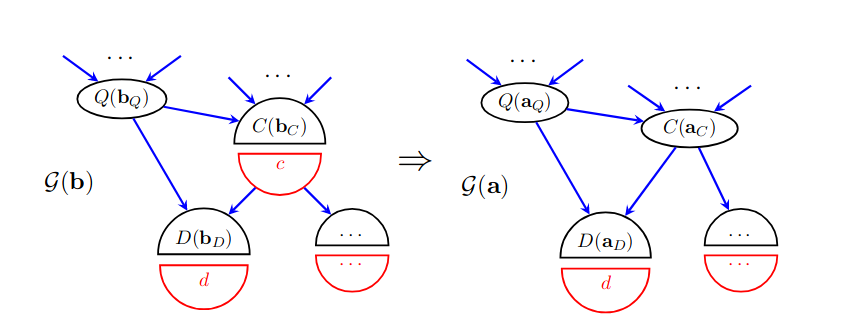
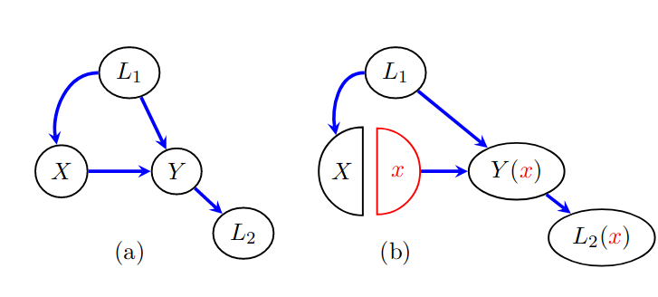

$\newcommand{\ci}{\perp\!\!\!\perp}$

# Graphical Representations of Casual Effects

+ We can represent causal effects in a graph, with arrows. 

+ Nodes in the graph are random variables. 

+ Directed edges represent direct causal effects (not mediated by any other variables in the graph).

+ The absence of an edge indicates the absence of a direct causal effect. 
--

```{r, echo = FALSE, out.width='90%', fig.height = 2.5, fig.align='left', message = FALSE, warning=FALSE}
library(DiagrammeR)
library(dplyr)
library(knitr)
library(kableExtra)

ay <- create_node_df(n = 5, label = c("A", "Y", "A", "Y", "L"), 
                     fontname = "Helvetica", 
                     fontsize = 10, 
                     width = 0.3, 
                     fillcolor = "white", 
                     fontcolor = "black",
                     color = "black", 
                     x = c(0, 1, 2.2, 3.2, 2.7), 
                     y = c(0, 0, 0, 0, 0.5))
ay_edge <- create_edge_df(from = c(1, 3, 5, 5), to = c(2, 4, 4, 3), 
                          minlen = 1, 
                          color = "black", 
                          )
ay_graph <- create_graph(nodes_df = ay, edges_df = ay_edge)

render_graph(ay_graph)
```

---


# Graph Definitions 

- A graph, $\mathcal{G} = \lbrace V, E\rbrace$ consists of
  - A set of nodes (vertices) $V = \lbrace V_1, \dots, V_J\rbrace$
  - A set of edges $E = \lbrace (V_{1_1}, V_{1_2}), \dots, (V_{K_1}, V_{K_2}) \rbrace$, which can be represented as pairs of nodes.
  
- A graph can be either *directed*, in which case elements of $E$ are ordered pairs or *undirected*, in which case
elements of $E$ are un-ordered. 
  - Our graphs will almost always be directed. 

- Two nodes are *adjacent* if they are connected by an edge. 
  + If the edge is directed, the node at the beginning of the edge is the *parent* and the node at the end is the *child*.

---

# Graph Definitions

- A *path* is a sequence of edges in which each edge contains one node from the previous edge.

- In a directed path, all of the edges are oriented in the same direction: i.e. each edge starts at last node of the previous edge. 

- In this graph:

<center>

```{r, echo = FALSE, out.width='40%', fig.height = 2.5, fig.align='left'}
ayl <- create_node_df(n = 3, label = c("A", "Y", "L"), 
                     fontname = "Helvetica", 
                     fontsize = 10, 
                     width = 0.3, 
                      fillcolor = "white", 
                     color = "black", 
                     x = c(0, 1, 0.5), 
                     y = c(0, 0, 0.5))
ayl_edge <- create_edge_df(from = c( 1, 3, 3), to = c(2, 2, 1), 
                          minlen = 1, 
                          color = "black", 
                          )
ayl_graph <- create_graph(nodes_df = ayl, edges_df = ayl_edge)

render_graph(ayl_graph)
```
</center>

there are two paths from $A$ to $Y$ but only one directed path. 

---

# Graph Definitions

- If there are no paths between two nodes, they are *disconnected* (or *connected* otherwise).

- Node $j$ is a descendant of node $k$ if there is a directed path from $V_j$ to $V_k$. 

- If a graph contains no directed cycles, it is *acyclic*
  + We will require all of our graphs to be acyclic.

- DAG = Directed Acyclic Graph
---

# Example: Different Treatments for Different Patients

+ Consider this story:

  - There are two possible treatments for a disease. Treatment $A$ is more effective than $B$, but has more side effects.
  - Doctors prefer treatment $B$ for patients who are older or who have more mild disease.
  - Patient outcome (remission or not) is affected by initial severity, treatment, and treatment adherence.
  - Conditional on everything else, age has no effect on patient outcome or disease severity.

--

+ Work with your neighbor to arrange the following variables in a DAG:

  - Patient outcome
  - Initial disease severity
  - Treatment
  - Treatment Adherence
  - Age

(The DAG is not uniquely determined from the information given.)

---
# Disease Treatment Example 

<center>
```{r, echo = FALSE, out.width='90%',  fig.align='center'}

di <- create_node_df(n =5, label = c("Age", "Severity", "Treatment", "Outcome", "Adherence"), 
                     fontname = "Helvetica", 
                     fontsize = 12, 
                     fillcolor = "white", 
                     color = "black", 
                     fontcolor = "black",
                     fixedsize = TRUE,
                     width = 1,
                     x = c(0.2, 0.2, 2, 4, 3), 
                     y = c(1.2, -1.2, 0, 0, 1.2))
di_edge <- create_edge_df(from = c(1, 2, 2,3, 5), to = c(3,  3, 4,  4, 4), 
                          minlen = 1, 
                          color = "black", 
                          )
di_graph <- create_graph(nodes_df = di, edges_df = di_edge)

render_graph(di_graph)
```

</center>

---
# Temporality

- Our definition of causality requires that the exposure occur before the outcome in time. 

- Under this restriction, a causal DAG must be consistent with at least one strict ordering of nodes.
  
--

- How do we represent a feedback loop?

--
  + We can create multiple nodes representing unique time points (e.g. $A_1, A_2, \dots$), with each node only permitted to have causal effects on future nodes.
  + More on this later. 


<center>

```{r, echo = FALSE, out.width='90%', fig.height = 2.5, fig.align='left', message = FALSE, warning=FALSE}
t_node <- create_node_df(n = 6, label = c("A", "Y", "A@_{1}", "Y@_{1}", "A@_{2}", "Y@_{2}"), 
                     fontname = "Helvetica", 
                     fontsize = 10, 
                     width = 0.3, 
                     fillcolor = "white", 
                     fontcolor = "black",
                     color = "black", 
                     x = c(0, 1, 2, 2.5, 3, 3.5), 
                     y = c(0, 0, 0.3, -0.3, 0.3, -0.3))
t_edge <- create_edge_df(from = c(1, 2, 3, 4, 4, 5), to = c(2, 1, 4, 5, 6, 6), 
                          minlen = 1, 
                          color = "black", 
                          )
t_graph <- create_graph(nodes_df = t_node, edges_df = t_edge)

render_graph(t_graph)
```

</center>
<!-- - What if measurements are taken at the same time? -->

<!-- -- -->
<!--   + We are generally forced to assume a temporal ordering even if our observations are taken at the same time.  -->
<!--   + For example, if we measure height and blood pressure, we can assume that height is stable over a long period of time while blood pressure is more variable. -->

---
# Causal Markov Property

- The causal Markov property translates graph structure into probability statements.

+ It states that, conditional on it's parents, each node is independent of all nodes that are not not it's descendants. 

+ This implies that the joint probability distribution of all nodes can be factored as

$$
P(V) = \prod_{j = 1}^{J} P(V_j \vert pa_j).
$$


---

# Example

Conditional independence statements in the disease tratment graph:

$$S\ci A \qquad S\ci Ad \qquad A \ci Ad$$
$$T \ci Ad\ \vert A, S \qquad O \ci A \ \vert S, T, Ad$$
<center>

```{r, echo = FALSE, fig.width = 6, fig.height = 5,  fig.align='center'}
di$label <- c("Age\nA", "Severity\nS", "Treatment\nT", "Outcome\nO", "Adherence\nAd")
di_graph <- create_graph(nodes_df = di, edges_df = di_edge)
render_graph(di_graph)
```

</center>

---

# Example

In our example, we can factor the joint probability as 

$$P(A, S, T, Ad, O) = P(A)P(S)P(Ad)P(T \vert A, S)P(O \vert S, T, Ad)$$

<center>

```{r, echo = FALSE, fig.width = 6, fig.height = 5, fig.align='center'}
render_graph(di_graph)
```

</center>

---

# Exchangeability

- Is the outcome O exchangeable with respect to the treatment? $O(t) \ci T$?

<center>

```{r, echo = FALSE, fig.width = 6, fig.height = 5, fig.align='center'}
render_graph(di_graph)
```

</center>

---

# Recognizing Lack of Exchangeability in a DAG

- Informally, there are two sources of lack of exchangeability:

  + The presence of common causes (confounders) that have not been conditioned on.
  + Common effects (colliders) that have been conditioned on. 
  
- We will see how to formalize these statements and how to use a DAG to identify a sufficient conditioning set to remove confounding.

---

# Common Causes (Confounders)

- The presence of a common cause introduces association between two variables that is not due to a causal effect. 

<center>

```{r, echo = FALSE, fig.width = 6, fig.height = 2.5, fig.align='center'}
#ayl <- ayl %>% mutate( label = recode(label, "A" = "X", "L" = "U"))
ayl_edge0 <- filter(ayl_edge, from != 1)
ayl_graph0 <- create_graph(nodes_df = ayl, edges_df = ayl_edge0)

render_graph(ayl_graph0)
```

</center>

--

- In the disease treatment example, disease severity is a confounder:
  - Sicker patients are more likely to receive drug $B$ and sicker patients are also more likely to have a poor outcome.
  - So there would be an association between treatment and outcome, even if the two drugs worked equally well. 
  
---

# Confounding

- Confounding as a concept is quite old and therefore has been given many definitions. 

- We will define confounding as the lack of exchangeability that results from common causes. 
  
- *Confounders* are variables which can be used to adjust for confounding. 
  + In the graph below, $L_1$ and $L_2$ are both confounders, even though only $L_1$ is a common cause of $A$ and $Y$.
  
<center>

```{r, echo = FALSE, fig.width = 6, fig.height = 2.5, fig.align='center'}

ayll <- create_node_df(n = 4, label = c("A", "Y", "L@_{1}", "L@_{2}"), 
                     fontname = "Helvetica", 
                     fontsize = 10, 
                     width = 0.3, 
                      fillcolor = "white", 
                     color = "black", 
                     x = c(0, 1.5, 0.5, 1), 
                     y = c(0, 0, 0.8, 0.4))
ayll_edge <- create_edge_df(from = c( 3, 3, 4), to = c( 1, 4, 2), 
                          minlen = 1, 
                          color = "black", 
                          )
ayll_graph <- create_graph(nodes_df = ayll, edges_df = ayll_edge)

render_graph(ayll_graph)
```

</center>
---

# Common Effects (Colliders)

+ A variable $L$ is a collider relative to $A$ and $Y$ if $L$ is a descendent of both $A$ and $Y.$ 

+ Conditioning on a collider introduces an association between $A$ and $Y$. 
  - This is not necessarily as intuitive as the bias introduced by a common cause. 
  
<center>

```{r, echo = FALSE, out.width='40%', fig.height = 2.5, fig.align='left'}
ayl_node_collider <- ayl %>% mutate(y = -y)
ayl_edge_collider <- create_edge_df(from = c( 2, 1), to = c(3, 3), 
                          minlen = 1, 
                          color = "black", 
                          )
ayl_graph_collider <- create_graph(nodes_df = ayl_node_collider, edges_df = ayl_edge_collider)

render_graph(ayl_graph_collider)
```


</center>

---

# Collider Example: Routes to Stardom

+ Suppose that in order to become a movie star, one must either be talented or beautiful. 

+ Suppose that in the population, talent and beauty are uncorrelated. 
  - For simplicity, suppose $P(\text{talent}) = P(\text{beauty}) = 0.1$.
  
+ For simplicity, assume that anyone with talent or beauty has the same chance of becoming a star. 

<center>
```{r, echo = FALSE, fig.height = 2.5, fig.align='left'}
ayl_node_collider2 <- ayl_node_collider %>% 
  mutate(label = recode(label, "A" = "Talent", "Y" = "Beauty", "L" = "Stardom"), 
         shape = "ellipse", 
         width = 0.5, fixedsize = FALSE, 
         y = y *1.5)
ayl_graph_collider <- create_graph(nodes_df = ayl_node_collider2, edges_df = ayl_edge_collider)

render_graph(ayl_graph_collider)
```

</center>
---

# Collider Example: Routes to Stardom

+ Tables below show the proportions of talent and beauty in the general population and among stars: 

<center>
```{r, echo = FALSE}
library(knitr)
library(kableExtra)
pop <- data.frame( B_0 = c(0.81, 0.09), B_1 = c(0.09, 0.01) )
stars <- data.frame(B_0 = c(0, round(0.09/0.19, digits = 2)), B_1 = c(round(0.09/0.19, digits = 2), round(0.01/0.19, digits = 2)))
rownames(pop ) <- rownames(stars) <-  c("\\(T = 0\\)", "\\(T = 1\\)")
# full <- cbind(pop, stars)
# knitr::kable(full, row.names = TRUE, col.names =  rep(c("\\(B = 0\\)", "\\(B = 1\\)"), 2), format = 'html')%>%
#    add_header_above(c(" " = 1, "Population" = 2, "Stars" = 2))
 knitr::kable(pop, row.names = TRUE, col.names = c("\\(B = 0\\)", "\\(B = 1\\)"), format = 'html', caption = "Population")%>%
   kable_styling(position = "float_left", full_width = FALSE)
 knitr::kable(stars, row.names = TRUE, col.names = c("\\(B = 0\\)", "\\(B = 1\\)"), format = 'html', caption = "Stars") %>%
  kable_styling(position = "center", full_width = FALSE)
```


</center>

--

- In the population $P[T=1] = P[ T = 1 \vert B = 1] = 0.1$

- Among stars $P[T=1] = 0.1/0.19 = 0.53$, and $P[T = 1 \vert B = 1] = \frac{0.01/0.19}{0.1/0.19} = 0.1$

--

- Among stars, talent and beauty are negatively correlated. Talent is more rare among beautiful stars than among stars as a whole. 
  
- This is because we have conditioned on the collider "Becoming a star". 

---

# Colliders Can Block Confounding

- In the graph below, there is no confounding because there is no common cause of $A$ and $Y$.

- The collider $L_2$ is "blocking" the path from $A$ to $Y$. 

- Causal Markov properties show us that $A$ and $Y$ are independent in this graph. 

- d-Separation formalizes the rules for identifying pairs of independent variables based on graphical rules.


```{r, echo = FALSE, fig.width = 6, fig.height = 2.5, fig.align='center'}
ayll_edge <- create_edge_df(from = c( 3, 3, 2), to = c( 1, 4, 4), 
                          minlen = 1, 
                          color = "black", 
                          )
ayll_graph <- create_graph(nodes_df = ayll, edges_df = ayll_edge)

render_graph(ayll_graph)
```

---

# No Statistical Definition of Confounding

- One commonly given characterization of a confounder is a variable which 

  + Is associated with the exposure.
  + Is associated with the outcome.
  + Is not on the pathway of interest between exposure and outcome. 
  
--

- Note that $L_2$ satisfies all of these criteria but is not a confounder.

<center>

```{r, echo = FALSE, fig.width = 6, fig.height = 2.5, fig.align='center'}

render_graph(ayll_graph)
```

</center>

- Determining confounding requires a causal model. 
  + The data cannot tell you if confounding is present.
  
---

# d-Separation

+ A path is *blocked* if:
  1. Two arrowheads on the path collide ( $\rightarrow W \leftarrow$ ) at a variable that is not being conditioned on *and* which has no descendants in the conditioning set. OR
  1. It contains a non-collider that is being conditioned on. 
  
+ A path is *open* if it is not blocked:
  - It does not contain a collider and no variables on the path are being conditioned on. OR
  - All colliders are conditioned on and no non-colliders are conditioned on.
  
+ Two variables are *d-separated* if all paths between them are blocked. 

---

# d-Separation and the Causal Markov Property

Let $A$, $B$, and $C$ be sets of variables. Verma and Pearl (1988) proved that:

If $A$ and $B$ are d-separated given $C$ then $A \ci B \vert\ C$.

- We will not prove this in class. 

---
# Faithfulness

Faithfulness is the property that, for three sets of variables $A$, $B$, and $C$
$$A \ci B \vert C \Rightarrow\ A \text{ is } d\text{-separated from }B\text{ given }C$$. 

- Violations of faithfulness occur when confounding effects perfectly cancel each other. 
  + Pearl calls these "incidental cancellations". 
  + And then defines "stable" vs "unstable" unbiasedness. Unstable unbiasedness occurs when faithfulness is violated. 
  
- Practically, we can assume that faithfulness is never violated except when it is violated by design.

- Matching studies intentionally violate faithfulness. 

---

# Example

Which pairs of variables are d-Separated? 

<center>
```{r, echo = FALSE, fig.width = 6, fig.height = 5, fig.align='center'}
render_graph(di_graph)
```
</center>

--

- The causal Markov property allowed us to conclude that $T \ci Ad \vert S, A$.
- Because $T$ and $Ad$ are d-separated, we can also conclude that $T \ci Ad$ unconditionally.

---

# Backdoor Path

- A backdoor path from $A$ to $Y$ is a path from $A$ to $Y$ that begins with an edge going *into* $A$. 

<center>

```{r, echo = FALSE, out.width='60%', fig.height = 2.5, fig.align='left', message=FALSE}
ayl2 <- ayl %>% mutate(x = x + 1.5)
ayl2  <- combine_ndfs(ayl, ayl2) #%>% 
        #mutate( label = recode(label, "A" = "X", "L" = "U"))

ayl_edge2 <- create_edge_df(from =3+ c( 1, 3, 1), to = 3+c(2, 2, 3), 
                          minlen = 1, 
                          color = "black", 
                          )
ayl_edge2 <- combine_edfs(ayl_edge, ayl_edge2)
ayl_graph2 <- create_graph(nodes_df = ayl2, edges_df = ayl_edge2)

render_graph(ayl_graph2)
```

```{r, echo = FALSE, out.width='60%', fig.height = 2.5, fig.align='left'}
m_node <- create_node_df(n = 5, label = c("A", "Y", "L", "U@_{1}", "U@_{2}"), 
                     fontname = "Helvetica", 
                     fontsize = 10, 
                     width = 0.3, 
                      fillcolor = "white", 
                     color = "black", 
                     x = c(0, 1.8, 0.9, 0.45, 1.35), 
                     y = c(0, 0, 0.4, 0.9, 0.9))
m_edge <- create_edge_df(from = c(4, 4,5,5, 1, 3), to = c(1,3,3,2, 2, 2), 
                          minlen = 1, 
                          color = "black", 
                          )
m_graph <- create_graph(nodes_df = m_node, edges_df = m_edge)

render_graph(m_graph)
```

</center>


---

# Backdoor Criterion and Exchangeability

Theorem: If a set of variables, $L$, 
  + blocks every backdoor path between $A$ and $Y$ 
  + contains no descendants of $A$,
  
then $Y(a) \ci A \vert L$. 

--
- The two conditions in the theorem are referred to as the *backdoor criterion*. 

--

- To justify this, we need a connection between DAGs and counterfactuals. 

---

# Examples

What set of variables makes $A$ and $Y$ conditionally exchangeable?

<center>

```{r, echo = FALSE, out.width='60%', fig.height = 3, fig.align='left'}
m_edge <- create_edge_df(from = c(4, 4,5,5, 1), to = c(1,3,3,2, 2), 
                          minlen = 1, 
                          color = "black", 
                          )
m_graph <- create_graph(nodes_df = m_node, edges_df = m_edge)

render_graph(m_graph)
```

</center>

--

- $A$ and $Y$ are exchangeable unconditionally. 

- Conditioning on $L$ induces bias. (M-Bias).

---

# Examples

What set of variables makes $A$ and $Y$ conditionally exchangeable?

<center>

```{r, echo = FALSE, out.width='60%', fig.height = 3, fig.align='left'}
m_edge <- create_edge_df(from = c(4, 4,5,5, 1, 3), to = c(1,3,3,2, 2, 2), 
                          minlen = 1, 
                          color = "black", 
                          )
m_graph <- create_graph(nodes_df = m_node, edges_df = m_edge)

render_graph(m_graph)
```

</center>

--

- If $U_1$ and $U_2$ are unobserved, there is no available set of variables we can condition on to remove bias. 

- If we can measure either, $\lbrace U_1, L\rbrace$ and $\lbrace U_2, L \rbrace$ are both sufficient adjustment sets. 


---

# Examples

What set of variables makes $A$ and $Y$ conditionally exchangeable?

<center>
```{r, echo = FALSE, out.width='60%', fig.height = 3, fig.align='left'}
f711_node <- create_node_df(n = 4, label = c("A", "Y", "L", "U"), 
                     fontname = "Helvetica", 
                     fontsize = 10, 
                     width = 0.3, 
                      fillcolor = "white", 
                     color = "black", 
                     x = c(0, 1.8, 0.9, 0.45), 
                     y = c(0, 0, 0, 0.5))
f711_edge <- create_edge_df(from = c(1, 3, 4, 4), to = c(3, 2, 1, 3), 
                          minlen = 1, 
                          color = "black", 
                          )
f711_graph <- create_graph(nodes_df = f711_node, edges_df = f711_edge)

render_graph(f711_graph)
```

</center>

--

-  Conditioning on $U$ blocks all backdoor paths.

- Could we condition on $L$ instead?

--

- No. $L$ is a descendant of $A$, so it does not satisfy the backdoor criterion.

---

# Single World Intervention Graphs (SWIGs)

- SWIGs are a method of including counterfactuals in DAG. 

- To create a SWIG, the node representing the intervened on variable is split into two nodes. 
  - One node represents the natural value of of the variable.
  - The other represents the fixed value due to the intervention.

<center> 

```{r, echo=FALSE, out.width="30%"}
knitr::include_graphics("img/2_dag1.png")
```

```{r, echo=FALSE, out.width="80%"}
knitr::include_graphics("img/2_swig1.png")
```

</center>

<!-- --- -->

<!-- # SWIG Procedure -->

<!-- - To represent the counterfactual $Y(a)$, we split the node $A$ in the original graph into two nodes: -->

<!-- - $A$ (in the SWIG) represents the naturally occurring treatment -- what would have occurred with no intervention.  -->
<!--   + All of the arrows which entered into $A$ in the original DAG will enter into $A$ in the SWIG. -->

<!-- - $a$ represents the intervened on value of the treatment.  -->
<!--   + This variable is fixed at the value $a$ (i.e. it is deterministic rather than random). -->
<!--   + All arrows which exited $A$ in the original DAG now exit the $a$ intervention node. -->
<!--   + All variables which were downstream of $A$ in the original DAG are replaced by their counterfactual values.  -->

---


# Templates (SWITs)

- Each SWIG can represent only a single intervention, i.e. the world in which everyone receives treatment $A = a$. 

- A template is graph valued function $x \rightarrow \mathcal{G}(x)$
  + Input is the value the intervened on variable is set to.
  + Output is a SWIG.
  
<center> 


```{r, echo=FALSE, out.width="80%", fig.height=2}
knitr::include_graphics("img/2_swig1.png")
```


```{r, echo=FALSE, out.width="40%", fig.height=2}
knitr::include_graphics("img/2_swig4.png")
```

</center>
  
---

# Single World

+ $Y(0)$ and $Y(1)$ never appear on the same graph.

+ SWIGs cannot represent relationships between counterfactuals "across worlds" (i.e. $Y(0)$ and $Y(1)$ ).

+ From the SWIGs below, we can conclude $ Y(0) \ci X$ and $Y(1) \ci X$ but not $Y(1), Y(0) \ci X$ or $Y(1) \ci Y(0)$.

<center> 


```{r, echo=FALSE, out.width="80%", fig.height=2}
knitr::include_graphics("img/2_swig1.png")
```

</center>

---
# SWIG Procedure

- Step 1: Split nodes

<center> 


```{r, echo=FALSE, out.width="40%", fig.height=2}
knitr::include_graphics("img/2_split_nodes.png")
```

</center>

- Split every intervention node into
  - $A$ the random component; what $A$ would have been without intervention.
  - $a$ a fixed component representing the intervention.

- Incoming arrows go into $A$ and outgoing arrows go out of $a$. 
---
# SWIG Procedure

- Step 2: Re-label downstream nodes as counterfactuals.

<center> 


```{r, echo=FALSE, out.width="80%", fig.height=2}
knitr::include_graphics("img/2_label_nodes.png")
```

</center>
---

# d-Separation in SWIGs

- In SWIGs we have an additional rule for d-separation.

- Any path containing an intervention node is blocked. 

- Alternatively, $A$ and $Y$ are d-separated in $\mathcal{G}(a)$ if they are d-separated in the subgraph of $\mathcal{G}(a)$ achieved by removing all of the fixed nodes. 

- Remember, intervention nodes are fixed at a single value, so no information can propogate through them.

- We are heading toward the result that (conditional) d-separation of $Y(a)$ and $A$ in a SWIG $\mathcal{G}(a)$ implies (conditional) exchangeability of $Y(a)$ and $A$. 

---
# Applying d-separation in SWIGs

<center> 


```{r, echo=FALSE, out.width="80%", fig.height=2}
knitr::include_graphics("img/2_fig16.png")
```

</center>

- This is the M-Bias example. 

- We can see that $Y(a)$ is d-separated from $A$ unconditionally.

- Conditional on $Z$, $Y(a)$ is not d-separated from $A$. 

---

# Linking $\mathcal{G}$ and $\mathcal{G}(a)$


- Let $P(\mathbf{V})$ be a probability distribution over nodes $\mathbf{V}$ that factorizes according to the DAG $\mathcal{G}$. 

- Goal: conditional d-separation in SWIG $\Rightarrow$ conditional exchangeability


- To get there, we need to know that $P(\mathbf{V}(\mathbf{a}))$, the probability distribution over counterfactuals subject to the intervention $\mathbf{a},$ factorizes according to the SWIG $\mathcal{G}(\mathbf{a})$.

- To get this, we need to be more specific about defining a model to go with our DAGs. 


---

# Non-Parametric Structural Equation Models

- The models we have expressed so far as DAGs represent underlying counterfactual models. We can now give a formal definition of that model.

- Start with a set of variables $\mathbf{V}$ represented by a DAG $\mathcal{G}$.

--

Counterfactual Existance Assumption:

- Every variable $V \in \mathbf{V}$ can be intervened on. 

- Let $\mathbf{R}$ be a set of variables to be intervened on and set to $\widetilde{\mathbf{r}}$. We define the counterfactual value of $V(\mathbf{r})$ recursively as a function of the counterfactual values of it's parents. Let $\widetilde{\mathbf{r}}_{pa(V)}$ be the subset of $\widetilde{\mathbf{r}}$ which correspond to parents of $V$.
$$V(\widetilde{\mathbf{r}}) = V \left(\widetilde{\mathbf{r}}_{pa(V)}, (\mathbf{PA}_V \backslash \mathbf{R})(\widetilde{\mathbf{r}}) \right)$$
---

# Equivalent Equation Version 

The previous definition is equivalent to: 

- Assume the existence of unmeasured errors $\epsilon_V$. 

- Let $\widetilde{\mathbf{pa}}_V$ be an intervention on the parents of $V$. Then we assume the existence of deterministic functions 
$$V(\widetilde{\mathbf{pa}}_V) = f_V(\widetilde{\mathbf{pa}}_V, \epsilon_V).$$
- With consistancy, this also implies that 
$$ V = f_V(PA_V, \epsilon_V)$$
---

# Example

This graph

<center> 

```{r, echo=FALSE, out.width="40%", fig.height=1.7}
knitr::include_graphics("img/2_swig6_fig9.png")
```

</center>

corresponds to equations

$$Z = f_Z(\epsilon_Z)$$
$$M(z) = f_M(z, \epsilon_M)$$
$$Y(z, m) = f_Y(z, m, \epsilon_Y)$$

- Our model also says that intervening on the future, does not affect past variables: $Z(m, y) = Z$, $M(z, y) = M(z)$, $M(y) = M(Z)$. 

- For partial interventions, we have $Y(m) = Y(m, Z)$, $Y(z) = Y(z, M(z))$, $Y = Y(Z, M(Z))$.

---

# Independence Assumptions

- From this model alone, we can't conclude the causal Markov property. We need an additional assumption.

- FFRCISTG Assumption: Let $\mathbf{v}^\dagger$ be an intervention on every variable in $V$. The FFRCISTG independence assumption says that all of the counterfactual variables $\lbrace V(\mathbf{v}^\dagger) \rbrace$ are mutually independent after this intervention. 

- NPSEM-IE assumption: The NPSEM-IE assumption says that all of the errors $\epsilon_V$ are independent. 

- NPSEM-IE is strictly stronger than FFRCISTG.

- NPSEM-IE implies cross-world independences while FFRCISTG does not. 

- We will generally always assume FFRCISTG.

---
# FFRCISTG vs NPSEM-IE
<center> 

```{r, echo=FALSE, out.width="40%", fig.height=2}
knitr::include_graphics("img/2_swig6_fig9.png")
```

</center>

- FFRCISTG says $$ Z\ci M(z) \ci Y(z, m)$$ for any $z$ and $m$.

- NPSEM-IE says $$Z \ci \lbrace M(z) \text{ for all } z \rbrace \ci \lbrace Y(z, m)\ \text{for all } z, m \rbrace$$

  - For example, $M(0) \ci Y(Z = 1, M = 0)$.

---

# Factorization Proof Sketch

- The result that $P(\mathbf{V})$ factorizes according to $\mathcal{G} \Rightarrow P(\mathbf{V}(\mathbf{a}))$ factorizes according to the SWIG $\mathcal{G}$ follows from the FFRCISTG independence assumption. 


Proof idea: Work by reverse induction
- FFRCISTG tells us that the property holds for interventions on all variables. 
  - This follows trivially (in a mathematical sense)
  - CI properties for of the SWIG for an intervention on all variables say that $P(\mathbf{V}(\mathbf{a})) = \prod_j P(V_j(\mathbf{a}))$.
  - This is exactly the FFRCISTG independence assumption. 
  
  
---
# Factorization Proof Sketch 


- Suppose we have an intervention on a set of variables $A \subset \mathbf{V}$ and that the property holds for all (strict) supersets of $A$. 

- We can find a single variable $C$ to add to $A$ and prove the factorization result only for terms involving $C$.

<center> 

```{r, echo=FALSE, out.width="75%", fig.height=3}

```

</center>

- See appendix B1 of Richardson and Robins (2013).

---

# SWIGs, Exchangeability, and d-Separation

- The factorization result allows us to conclude that d-separation in the SWIG implies conditional exchangeability. 

- Recall: Conditional exchangeability says that $Y(a) \ci A \vert L$, which is exactly what is implied by $d$-separation in the SWIG. 

- This is an alternative formulation of the backdoor criterion. 

---

# Descendents of $A$ in the Backdoor Criterion

+ Using SWIGs helps show why the backdoor criterion excludes descendants of $A$. 

<center>
```{r, echo=FALSE, out.width="50%"}

```

</center>

+ The SWIG on the right shows that, $Y(x) \ci X \vert L_2(x)$.

+ However, we cannot conclude that $Y(x) \ci X \vert L_2$ because $L_2$ is not on the graph. 

+ If there is a causal effect of $X$ on $Y$, then conditioning on $L_2$ introduces a type of selection bias (more on this in the future).

---

# More Examples: Confounder

<center> 

```{r, echo=FALSE, out.width="40%", fig.height=2}
knitr::include_graphics("img/2_fig9iii.png")
```

</center>

- $Y(m)$ is not unconditionally independent of $M$ but, $Y(m) \ci M \vert Z$

- The factorization result gives us
$$P(Z, M, Y(m)) = P(Z)P(M \vert Z)P(Y(m) \vert Z)$$

- Note that we left the fixed node out of the probability calculation.

---

# Mediator

<center> 

```{r, echo=FALSE, out.width="40%", fig.height=2}
knitr::include_graphics("img/2_fig9ii.png")
```

</center>

- Here we do have unconditional exchangeability because $Y(z) \ci Z$. 

- From factorization, $P(Z, M(z), Y(z)) = P(Z)P(M(z))P(Y(z) \vert M(z))$

---

# Mediator with Two Interventions

<center> 

```{r, echo=FALSE, out.width="40%", fig.height=2}
knitr::include_graphics("img/2_fig9iv.png")
```

</center>

- From this graph we can get $Y(z, m) \ci M(z)$. 

- We have to use the new rule that fixed nodes block paths.

- This is saying that intervening on $M$ blocks the effect of $Z$ that is propogated through $M(z)$. 

- From factorization, $P(Z, M(z), Y(z)) = P(Z)P(M(z))P(Y(z))$


---

# Mediation Effects

<center>

```{r, echo = FALSE, out.width='40%', fig.height = 2, fig.align='left'}
ayl <- create_node_df(n = 3, label = c("A", "Y", "L"), 
                     fontname = "Helvetica", 
                     fontsize = 10, 
                     width = 0.3, 
                      fillcolor = "white", 
                     color = "black", 
                     x = c(-0.1, 1, 0.2), 
                     y = c(0.5, 0, 0))
ayl_edge <- create_edge_df(from = c( 1, 1, 3), to = c(2, 3, 2), 
                          minlen = 1, 
                          color = "black", 
                          )
ayl_graph <- create_graph(nodes_df = ayl, edges_df = ayl_edge)

render_graph(ayl_graph)
```
</center>

- In the graph above, $L$ is *mediating* part of the effect of $A$ on $Y$. 

- Using our machinery so far, we can define the total effect (TE) of $A$ on $Y$ as
$$E[Y(A = 1)] - E[Y(A = 0)]$$
- We might be interested in the effect of $A$ that is not mediated through $L$. 

- This would be the effect of $A$ on $Y$ if we intervened on $L$ and prevented $L$ from changing. 
  - For example, we intervene on $A$ and set it to 1. 
  - But we intervene on $L$ and set it to $L(0)$. 
---

# Natural Direct and Indirect Effect

<center>

```{r, echo = FALSE, out.width='40%', fig.height = 2, fig.align='left'}
render_graph(ayl_graph)
```
</center>
  
- The *natural direct effect*(NDE) is
$$E[Y(A = 1, L = L(0))] - E[Y(A = 0, L = L(0)]$$
- The *natural indirect effect*(NIE) is 

$$
E[Y(A = 1, L= L(1))] - E[Y(A = 1, L = L(0))]
$$
- So TE = NDE + NIE 

- Note that both of these involove "cross-world" counterfactuals.


---
# Usual Aproach to Estimating NIE and NDE

- The NIE and NDE are usually estimated by controlling for $L$. One strategy is the addition method: 

- The NDE is computed as $P\sum_l[Y \vert A = 1, L=l] - P[Y \vert A = 0, L=l]$.

- The total effect is computed as $P[Y \vert A = 1] - P[Y \vert A = 0]$.

- The total indirected effect is computed as TE - NDE.


---

# Identifying NIE and NDE

- The FFRCISTG independence assumption does not allow identification of the NIE and NDE. 

- Robins and Greenland (1992) demonstrate this with an example where the difference method fails and demonstrate that NIE and NDE are not identifiable. 

- If we further assume the NPSEM-IE model, NIE and NDE are identifiable.

<!-- Idenifying the NIE and NDE require that -->

<!-- $$E[Y \vert A = 1, L = 0] =  E[Y(A = 1, L = L(0)) \vert A = 1, L = 1 ]$$ -->
<!-- and -->

<!-- $$ E[Y \vert A = 0, L = 0] = E[Y(A = 0, L = L(0)) \vert A = 0, L = 1].$$ -->


---
# Controlled Direct and Indirect Effects

- Controlled effects are an alternative to natural effects. 

- These are the effect of $Y$ when we control $L$ at some pre-determined value.

$$E[Y(A = 1, L = l)] - E[Y(A = 0, L = l)]$$

- This definition only requires a joint intervention and doesn't require cross-world relationships between counterfactuals.

- Therefore CDE and CIE are identifiable under the FFRCISTG model.

<!-- --- -->

<!-- # Extras: Collapsibility and Confounding -->


<!-- --- -->
<!-- # Causal Identification -->

<!-- - Suppose I know the joint distribution $P(V)$ over a set of variables.  -->

<!-- - Suppose I also assume: -->
<!--   - The distribution factorizes according to a DAG. -->
<!--   - We have observed all of the nodes on the DAG. -->
<!--   - Faithfulness -->

<!-- - When is it possible to infer the structure of the DAG? -->

<!-- --- -->

<!-- # Markov Equivalence -->

<!-- - Multiple graphs can imply the same set of conditional independence relations. -->

<!-- - Two graphs $\mathcal{G}_1$ and $\mathcal{G}_2$ are Markov equivalent if they imply the same set of d-separation relations.  -->

