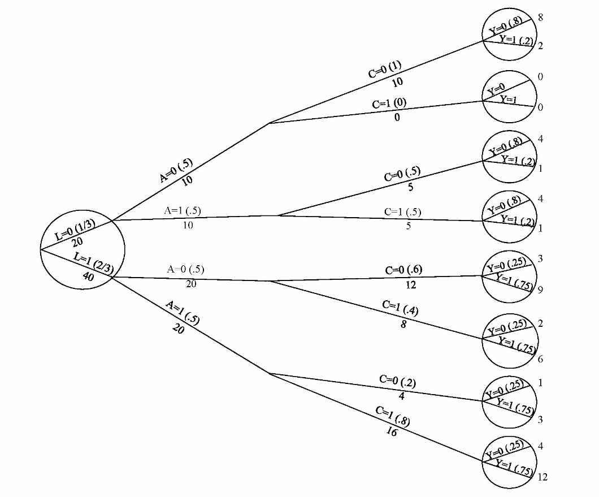

$\newcommand{\ci}{\perp\!\!\!\perp}$

# HIV Treatment Example


- We are interested in the effect of a drug for treating HIV ( $A$ ) on the risk that CD4 count is below a particular threshold at three months after treatment ( $Y$ ). 

- We cannot observe outcomes for patients who do not make it to their three month follow-up appointment. 

- Patients may miss their appointments if they are in poor health. This could occur if 
their disease has progressed (low CD4 count) or they are experiencing side effects from their treatment. 

- Use a variable $C$ (for censoring) to represent whether or not a patient's CD4 count is measured at three months.
  + $C = 0$ if the measurement was taken.
  + $C = 1$ if the measurement is missing.

- With a partner, draw a DAG representing this scenario.

---

# HIV Treatment Example

<center>
```{r, echo = FALSE, out.width='90%', fig.align='left', message = FALSE, warning=FALSE}
library(DiagrammeR)
library(dplyr)
library(knitr)
library(kableExtra)

hiv_node0 <- create_node_df(n = 4, label = c("A", "Y", "L", "C"), 
                     fontname = "Helvetica", 
                     fontsize = 10, 
                     width = 0.3, 
                     fillcolor = "white", 
                     fontcolor = "black",
                     color = "black", 
                     shape = rep(c("circle", "square"), c(3, 1)),
                     x = c(0, 1, 1, 2)*0.8, 
                     y = c(0, 0, 1, 0)*0.8)
hiv_edge0 <- create_edge_df(from = c(1, 1, 2, 3 ), to = c(2, 3, 4, 4),
                          minlen = 1, 
                          color = "black", 
                          )
hiv_graph0 <- create_graph(nodes_df = hiv_node0, edges_df = hiv_edge0)

render_graph(hiv_graph0)
```
</center>

---

# HIV Treatment Example

- In this study, if we had been able to measure $Y$ for all patients, could we identify the effect of $A$ on $Y$ -- i.e. would we have $Y(a) \ci A$?

- With some data unobserved, can we identify the effect of $A$ on $Y$?
<center>
```{r, echo = FALSE, fig.height = 2.5}
render_graph(hiv_graph0)
```
</center>
--

- No. We have *selection bias*. 

- $C$ is a collider on a path between $Y$ and $L$. Conditioning on $C$ induces a correlation between $Y$ and $L$ and therefore a non-causal association between $Y$ and $A$. 


---

# HIV Treatment Example

- Suppose now that treatment has no side effects. Treatment can only influence selection *through* its effect on $Y$.

<center>
```{r, echo = FALSE, fig.height = 2.5}
hiv_node <- create_node_df(n =3 , label = c("A", "Y", "C"), 
                     fontname = "Helvetica", 
                     fontsize = 10, 
                     width = 0.3, 
                     fillcolor = "white", 
                     fontcolor = "black",
                     color = "black", 
                     shape = rep(c("circle", "square"), c(2, 1)),
                     x = c(0, 1, 2)*0.8, 
                     y = c(0, 0, 0)*0.8)
hiv_edge <- create_edge_df(from = c(1, 2), to = c(2, 3),
                          minlen = 1, 
                          color = "black", 
                          )
hiv_graph <- create_graph(nodes_df = hiv_node, edges_df = hiv_edge)

render_graph(hiv_graph)
```
</center>

- Do we still have selection bias?

---

# Example Continued

- Suppose that $A$ is effective. Patients receiving $A = 1$ have lower CD4 count at three months and also fee better and are more likely to make it to their follow-up appointments. 

- To be concrete, suppose that 
  + $P[Y = 1 \vert A = 1] = 0.2$ and $P[Y = 1 \vert A = 0] = 0.7$.
  + $P[C = 0 \vert Y = 0] = 1$ and $P[C = 0 \vert Y = 1] = 0.5$.

- With your partner, compute the average causal effect of $A$ on $Y$ and compute
$E[Y \vert A = 1] - E[Y \vert A = 0]$ in the sub-population with $C =0$.

- Repeat your calculations assuming that there is no effect of $A$ on $Y$ and $P[Y = 1 \vert A =0 ] = P[Y = 1 \vert A =1] = p$.

<center>
```{r, echo = FALSE, fig.height = 2.5}
render_graph(hiv_graph)
```
</center>


---

# Selection Bias Under the Null

- In both examples we have selection bias because $C$ is a common cause of both $A$ and $Y$.

- In the first case, this condition is true whether or not $A$ has a non-zero effect on $Y$.
  + "Selection bias under the null"

- In the second case (all of the effect of $A$ on $C$ is mediated by $Y$), this condition *only* occurs when there is a non-zero causal effect of $A$ on $Y$. 

- Selection bias under the null always implies selection bias in non-null settings.

- There are some circumstances when we can have selection bias only under the non-null.

---
# Colliding Creates Selection Bias 

- Conditioning on a variable that is a child of both the outcome and the exposure creates selection bias.

- Recall that conditioning on the child of a collider will also open a path.

<center>
```{r, echo = FALSE, fig.height = 5}
#render_graph(hiv_graph)
ndf6 <- create_node_df(n =3 , label = c("A", "Y", "C"), 
                     fontname = "Helvetica", 
                     fontsize = 10, 
                     width = 0.3, 
                     fillcolor = "white", 
                     fontcolor = "black",
                     color = "black", 
                     shape = rep(c("circle", "square"), c(2, 1)),
                     x = c(0, 1, 0.5)*0.8 + 2.8, 
                     y = c(1, 1, 0)*0.8)
edf6 <- create_edge_df(from = c(1, 2, 1)+4, to = c(3, 3, 2)+4,
                          minlen = 1, 
                          color = "black", 
                          )
ndf7 <- create_node_df(n = 5, label = c("A", "Y", "L", "U", "C"), 
                     fontname = "Helvetica", 
                     fontsize = 10, 
                     width = 0.3, 
                     fillcolor = "white", 
                     fontcolor = "black",
                     color = "black", 
                     shape = rep(c("circle", "square"), c(4, 1)),
                     x = c(0, 1, 1, 2, 3)*0.8 + 1.5, 
                     y = c(0, 0, 1, 0, 0)*0.8 - 2)
edf7<- create_edge_df(from = c(1, 1, 2, 3, 4 ) + 7, to = c(2, 3, 4, 4, 5) + 7,
                          minlen = 1, 
                          color = "black", 
                          )
g6 <- create_graph(nodes_df = combine_ndfs(hiv_node0, ndf6, ndf7), edges_df = combine_edfs(hiv_edge0, edf6, edf7))
render_graph(g6)
```
</center>


---

# Selection Bias without Colliding

- In our previous HIV treatment example, suppose that low CD4 count does not directly cause censoring.

- Instead there is a variable $U$ representing disease progression which is a common cause of both $Y$ and $S$. 

- We still have selection bias in this case, but $C$ is not a descendant of $Y$.

<center>
```{r, echo = FALSE, fig.height = 3.5}
hiv_node2 <- create_node_df(n =4 , label = c("A", "Y", "L", "C"), 
                     fontname = "Helvetica", 
                     fontsize = 10, 
                     width = 0.3, 
                     fillcolor = "white", 
                     fontcolor = "black",
                     color = "black", 
                     shape = rep(c("circle", "square"), c(3, 1)),
                     x = c(0, 2, 1, 2)*0.8, 
                     y = c(0, 1, 0, -1)*0.5)
hiv_edge2 <- create_edge_df(from = c(1, 3, 3), to = c(3, 2, 4),
                          minlen = 1, 
                          color = "black", 
                          )
hiv_graph2 <- create_graph(nodes_df = hiv_node2, edges_df = hiv_edge2)

render_graph(hiv_graph2)
```
</center>

---
# Selection Bias Definition


- Selection bias occurs when we condition on a variable which is a common effect of two variables.

- One must be either the treatment or *associated* with the treatment.

- The other must be the exposure or *associated* with the exposure. 

---

# Selection Could Happen Before the Outcome 


<center>
```{r, echo = FALSE, fig.height = 5}
ndf8 <- create_node_df(n =5 , label = c("A", "L", "C", "Y", "U"),
                     fontname = "Helvetica", 
                     fontsize = 10, 
                     width = 0.3, 
                     fillcolor = "white", 
                     fontcolor = "black",
                     color = "black", 
                     shape = rep(c("circle", "square", "circle"), c(2, 1, 2)),
                     x = c(0, 1, 2, 3, 2)*0.8, 
                     y = c(0, 0, 0,0,1)*0.5)
edf8 <- create_edge_df(from = c(1, 2, 5, 5), to = c(2, 3, 2, 4),
                          minlen = 1, 
                          color = "black", 
                          )
gr8 <- create_graph(nodes_df = ndf8, edges_df = edf8)

render_graph(gr8)
```
</center>


---

# Selection Could Happen Before the Exposure 


<center>
```{r, echo = FALSE, fig.height = 5}
ndf9 <- create_node_df(n =5 , label = c("L", "U", "C", "A", "Y"),
                     fontname = "Helvetica", 
                     fontsize = 10, 
                     width = 0.3, 
                     fillcolor = "white", 
                     fontcolor = "black",
                     color = "black", 
                     shape = rep(c("circle", "square", "circle"), c(2, 1, 2)),
                     x = c(0, 1,1,2,  3)*0.8, 
                     y = c(0, 1, -2, 0, 0)*0.5)
edf9 <- create_edge_df(from = c(1, 1, 2, 2), to = c(3, 4, 1, 5),
                          minlen = 1, 
                          color = "black", 
                          )
gr9 <- create_graph(nodes_df = ndf9, edges_df = edf9)

render_graph(gr9)
```
</center>


<!-- --- -->

<!-- # Extended Backdoor Criterion -->

---
# Augmenting DAGs

- We want to estimate $E[Y(a, c = 0)]$, the expected counterfactual value of $Y$ if everyone had been treated
witht $A = a$ and nobody had been censored. 

- $Y(c =0)$ is the uncensored value of $Y$. So we could re-write our DAGs 
  + replacing $Y$ with $Y(c = 0)$ and 
  + Adding a node $Y^{obs}$, the observed (censored) value of $Y$. 


---
# Identifiability Under Seletion

- We can estimate $E[Y(a, c = 0)]$ if  $Y(a, c = 0) \ci (A, C) \vert L$ for some set of variables $L$. 


---

# Adjusting for Selection

- If we have a set of variables $L$ such that $Y(a, c = 0) \ci (A, C) \vert L$, we can estimate 
$E[Y(a, c = 0)]$ by IP weighting. 

- Think of $(a, c = 0)$ as a joint intervention. Using our previous IP weighting strategy, we need to 
compute $W^{A,C} = \frac{1}{P[A = a, C = 0 \vert L]}$. (or $f(A, C = 0 \vert L)$ for general $A$).

- We can factor $P[A = a, C = 0 \vert L]$ as 

$$P[A = a, C = 0 \vert L ] = P[C = 0 \vert A=a, L] \cdot P[A = a \vert L]$$ 
-Our total weights are a product of the weights we used previously, $W^A = \frac{1}{P[A = a \vert L]}$ and $$W^c = \frac{1}{P[C = 0 \vert A, L]}$$.

---
# IP Weighting Example 1

- Using the example from HR (modified fig 8.3), data follow the DAG below:


<center>
```{r, echo = FALSE, fig.height = 2.5}
ndf1 <- create_node_df(n =4 , label = c("A", "Y(C = 0)", "L", "C"), 
                     fontname = "Helvetica", 
                     fontsize = 10, 
                     width = 0.3, 
                     fillcolor = "white", 
                     fontcolor = "black",
                     color = "black", 
                     fixedsize = FALSE,
                     shape = c("circle", "ellipse", "circle", "square"),
                     x = c(0, 1.3, -0.5, 1)*0.8, 
                     y = c(0, 0, 1, 1)*0.5)
edf1 <- create_edge_df(from = c(1, 3, 3, 1), to = c(2, 2, 4, 4),
                          minlen = 1, 
                          color = rep(c("blue", "black"), c(1, 3)), 
                          )
gr1 <- create_graph(nodes_df = ndf1, edges_df = edf1)

render_graph(gr1)
```
</center>

- $L$ represents pre-existing heart disease. 

- $A$ is random assignment to a diet containing wasabi. 

- $Y$ indicates death by the end of the trial. 

- Some participants are lost to follow-up ( $C = 1$ ) due either to heart disease or the treatment assignment.

- There is no effect of $A$ on $Y$, though this is unknown to investigators (blue arrow).

---
# IP Weighting Example 1

<center> 

```{r, echo=FALSE, out.width="80%"}
knitr::include_graphics("img/4_comb_ipw1.png")
```

</center>

- There is no confounding between $A$ and $Y$. 

- However, in order for $Y(a, c = 0)$ to be independent of $C$, we must condition on $L$. 

- We only need to compute $P[C = 0 \vert L, A]$ for all levels of $L$ and $A$. 

- $P[A \vert L] = P[A]$ is constant over levels of $L$. 

---
# IP Weighting Example 1

<center> 

```{r, echo=FALSE, out.width = "67%"}

```

$$P[C = 0 \vert L = 0, A = 0] = 1 \qquad P[C = 0 \vert L =0, A =1] = 0.5\\\

P[C = 0 \vert L  =1, A = 0] = 0.6 \qquad P[C = 0 \vert L  = 1, A = 1] = 0.2$$
</center>

---

# Positivity and Consistency 

- In order to use IP weighting, we need $P[C = 0 \vert A, L] > 0$ in all strata of $A$ and $L$.

- We do not need $P[C = 1 \vert A, L] > 0$.

- We also need the the counterfactual outcome $Y(a, c = 0)$ to be well defined. 
  + If $C$ is loss to follow-up, it makes sense to suppose that all patients were followed. 

- Suppose that $C$ is censoring due to death due to causes other than $A$. 
  + HR argue that it doesn't make sense to propose an intervention that that eliminates all other causes of death.
  
---
# IP Weighting Example 2

- In the previous example, we also could have stratified on $L$. 

- This doesn't always work. 

<center>
```{r, echo = FALSE, fig.height = 2.5}
ndf2 <- create_node_df(n =5 , label = c("A", "Y(C = 0)", "L", "C", "U"), 
                     fontname = "Helvetica", 
                     fontsize = 10, 
                     width = 0.3, 
                     fillcolor = "white", 
                     fontcolor = "black",
                     color = "black", 
                     fixedsize = FALSE,
                     shape = c("circle", "ellipse", "circle", "square", "circle"),
                     x = c(0, 3, 1,2, 2)*0.8, 
                     y = c(0, 0, 0, 0, 1)*0.8)
edf2 <- create_edge_df(from = c(1, 3, 5, 5), to = c(3, 4, 3, 2),
                          minlen = 1, 
                          color = "black" 
                          )
gr2 <- create_graph(nodes_df = ndf2, edges_df = edf2)

render_graph(gr2)
```
</center>


- In this case, stratifying by $L$ induces confounding through the backdoor path $A \rightarrow L \leftarrow U \rightarrow Y$.

- But weighting by $1/P[C = 0 \vert A, L]$ works.
---

# Sources of Selection Bias

- Differential loss to follow-up: Participants may drop out of the study for reasons related to the treatment or outcome.

- Non-response: Social stigmas may make people more likely to omit some kinds of information than others.
  
- Self-selection/volunteer bias: Some individuals may be more likely to volunteer for a study than others. 
  <!-- + For example, healthy people with a family history of cancer may be more likely to participate in a cancer study.  -->
  <!-- + If the study is advertised in particular places (e.g. on public transport), some people will be more likely to know about the study than others.  -->
  
- Healthy worker bias: Participants for a study of an occupational exposure on an outcome are recruited from among those who are at work on the day the exposure is measured.
  + People may be more likely to miss work for reasons directly related to the outcome or for 
  reasons that are associated with both outcome and exposure (e.g. SES).

---

# Case-Control Studies

- The graph from our first example could have described a case-control study. 

<center>
```{r, echo = FALSE, fig.height = 1.5}
render_graph(hiv_graph)
```
</center>

- Individuals are selected into the study based on their value of $Y$. 

- In this case, we are no longer able estimate the average causal effect or the causal risk ratio. 
- However, in this DAG, we can estimate the causal odds ratio due to cancellation. 
---
# Case-Control Studies

<center>
```{r, echo = FALSE, fig.height = 1.5}
render_graph(hiv_graph)
```
</center>

- In uncensored data $Y(a)$ and $A$ are exchangeable so $E[Y(a)]= E[Y \vert A]$. We only get to observe $E[Y \vert A, C = 0]$

$$
\text{OR} = \frac{P[Y = 1 \vert A ]}{P[Y = 0 \vert A ]}
= \frac{P[Y = 1\vert A, C = 0]P[C = 0 \vert A]}{P[Y = 0\vert A, C = 0]P[C = 0 \vert A]} 
= \frac{P[Y = 1\vert A, C = 0]}{P[Y = 0\vert A, C = 0]}
$$
- So the association odds ratio is equal to the causal odds ratio. 

- If selection was performed based only on $Y$ then for each person, we know their probability of inclusion $(C = 0)$: $P[C = 0 \vert A] = P[C = 0 \vert Y]$ (from the causal Markov property).

- With a population estimate $P[Y]$ we can estimate $P[C = 0 \vert Y ] \propto \frac{\pi_Y}{P[Y]}$ where $\pi_Y$ is the proportion of study participants with outcome $Y$.  


---

# Selection Bias and Hazard Ratios

- Suppose we have a single treatment $A$ and then individuals are followed over time. 

- We are interested in estimating the counterfactual risk of death under treatment $a$ (or the RR comparing treatment $a$ and $a^\prime$ ). 

- For simplicity, assume we have two discrete time points and know 
  + $Y_1$: death  by time point 1
  + $Y_2$: death by time point 2
  
<center>
```{r, echo = FALSE, fig.height = 2.5}
ndf3 <- create_node_df(n =4 , label = c("A", "Y@_{2}", "Y@_{1}", "U"), 
                     fontname = "Helvetica", 
                     fontsize = 10, 
                     width = 0.3, 
                     fillcolor = "white", 
                     fontcolor = "black",
                     color = "black", 
                     
                     shape = "circle",
                     x = c(0, 2, 1, 1.5)*0.8, 
                     y = c(0, 0, 0, 1)*0.5)
edf3 <- create_edge_df(from = c(1, 4, 4, 3), to = c(3, 3, 2, 2),
                          minlen = 1, 
                          color = "black" 
                          )
gr3 <- create_graph(nodes_df = ndf3, edges_df = edf3)

render_graph(gr3)
```
</center>
  

---

# Hazard Ratios

- In this DAG, we can estimate the total causal effect of $A$ on both $Y_1$ and $Y_2$ since we have exchangeability for both. 

- In both cases, the causal risk ratio is equal to the association risk ratio
$$
\frac{P[Y_j(1)]}{P[Y_j(0)]} = \frac{E[Y_j \vert A = 1]}{E[Y_j \vert A = 0]}
$$

- The *hazard* at time 2 is the probability of dying by time 2 conditional no being alive at time 1. 

- Conditioning on $Y_1$ induces a non-causal association between $Y_2$ and $A$ through $U$. 

<center>
```{r, echo = FALSE, fig.height = 2.5}
ndf4 <- ndf3
ndf3$shape[3] <- "square"
gr3 <- create_graph(nodes_df = ndf3, edges_df = edf3)
render_graph(gr3)
```
</center>
  

---

# Non-Compliance

- Suppose we do a randomized trial of smoking cessation. 

- A population of current smokers with no immediate plans to quit are recruited. 

- Half the participants are assigned to quit smoking for six weeks, the other half are assigned to continue smoking as usual ($Z$).

- We measure cardiovascular endurance at the beginning and end of the study. 
  + $Y$ represents the change in endurance over 6 weeks. 


---
# Non-Compliance

- Suppose that both treatment groups have some rate of non-adherence to the treatment plan. 

  + There are some people who are assigned to quit and don't. 
  + Some people assigned to continue are inspired by their study particpation and decide to quit anyway. 

- Let $A$ represent the actual treatment each person receives (quitting or not). 

- Let $U$ be a confounder that affects both adherence and change in endurance. 

- Draw a DAG of this scenario. 

---
# Non-Compliance

<center>
```{r, echo = FALSE, fig.height = 4}
ndf4$label[1:3] <- c("Z", "Y", "A")
ndf4$y[4] <- -0.5
ndf4$y[1] <- 0.5
ndf4$x[1] <- 0.2
ndf4$x <- ndf4$x*1.5
edf4 <- create_edge_df(from = c(1, 4, 4, 3,1), to = c(3, 3, 2, 2, 2),
                          minlen = 1, 
                          color = rep(c("black", "blue"), c(4, 5)) 
                          )
gr4 <- create_graph(nodes_df = ndf4, edges_df = edf4)
render_graph(gr4)
```
</center>

- The blue arrow may exist if knowledge of the treatment assignment alters participants behavior. 
  + For example, people who are assigned to quit and don't may exercise more to "make up" for not quitting. 
---

# Non-Compliance

- We would like to estimate $E[Y(a)]$ and 
   + $E[Y(A=1)] - E[Y(A = 0)]$, the *per-protocol effect (PP)*.
   + In this graph, the presence of $U$ means that $E[Y(a)]$ is not identifiable.

- We can identify $E[Y(z)]$. 
  + $E[Y(z =1)] - E[Y(z = 0)]$ is the *intention-to-treat effect (ITT)*. 
<center>
```{r, echo = FALSE, fig.height = 3.5}
render_graph(gr4)
```
</center>
---

# Pros of the ITT

- The ITT can be measured from the data without confounding and is therefore often preferred. 

- If we further assume that the blue arrow does not exist, then the following arguments are in favor of the ITT.

- The ITT preserves the null: If there is no effect of $A$ on $Y$ then there is no effect of $Z$ on $Y$. 

- If we further assume *monotonicity* ($Y_i(1) \geq Y_i(0)$ for all individuals $i$ ), then the ITT effect is closer to zero than the PP effect, making the estimate conservative.


<center>
```{r, echo = FALSE, fig.height = 3}
render_graph(gr4)
```
</center>


# Cons of the ITT

- Conservativeness is not always good. 

  + For example, if we are looking for adverse effects of a medication, a conservative estimate is dangerous. 
  
- If montonicity does not hold, the ITT may be anti-conservative:

  + Suppose individuals who benefit from the treatment are more likely to comply than individuals who would be harmed by it.
  
- In some cases, assuming the blue arrow is not present is unreasonable. 
  + If the blue arrow is present the ITT may differ from the PP in any direction. 

---
# "As-Treated" Analysis to Estimate the PP Effect

- If we can measure confounding factors between $A$ and $Y$, we can estimate the PP effect using IP weighting or standardization. 

- In this case we are treating our trial data like observational data. 
  
- This is the "as-treated" analysis. 


---
# "Per-Protocol" Analysis to Estimate the PP Effect

- Another commonly used alternative is to exclude all non-compliers from the analysis.  

- This approach introduces selection bias unless the the confounders $U$ are measured.

- So either way, we need to measure $U$. 

- Later we will see an alternative method, instrumental variable analysis, which requires some additional assumptions.

<center>
```{r, echo = FALSE, fig.height = 3.5}
ndf5 <- create_node_df(n =5 , label = c("Z", "Y", "A", "U", "C"), 
                     fontname = "Helvetica", 
                     fontsize = 10, 
                     width = 0.3, 
                     fillcolor = "white", 
                     fontcolor = "black",
                     color = "black", 
                     shape = rep(c("circle", "square"), c(4, 1)),
                     x = c(0.25, 2, 1, 1.5, 1.5)*0.8, 
                     y = c(0, 0, 0, -1, 1)*0.5)
edf5 <- create_edge_df(from = c(1, 4, 4, 3, 1, 3), to = c(3, 3, 2, 2, 5, 5),
                          minlen = 1, 
                          color = "black"
                          )
gr5 <- create_graph(nodes_df = ndf5, edges_df = edf5)

render_graph(gr5)
```
</center>

---

# Measurement Error

- The non-compliance problem is similar to a measurement error problem. 

  + $Z$ is like a mis-measured version of $A$. 

- More generally, measurements of $A$, $Y$, or other variables inaccurate. 

- We won't cover methods for accounting for measurment error, but it is important to be aware of. 
