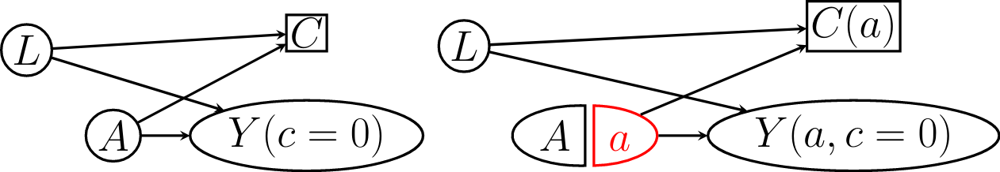

$\newcommand{\ci}{\perp\!\!\!\perp}$

# Example


- We are interested in the effect of drug $A$, an HIV treatment on preventing disease progression.

- We will use CD4 count as a measurement of disease progression. Our outcome $Y$ is 1 if CD4 count falls below a threshold within one year of starting treatment.  

- Some patients drop out of the study before the one year mark and we cannot observe their outcome.

- Patients may drop out if they are in poor health. This could occur if their disease progresses and their CD4 count drops or if they are experiencing side effects ( $L$ ) from the treatment.

- Use a variable $C$ (for censoring) to represent if a patient drops out of the study before one year ( $C = 1$ ) or not ( $C = 0$).

- With a partner, draw a DAG representing this scenario.

---

# HIV Treatment Example

<center>
```{r, echo = FALSE, out.width='90%', fig.align='left', message = FALSE, warning=FALSE}
library(DiagrammeR)
library(dplyr)
library(knitr)
library(kableExtra)

hiv_node0 <- create_node_df(n = 4, label = c("A", "Y", "L", "C"), 
                     fontname = "Helvetica", 
                     fontsize = 10, 
                     width = 0.3, 
                     fillcolor = "white", 
                     fontcolor = "black",
                     color = "black", 
                     shape = rep(c("circle", "square"), c(3, 1)),
                     x = c(0, 1, 1, 2)*0.8, 
                     y = c(0, 0, 1, 0)*0.8)
hiv_edge0 <- create_edge_df(from = c(1, 1, 2, 3 ), to = c(2, 3, 4, 4),
                          minlen = 1, 
                          color = "black", 
                          )
hiv_graph0 <- create_graph(nodes_df = hiv_node0, edges_df = hiv_edge0)

render_graph(hiv_graph0)
```
</center>

---

# HIV Treatment Example

- In this study, if we had been able to measure $Y$ for all patients, could we identify the effect of $A$ on $Y$ -- i.e. would we have $Y(a) \ci A$?

- With some data unobserved, can we identify the effect of $A$ on $Y$?
<center>
```{r, echo = FALSE, fig.height = 2.5}
render_graph(hiv_graph0)
```
</center>
--

- No. We have *selection bias*. 

- $C$ is a collider on a path between $Y$ and $L$. Conditioning on $C$ induces a correlation between $Y$ and $L$ and therefore a non-causal association between $Y$ and $A$. 


---

# HIV Treatment Example

- Suppose now that treatment has no side effects. 

- Treatment can only influence selection *through* its effect on $Y$.

<center>
```{r, echo = FALSE, fig.height = 2.5}
hiv_node <- create_node_df(n =3 , label = c("A", "Y", "C"), 
                     fontname = "Helvetica", 
                     fontsize = 10, 
                     width = 0.3, 
                     fillcolor = "white", 
                     fontcolor = "black",
                     color = "black", 
                     shape = rep(c("circle", "square"), c(2, 1)),
                     x = c(0, 1, 2)*0.8, 
                     y = c(0, 0, 0)*0.8)
hiv_edge <- create_edge_df(from = c(1, 2), to = c(2, 3),
                          minlen = 1, 
                          color = "black", 
                          )
hiv_graph <- create_graph(nodes_df = hiv_node, edges_df = hiv_edge)

render_graph(hiv_graph)
```
</center>

- Do we still have selection bias?

---

# Example Continued

- Suppose that $A$ is effective and 
- Patients with $Y = 0$ are more likely to remain in the study than patients with $Y = 1$.


$$P[Y = 1 \vert A = 0] = 0.8 \qquad P[Y = 1 \vert A = 1] = 0.1\\\
  P[C = 0 \vert Y = 0] = 1 \qquad P[C = 0 \vert Y = 1] = 0.5$$

- With your partner, compute the average causal effect of $A$ on $Y$ and compute
$E[Y \vert A = 1] - E[Y \vert A = 0]$ in the sub-population with $C =0$.

- Repeat your calculations assuming that there is no effect of $A$ on $Y$ and $P[Y = 1 \vert A =0 ] = P[Y = 1 \vert A =1] = p$.

<center>
```{r, echo = FALSE, fig.height = 2}
render_graph(hiv_graph)
```
</center>

---

# Example Continued

- In the scenario with a treatment effect: 

```{r, echo = FALSE}
 opts <- options(knitr.kable.NA = "")
full <- data.frame(A0 = c(0.2, 0.8), A1 = c(0.8, 0.2), sp = c(NA, NA))
C1 <- data.frame(A0 = c(0.2, 0.4)/0.6, A1 = c(0.8, 0.1)/0.9)


tot <- cbind(full,  C1)
row.names(full) <- row.names(C1) <- row.names(tot) <-  c("\\(Y=0\\)", "\\(Y=1\\)")
kable(tot, col.names = c( "\\(A=0\\)", "\\(A=1\\)", "", "\\(A=0\\)", "\\(A=1\\)"), 
      format = 'html', row.names = TRUE, digits = 2) %>%
  kable_styling(position = "center", full_width = FALSE) %>%
   add_header_above(c(" " = 1, "Full Data" = 2, " " = 1, "\\(C = 0\\)" = 2))

```

- The causal risk difference is -0.4.

- The associational risk difference among those with $C = 0$ is -0.56
---

# Example Continued

- In the scenario with no effect: 

```{r, echo = FALSE}
 opts <- options(knitr.kable.NA = "")
full <- data.frame(A0 = c("\\(1-p\\)", "\\(p\\)"), A1 = c("\\(1-p\\)", "\\(p\\)"), sp = c(NA, NA))
C1 <- data.frame(A0 = c("\\(\\frac{2-2p}{2-p}\\)", "\\(\\frac{p}{2-p}\\)"), A1 = c("\\(\\frac{2-2p}{2-p}\\)", "\\(\\frac{p}{2-p}\\)"))


tot <- cbind(full,  C1)
row.names(full) <- row.names(C1) <- row.names(tot) <-  c("\\(Y=0\\)", "\\(Y=1\\)")
kable(tot, col.names = c( "\\(A=0\\)", "\\(A=1\\)", "", "\\(A=0\\)", "\\(A=1\\)"), 
      format = 'html', row.names = TRUE, digits = 2) %>%
  kable_styling(position = "center", full_width = FALSE) %>%
   add_header_above(c(" " = 1, "Full Data" = 2, " " = 1, "\\(C = 0\\)" = 2))

```

- The causal risk difference is 0. 

- The associational risk difernce in the observed data is also 0. So there is no selection bias for the measure of association.

- However, in the observed data, $E[Y \vert A= a, C = 0] \neq E[Y(a)]$.
---

# Selection Bias Under the Null

- In both examples we have selection bias because $C$ is a common effect of both $A$ and $Y$.

- In the first case, this condition is true whether or not $A$ has a non-zero effect on $Y$ (*selection bias under the null*).

- In the second case (all of the effect of $A$ on $C$ is mediated by $Y$), this condition *only* occurs when there is a non-zero causal effect of $A$ on $Y$. 

- Selection bias under the null always implies selection bias in non-null settings.

- The reverse is not true (as we have seen).

---
# Colliding Creates Selection Bias

- Conditioning on a variable that is a child of both the outcome and the exposure creates selection bias.

- If the effect of the exposure on the selection variable is not entirely mediated by the outcome, we will have selection bias under the null.

- Recall that conditioning on the child of a collider will also open a path.

<center>
```{r, echo = FALSE, fig.height = 5}
#render_graph(hiv_graph)
ndf6 <- create_node_df(n =3 , label = c("A", "Y", "C"), 
                     fontname = "Helvetica", 
                     fontsize = 10, 
                     width = 0.3, 
                     fillcolor = "white", 
                     fontcolor = "black",
                     color = "black", 
                     shape = rep(c("circle", "square"), c(2, 1)),
                     x = c(0, 1, 0.5)*0.8 + 2.8, 
                     y = c(1, 1, 0)*0.8)
edf6 <- create_edge_df(from = c(1, 2, 1)+4, to = c(3, 3, 2)+4,
                          minlen = 1, 
                          color = "black", 
                          )
ndf7 <- create_node_df(n = 5, label = c("A", "Y", "L", "U", "C"), 
                     fontname = "Helvetica", 
                     fontsize = 10, 
                     width = 0.3, 
                     fillcolor = "white", 
                     fontcolor = "black",
                     color = "black", 
                     shape = rep(c("circle", "square"), c(4, 1)),
                     x = c(0, 1, 1, 2, 3)*0.8 + 1.5, 
                     y = c(0, 0, 1, 0, 0)*0.8 - 1.5)
edf7<- create_edge_df(from = c(1, 1, 2, 3, 4 ) + 7, to = c(2, 3, 4, 4, 5) + 7,
                          minlen = 1, 
                          color = "black", 
                          )
g6 <- create_graph(nodes_df = combine_ndfs(hiv_node0, ndf6, ndf7), edges_df = combine_edfs(hiv_edge0, edf6, edf7))
render_graph(g6)
```
</center>


---

# Selection Bias without Colliding

- In our previous HIV treatment example, suppose that low CD4 count does not directly cause censoring.

- Instead there is a variable $U$ representing health which is a common cause of both $Y$ and $S$. 

- We still have selection bias in this case, but $C$ is not a descendant of $Y$.

<center>
```{r, echo = FALSE, fig.height = 3.5}
hiv_node2 <- create_node_df(n =4 , label = c("A", "Y", "U", "C"), 
                     fontname = "Helvetica", 
                     fontsize = 10, 
                     width = 0.3, 
                     fillcolor = "white", 
                     fontcolor = "black",
                     color = "black", 
                     shape = rep(c("circle", "square"), c(3, 1)),
                     x = c(0, 2, 1, 2)*0.8, 
                     y = c(0, 1, 0, -1)*0.5)
hiv_edge2 <- create_edge_df(from = c(1, 3, 3), to = c(3, 2, 4),
                          minlen = 1, 
                          color = "black", 
                          )
hiv_graph2 <- create_graph(nodes_df = hiv_node2, edges_df = hiv_edge2)

render_graph(hiv_graph2)
```
</center>

---
# Selection Bias Definition


- Selection bias occurs when we condition on a variable which is a common effect of two variables.

- One must be either the treatment or *associated* with the treatment.

- The other must be the exposure or *associated* with the exposure. 

---

# Selection Could Happen Before the Outcome 


<center>
```{r, echo = FALSE, fig.height = 5}
ndf8 <- create_node_df(n =5 , label = c("A", "L", "C", "Y", "U"),
                     fontname = "Helvetica", 
                     fontsize = 10, 
                     width = 0.3, 
                     fillcolor = "white", 
                     fontcolor = "black",
                     color = "black", 
                     shape = rep(c("circle", "square", "circle"), c(2, 1, 2)),
                     x = c(0, 1, 2, 3, 2)*0.8, 
                     y = c(0, 0, 0,0,1)*0.5)
edf8 <- create_edge_df(from = c(1, 2, 5, 5), to = c(2, 3, 2, 4),
                          minlen = 1, 
                          color = "black", 
                          )
gr8 <- create_graph(nodes_df = ndf8, edges_df = edf8)

render_graph(gr8)
```
</center>


---

# Selection Could Happen Before the Exposure 


<center>
```{r, echo = FALSE, fig.height = 5}
ndf9 <- create_node_df(n =5 , label = c("L", "U", "C", "A", "Y"),
                     fontname = "Helvetica", 
                     fontsize = 10, 
                     width = 0.3, 
                     fillcolor = "white", 
                     fontcolor = "black",
                     color = "black", 
                     shape = rep(c("circle", "square", "circle"), c(2, 1, 2)),
                     x = c(0, 1,1,2,  3)*0.8, 
                     y = c(0, 1, -2, 0, 0)*0.5)
edf9 <- create_edge_df(from = c(1, 1, 2, 2), to = c(3, 4, 1, 5),
                          minlen = 1, 
                          color = "black", 
                          )
gr9 <- create_graph(nodes_df = ndf9, edges_df = edf9)

render_graph(gr9)
```
</center>


<!-- --- -->

<!-- # Extended Backdoor Criterion -->


---
# Augmenting DAGs

- The DAGs we have been drawing are harboring a hidden counterfactual. 

- The node $Y$ could be written as $Y(C = 0)$ -- the value of $Y$ that we would observe if nobody was censored.

- Our DAGs are missing the value of $Y$ that we actually observe, $Y^{obs}$ which is determined by $Y(C = 0)$ and $C$.

<center> 

```{r, echo=FALSE, fig.height  =3.5}
ndf10 <- create_node_df(n =6 , label = c("A", "L", "C", "Y(C=0)", "U", "Y@^{obs}"),
                     fontname = "Helvetica", 
                     fontsize = 10, 
                     width = 0.3, 
                     fillcolor = "white", 
                     fontcolor = "black",
                     color = "black", 
                     fixedsize =FALSE,
                     shape = c("circle", "circle", "square", "ellipse", "circle", "ellipse"),
                     x = c(0, 1, 2, 3, 2, 2.5)*0.8, 
                     y = c(0, 0, 0,0,1, -1.5)*0.5)
edf10 <- create_edge_df(from = c(1, 2, 5, 5, 4, 3), to = c(2, 3, 2, 4, 6, 6),
                          minlen = 1, 
                          color = "black", 
                          )
gr10 <- create_graph(nodes_df = ndf10, edges_df = edf10)

render_graph(gr10)
```

</center>


---
# Adjusting for Selection

- Under selection, we are interested in estimating the average of a joint intervention $Y(a, C = 0): 
  + First we intervene to set $C = 0$ for everyone (no more censoring).
  + Second we intervene and set $A = a$. 
  + The order doesn't matter. 

- We can use a two stage weighting procedure. 

- First we re-weight the data to look like the world in which nobody was censored. For this we need a set of variables $L_1$ such that
$$Y(a, C = 0) \ci C(a) \vert L_1$$

- We use a second set of weights to account for any confounding. So we need a set of variables $L_2$ such that

$$Y(a, C = 0) \ci A \vert L_2$$

- We will also need a modification of the positivity condition. 


---
# Adjusting for Selection 

- If $Y(a, C = 0) \ci C \vert L_1$, we can weight the data by $W^C = 1/P[ C = 0 \vert L_1, A]$

- For example, if half the participants with $L = l$ and $A = a$ were censored, the remaining individuals will receive weight 2. 

- If we need to do further adjustment for confounding, we can compute weights $W^A = 1/P[A = a \vert L_2]$

- Our total weights will be $W^C\cdot W^A$.

---

# IP Weighting Example 1

- Using the example from HR (modified fig 8.3), data follow the DAG below:


<center>
```{r, echo = FALSE, fig.height = 2.5}
ndf1 <- create_node_df(n =4 , label = c("A", "Y(C = 0)", "L", "C"), 
                     fontname = "Helvetica", 
                     fontsize = 10, 
                     width = 0.3, 
                     fillcolor = "white", 
                     fontcolor = "black",
                     color = "black", 
                     fixedsize = FALSE,
                     shape = c("circle", "ellipse", "circle", "square"),
                     x = c(0, 1.3, -0.5, 1)*0.8, 
                     y = c(0, 0, 1, 1)*0.5)
edf1 <- create_edge_df(from = c(1, 3, 3, 1), to = c(2, 2, 4, 4),
                          minlen = 1, 
                          color = rep(c("blue", "black"), c(1, 3)), 
                          )
gr1 <- create_graph(nodes_df = ndf1, edges_df = edf1)

render_graph(gr1)
```
</center>

- $L$ represents pre-existing heart disease. 

- $A$ is random assignment to a diet containing wasabi. 

- $Y$ indicates death by the end of the trial. 

- Some participants are lost to follow-up ( $C = 1$ ) due either to heart disease or the treatment assignment.

- There is no effect of $A$ on $Y$, though this is unknown to investigators.

---
# IP Weighting Example 1

<center> 

```{r, echo=FALSE, out.width="80%"}

```

</center>

- We must condition on $L$ to block the path between $Y(a, C = 0)$ and $C(a).$

- $Y(a, C = 0)$ is independent of $A$ unconditionally. 

- Since there is no confounding, we only need to compute $P[C = 0 \vert L, A]$ for all levels of $L$ and $A$. 


---
# IP Weighting Example 1

- The table shows $P[C = 0 \vert A, L]$ from the HR example.
<center> 
```{r, echo = FALSE}
 opts <- options(knitr.kable.NA = "")
X <- data.frame(A0 = c(1, 0.6), A1 = c(0.5, 0.2))

row.names(X) <- c("\\(Y=0\\)", "\\(Y=1\\)")
kable(X, col.names = c( "\\(A=0\\)", "\\(A=1\\)"), 
      format = 'html', row.names = TRUE, digits = 2)
```
</center>

- Individuals with $A = 0$ and $L = 0$ get weight 1 because they were never censored. 

- Individuals with $A = 1$ and $L =1$ get weight 5 because only 20\% of this strata were uncensored.

---

# Positivity and Consistency 

- In order to use IP weighting, we need $P[C = 0 \vert A, L] > 0$ in all strata of $A$ and $L$.

- We do not need $P[C = 1 \vert A, L] > 0$.

- We also need the the counterfactual outcome $Y(a, C = 0)$ to be well-defined. 
  + If $C$ is loss to follow-up, it makes sense to suppose that all patients were followed. 

- Suppose that $C$ is censoring due to death resulting from causes other than $A$. 
  + HR argue that it doesn't make sense to propose an intervention that that eliminates all other causes of death.
  
---
# IP Weighting Example 2

- In the previous example, we also could have stratified on $L$. 

- This doesn't always work. 

<center>
```{r, echo = FALSE, fig.height = 2.5}
ndf2 <- create_node_df(n =5 , label = c("A", "Y(C = 0)", "L", "C", "U"), 
                     fontname = "Helvetica", 
                     fontsize = 10, 
                     width = 0.3, 
                     fillcolor = "white", 
                     fontcolor = "black",
                     color = "black", 
                     fixedsize = FALSE,
                     shape = c("circle", "ellipse", "circle", "square", "circle"),
                     x = c(0, 3, 1,2, 2)*0.8, 
                     y = c(0, 0, 0, 0, 1)*0.8)
edf2 <- create_edge_df(from = c(1, 3, 5, 5), to = c(3, 4, 3, 2),
                          minlen = 1, 
                          color = "black" 
                          )
gr2 <- create_graph(nodes_df = ndf2, edges_df = edf2)

render_graph(gr2)
```
</center>


- In this case, stratifying by $L$ induces confounding through the backdoor path $A \rightarrow L \leftarrow U \rightarrow Y$.

- But weighting by $1/P[C = 0 \vert A, L]$ works.
---

# Sources of Selection Bias

- Differential loss to follow-up: Participants may drop out of the study for reasons related to the treatment or outcome.

- Non-response: Social stigmas may make people more likely to omit some kinds of information than others.
  
- Self-selection/volunteer bias: Some individuals may be more likely to volunteer for a study than others. 
  <!-- + For example, healthy people with a family history of cancer may be more likely to participate in a cancer study.  -->
  <!-- + If the study is advertised in particular places (e.g. on public transport), some people will be more likely to know about the study than others.  -->
  
- Healthy worker bias: Participants for a study of an occupational exposure on an outcome are recruited from among those who are at work on the day the exposure is measured.
  + People may be more likely to miss work for reasons directly related to the outcome or for 
  reasons that are associated with both outcome and exposure (e.g. SES).

---

# Case-Control Studies

- The graph from our first example could have described a case-control study. 

<center>
```{r, echo = FALSE, fig.height = 1.5}
render_graph(hiv_graph)
```
</center>

- Individuals are selected into the study based on their value of $Y$. 

- In this case, we are no longer able estimate the average counterfactuals or the causal risk ratio. 
- However, in this DAG, we can estimate the causal odds ratio due to cancellation. 
---
# Case-Control Studies

- Without censoring, $Y(a)$ and $A$ are exchangeable so $E[Y(a)]= E[Y \vert A]$.

- We only get to observe $E[Y \vert A, C = 0]$
$$
\text{OR} = \frac{P[Y = 1 \vert A ]}{P[Y = 0 \vert A ]}\\\
= \frac{P[Y = 1\vert A, C = 0]P[C = 0 \vert A]}{P[Y = 0\vert A, C = 0]P[C = 0 \vert A]} \\\
= \frac{P[Y = 1\vert A, C = 0]}{P[Y = 0\vert A, C = 0]}
$$
- So the association odds ratio is equal to the causal odds ratio. 

<center>
```{r, echo = FALSE, fig.height = 1.5}
render_graph(hiv_graph)
```
</center>

---
# Case-Control Studies

- If $Y$ is the only cause of selection, we can recover $E[Y(a)]$ by using outside information. 

- In our graph, $P[C = 0 \vert A] = P[C = 0 \vert Y]$ (from the causal Markov property).

- With a population estimate $P[Y]$ we can estimate $P[C = 0 \vert Y ] \propto \frac{\pi_Y}{P[Y]}$ where $\pi_Y$ is the proportion of study participants with outcome $Y$.  
<center>
```{r, echo = FALSE, fig.height = 1.5}
render_graph(hiv_graph)
```
</center>

---

# Selection Bias and Hazard Ratios

- Suppose we have a single treatment $A$ and then individuals are followed over time. 

- We are interested in estimating the counterfactual risk of death under treatment $a$ (or the RR comparing treatment $a$ and $a^\prime$ ). 

- For simplicity, assume we have two discrete time points and know 
  + $Y_1$: death  by time point 1
  + $Y_2$: death by time point 2
  
<center>
```{r, echo = FALSE, fig.height = 2.5}
ndf3 <- create_node_df(n =4 , label = c("A", "Y@_{2}", "Y@_{1}", "U"), 
                     fontname = "Helvetica", 
                     fontsize = 10, 
                     width = 0.3, 
                     fillcolor = "white", 
                     fontcolor = "black",
                     color = "black", 
                     
                     shape = "circle",
                     x = c(0, 2, 1, 1.5)*0.8, 
                     y = c(0, 0, 0, 1)*0.5)
edf3 <- create_edge_df(from = c(1, 4, 4, 3), to = c(3, 3, 2, 2),
                          minlen = 1, 
                          color = "black" 
                          )
gr3 <- create_graph(nodes_df = ndf3, edges_df = edf3)

render_graph(gr3)
```
</center>
  

---

# Hazard Ratios

- In this DAG, we can estimate the total causal effect of $A$ on both $Y_1$ and $Y_2$ since we have exchangeability for both. 
  - In both cases, the causal risk ratio is equal to the association risk ratio.


- The *hazard* at time 2 is the probability of dying by time 2 conditional on being alive at time 1 (for discrete time). 

- Based on our DAG, conditional on $Y_1$, there is no effect of $A$ on $Y_2$. 

- However, conditioning on $Y_1$ induces a non-causal association between $Y_2$ and $A$ through $U$. 

<center>
```{r, echo = FALSE, fig.height = 2.5}
ndf4 <- ndf3
ndf3$shape[3] <- "square"
gr3 <- create_graph(nodes_df = ndf3, edges_df = edf3)
render_graph(gr3)
```
</center>

---
# Hazard Ratios Example

- Suppose that $U$ is an indicator for being high-risk or low-risk.

- Suppose that the treatment kills all high-risk individuals by time 1 and has no effect for low-risk individuals.

- At time 2, the treatment group contains only low-risk individuals. The control group contains a mix of low and high-risk individuals.

- So the hazard ratio at time 2 will be less than 1 even though the treatment is not beneficial for any patients. 


<center>
```{r, echo = FALSE, fig.height = 2.5}
render_graph(gr3)
```
</center>


---
# Non-Compliance

- We perform a randomized trial of smoking cessation. 

- A population of current smokers with no immediate plans to quit are recruited. 

- Half the participants are assigned to quit smoking for six weeks, the other half are assigned to continue smoking as usual ( $Z$ ).

- We measure cardiovascular endurance at the beginning and end of the study. 

- Our outcome, $Y$, represents the change in endurance over 6 weeks. 


---
# Non-Compliance

- Suppose that both treatment groups have some rate of non-adherence to the treatment plan. 

  + There are some people who are assigned to quit and don't. 
  + Some people assigned to continue smoking are inspired by their study particpation and decide to quit anyway. 

- Let $A$ represent the actual treatment each person receives (quitting or not). 

- Let $U$ be a confounder that affects both adherence and change in endurance. 

- Draw a DAG of this scenario. 

---
# Non-Compliance

<center>
```{r, echo = FALSE, fig.height = 4}
ndf4$label[1:3] <- c("Z", "Y", "A")
ndf4$y[4] <- -0.5
ndf4$y[1] <- 0.5
ndf4$x[1] <- 0.2
ndf4$x <- ndf4$x*1.5
edf4 <- create_edge_df(from = c(1, 4, 4, 3,1), to = c(3, 3, 2, 2, 2),
                          minlen = 1, 
                          color = rep(c("black", "blue"), c(4, 5)) 
                          )
gr4 <- create_graph(nodes_df = ndf4, edges_df = edf4)
render_graph(gr4)
```
</center>

- The blue arrow may exist if knowledge of the treatment assignment alters participants behavior. 
  + People who are assigned to quit and don't may exercise more to "make up" for not quitting. 
  
- The blue arrow might be eliminated if it is possible to conceal the treatment from participants (*blinding*).

---

# Non-Compliance

- We would like to estimate $E[Y(a)]$ and 
   + $E[Y(A=1)] - E[Y(A = 0)]$, the *per-protocol (PP) effect*.
   + In this graph, the presence of $U$ means that $E[Y(a)]$ is not identifiable.

- We can identify $E[Y(z)]$. 
  + $E[Y(z =1)] - E[Y(z = 0)]$ is the *intention-to-treat (ITT) effect*. 
<center>
```{r, echo = FALSE, fig.height = 3.5}
render_graph(gr4)
```
</center>
---

# Pros of the ITT

- The ITT can be measured from the data without confounding and is therefore often preferred. 

- If we further assume that the blue arrow does not exist, then the following arguments are in favor of the ITT.

- The ITT preserves the null: If there is no effect of $A$ on $Y$ then there is no effect of $Z$ on $Y$. 

- If we further assume *monotonicity* ( $Y_i(1) \geq Y_i(0)$ for all individuals $i$ ), then the ITT effect is closer to zero than the PP effect, making the estimate conservative.


<center>
```{r, echo = FALSE, fig.height = 3}
render_graph(gr4)
```
</center>

---

# Cons of the ITT

- Conservativeness is not always good. 

  + For example, if we are looking for adverse effects of a medication, a conservative estimate is dangerous. 
  
- If montonicity does not hold, the ITT may be anti-conservative:

  + Suppose individuals who benefit from the treatment are more likely to comply than individuals who would be harmed by it.
  
- In some cases, assuming the blue arrow is not present is unreasonable. 
  + If the blue arrow is present the ITT may differ from the PP in any direction. 

---

# "As-Treated" Analysis to Estimate the PP Effect

- If we can measure confounding factors between $A$ and $Y$, we can estimate the PP effect using IP weighting or standardization. 

- In this case we are treating our trial data like observational data. 
  
- This is the "as-treated" analysis. 

<center>
```{r, echo = FALSE, fig.height = 3.5}
render_graph(gr4)
```
</center>

---
# "Per-Protocol" Analysis to Estimate the PP Effect

- Another commonly used alternative is to exclude all non-compliers from the analysis.  

- This approach introduces selection bias unless the the confounders $U$ are measured.

- So either way, we need to measure $U$. 

- Later we will see an alternative method, instrumental variable analysis, which requires some additional assumptions.

<center>
```{r, echo = FALSE, fig.height = 2.5}
ndf5 <- create_node_df(n =5 , label = c("Z", "Y", "A", "U", "C"), 
                     fontname = "Helvetica", 
                     fontsize = 10, 
                     width = 0.3, 
                     fillcolor = "white", 
                     fontcolor = "black",
                     color = "black", 
                     shape = rep(c("circle", "square"), c(4, 1)),
                     x = c(0.25, 2, 1, 1.5, 1.5)*1.2, 
                     y = c(0, 0, 0, -1, 1)*0.5)
edf5 <- create_edge_df(from = c(1, 4, 4, 3, 1, 3), to = c(3, 3, 2, 2, 5, 5),
                          minlen = 1, 
                          color = "black"
                          )
gr5 <- create_graph(nodes_df = ndf5, edges_df = edf5)

render_graph(gr5)
```
</center>

---

# Measurement Error

- The non-compliance problem is similar to a measurement error problem. 

  + $Z$ is like a mis-measured version of $A$. 

- More generally, measurements of $A$, $Y$, or other variables inaccurate. 

- We won't cover methods for accounting for measurment error, but it is important to be aware of. 


<center>
```{r, echo = FALSE, fig.height = 3.5}
ndf11 <- create_node_df(n =6 , label = c("U@_{A}", "A@^{*}", "A", "Y", "Y@^{*}", "U@_{Y}"), 
                     fontname = "Helvetica", 
                     fontsize = 10, 
                     width = 0.3, 
                     fillcolor = "white", 
                     fontcolor = "black",
                     color = "black", 
                     shape = "circle",
                     x = c(0, 0, 0, 1, 1, 1)*1, 
                     y = c(2, 1, 0, 0, 1,2)*0.5)
edf11 <- create_edge_df(from = c(1, 3, 3, 4, 6), to = c(2, 2,4, 5, 5 ),
                          minlen = 1, 
                          color = "black"
                          )
gr11 <- create_graph(nodes_df = ndf11, edges_df = edf11)

render_graph(gr11)
```
</center>

---

# Sources and Types of Measurement Error

- Measurement error is *independent* if $U_A$ is independent of $U_Y$

- Measurement error might be non-independent if $A$ and $Y$ are collected in the same survey.
  
- Measurement error is *non-differential* if $U_A$ and $U_Y$ are independent of $A$ and $Y$. 
- Differential error could occur in self-reported variables if participants tend to mis-report high or low values of $A$ or $Y$. 

- $Y$ might effect $U_A$ if $A$ is measured after some effect of $Y$ has already occurred, creating the appearance of reverse causation.

<center>
```{r, echo = FALSE, fig.height = 2.5}
edf11 <- create_edge_df(from = c(1, 3, 3, 4, 6, 4), to = c(2, 2,4, 5, 5, 1 ),
                          minlen = 1, 
                          color = "black"
                          )
ndf12 <- create_node_df(n =7 , label = c("U@_{A}", "A@^{*}", "A", "Y", "Y@^{*}", "U@_{Y}", "U@_{AY}"), 
                     fontname = "Helvetica", 
                     fontsize = 10, 
                     width = 0.3, 
                     fillcolor = "white", 
                     fontcolor = "black",
                     color = "black", 
                     shape = "circle",
                     x = c(0, 0, 0, 1, 1, 1, 0.5)*1 + 3.5, 
                     y = c(2, 1, 0, 0, 1,2, 3)*0.5)
edf12 <- create_edge_df(from = c(1, 3, 3, 4, 6, 7, 7) + 6, to = c(2, 2,4, 5, 5, 1, 6 ) + 6,
                          minlen = 1, 
                          color = "black"
                          )
gr12 <- create_graph(nodes_df = combine_ndfs(ndf11, ndf12), edges_df = combine_edfs(edf11, edf12))

render_graph(gr12)
```
</center>
  
