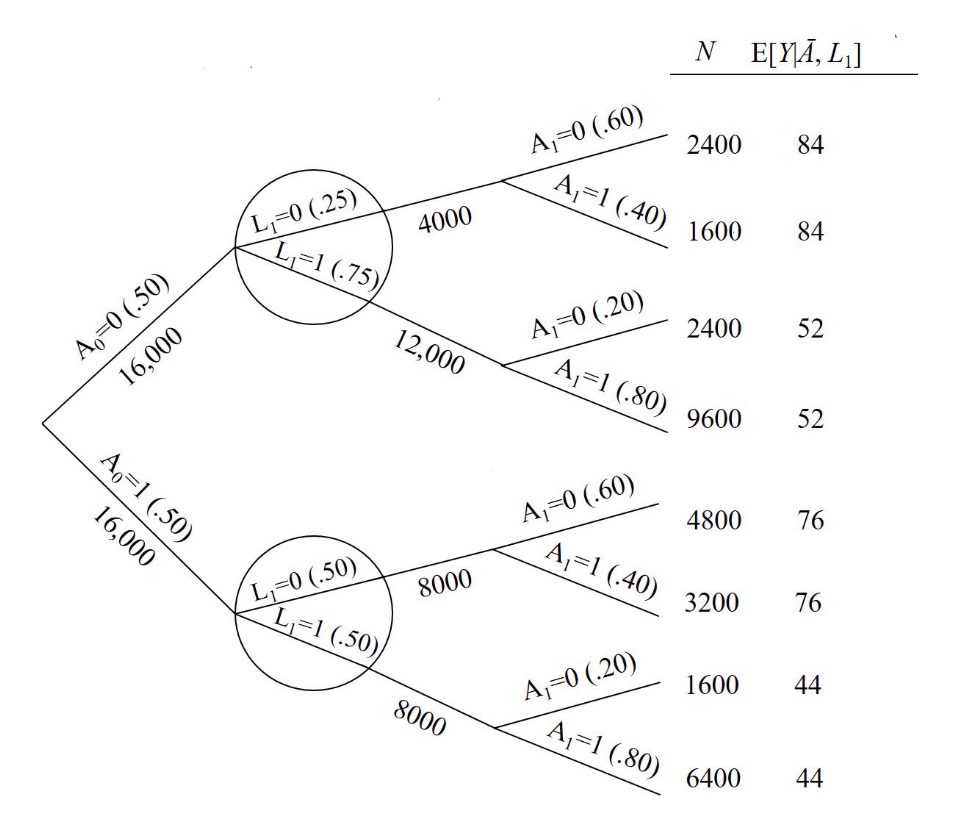

# Plan

$\newcommand{\ci}{\perp\!\!\!\perp}$

---
# Example 


- Patients are treated for a disease over time. 

- At each appointment, the treatment decision for the next period is made, possibly based on current or past symptoms. 

- We observe an outcome $Y$. 


<center>
```{r, echo = FALSE, fig.height = 3.5, warning=FALSE, message=FALSE}
library(DiagrammeR)
library(dplyr)
ndf2 <- create_node_df(n =5 , label = c("A@_{0}", "L@_{1}", "A@_{1}", "U", "Y"), 
                     fontname = "Helvetica", 
                     fontsize = 10, 
                     width = 0.3, 
                     fillcolor = "white", 
                     fontcolor = "black",
                     color = "black", 
                     x = c(0, 1, 2, 1, 3)*0.5, 
                     y = c(0, -1, 0, -2, 0)*0.6)
edf2 <- create_edge_df(from = c(1,  2, 3, 4, 4), to = c(2, 3, 5, 2, 5),
                          minlen = 1, 
                          color = "black" 
                          )
gr2 <- create_graph(nodes_df = ndf2, edges_df = edf2)

render_graph(gr2)
```
</center>

---
# Notation and Conventions

- Bar notation indicates the history of a variable $\bar{A}_k = (A_1, \dots, A_k)$.

- In statistical time, $A_k$ is the last variable at time $k$. 
  + Covariates $L_k$ are measuerments that are taken after treatment $A_{k-1}$ is given but before treatment $A_k$ is given. 
  
- Timing aligns for all units. 
  + We will often talk about time points as though they are evenly spaced (e.g. every month), but this is not required. 

- Time starts at 0. 

---
# Treatment Programs

- In this setting, we might be interested in the effect of the entire course of treatment $\bar{A} = (A_0, A_1)$. 
  - We are modeling a joint intervention. 
  
- With 2 time points, there are only four treatment strategies. 

- With $k$ time points there are $2^k$ treatment strategies. 

- How do we know which to compare?

---
# Treatment Strategies

- A treatment strategy is a rule for determining $A_k$ from a unit's past covariate values

$$g = (g_0(\bar{a}_{-1}, l_0), \dots, g_K(\bar{a}_{K-1}, \bar{l}_k))$$

- A treatment strategy is static if it does not depend on any covariates, only past treatments. 
  + In a static strategy, we could write out the entire program at the beginning of the study. 
  + Ex: Treat every other month
  + Ex: Treat for only the first two time points. 
  
- A treatment strategy is dynamic if it does depend on covariates. 
  + Ex: Treat if $L_{k-1}$ was high. 
  + Ex: If $L_{k-1}$ is high, switch treatment, so $A_{k} = 1-A_{k-1}$. Otherwise set $A_k = A_{k-1}$. 

---
# Sequentially Randomized Trials

- In a sequentially randomized trial, treatment $A_{k,i}$ is assigned randomly with $P[A_{k,i} = a]$ possibly depending on $\bar{A}_{k-1}$ and $\bar{L}_{k-1}$. 

--

- Example: Every patient starts on treatment 0. Every month a random set of patients are assigned to switch to treatment 1 and stay on that treatment for the rest of the study. 
      - Patients with high values of $L_{k}$ may have a higher probability of starting treatment. 
      
- Example: Treatment is assigned randomly at every time point. 
      - Patients with high values of $L_{k}$ have a higher probability of switching treatments. 

--

- A random strategy will never be as good as the optimal deterministic strategy.

  + We would never recommend a random strategy for general treatment of patients.
  + But random strategies are necessary when the optimal strategy is unknown. 

---
# Causal Contrasts

- The causal contrast we choose to look at will depend on the study. 

- We might be interested in comparing specific fixed programs, $E[Y(\bar{A} = \bar{a}_1)] - E[Y(\bar{A} = \bar{a}_2)]$ such as 
  + Always treat vs never treat: $\bar{a}_1 = (0, 0, \dots, 0)$, $\bar{a}_2 = (1, 1, \dots, 1)$
  + Treat early and continue vs begin treatment later and continue: $\bar{a}_1 = (1, 1, \dots, 1)$, $\bar{a}_2 = (0,\dots, 0, 1, \dots, 1)$.
  
- Or we could compare one or more dynamic strategies $g$, $E[Y(g)]$ such as:
  + Always treat vs treat only when symptoms are present. 

---
# DAG 1

- With your partner(s), draw a DAG for two time points for the following scenario:

- Patients are enrolled in a randomized trial of HIV medication. 

- At each time point CD4 count ( $L$ ) is measured. CD4 count is affected by the most recent treatment and the most recent past value of CD4 count.  

- Probability of receiving treatment 1 at time $k$ depends on CD4 count at time $k$, but not on past treatment or past CD4 count measurements.

- The outcome $Y$ depends on treatment at all time points but does not depend on CD4 count. 

---
# DAG 1


---
# DAG 2

- To your DAG add  an unmeasured variable $U$ which is also time-varying. 

  + $U$ represents disease progression. 
  
- $U$ at time $k$  is affected by the most recent treatment value and most recent past value of $U$. 
- $U$ at time $k$ affects CD4 count at time $k$, the next value of $U$, and $Y$.

- You can assume that $U_k$ is statistically before $L_k$. 


---
# DAG 3

- Draw the same scenario except that treatment $A_k$ does not depend on CD4 count but does depend on the most recent treatment $A_{k-1}$. 

---
# DAG 4

- Suppose that we now have an observational study. 

- Patients have checkups once a month. At each appointment, treatment is adjusted. 

- Doctors will take into account past treatment, current values of $L$, and other factors which are affected by $U$. 

---
# SWIGs for Static Strategies

- Draw a SWIG for the DAG below for the treatment strategy $(A_0 = a_0, A_1 = a_1).$

<center> 

```{r, echo=FALSE, out.width="55%"}
knitr::include_graphics("img/9_dag2s.png")
```

</center>

---
# SWIGs for Static Strategies

- Draw a SWIG for the DAG below for the treatment strategy $(A_0 = a_0, A_1 = a_1).$

<center> 

```{r, echo=FALSE, out.width="85%"}
knitr::include_graphics("img/9_swig2s.png")
```

</center>
---
# Static Sequential Exchangeability 

- Static sequential exchangeability says that

$$Y(\bar{a}) \ci A_k \vert\ \bar{A}_{k-1} = \bar{a}_{k-1}, \bar{L}_k\qquad k = 0, 1, \dots K$$
- Does static sequential exchangeability hold in our example?

<center> 
```{r, echo=FALSE, out.width="65%"}
knitr::include_graphics("img/9_swig2s.png")
```
</center>

---
# Static Sequential Exchangeability 

- We can see that $Y(a_0, a_1) \ci A_0$ ( $A_0$ is disconnected)

- In the SWIG we have $Y(a_0, a_1) \ci A_1(a_0) \vert A_0 = a_0, L_1(a_0)$. 
  + By consistency $A_0 = a_0 \Rightarrow A_1 = A_1(a_0)$ and 
  + $A_0 = a_0 \Rightarrow L_1 = L_1(a_0)$
  
- So $Y(a_0, a_1) \ci A_1 \vert A_0 = a_0, L_1$

<center> 
```{r, echo=FALSE, out.width="60%"}
knitr::include_graphics("img/9_swig2s.png")
```
</center>


---
# Static Sequential Exchangeability

- Does static sequential exchangeability hold in the SWIG below?

<center> 
```{r, echo=FALSE, out.width="80%"}
knitr::include_graphics("img/9_swig3.png")
```
</center>

---
# Static Sequential Exchangeability

- Does static sequential exchangeability hold in the SWIG below?

<center> 
```{r, echo=FALSE, out.width="80%"}
knitr::include_graphics("img/9_swig4.png")
```
</center>


---

# SWIGS for Dynamic Treatment Strategies

- Suppose that we want to estimate the counterfactual $E[Y(g)]$ where $g$ is a dynamic treatment strategy "treat only if $L_k = 1$".
  
+ Recall that the SWIG represents the hypothetical world of the intervention, not the world in which I collected my data. 

- Our intervention *introduces an arrow* from $L_1(g_0)$ to the value of $A_1$ under the intervention. 

<center> 
```{r, echo=FALSE, out.width="75%"}
knitr::include_graphics("img/9_swig2dyn.png")
```
</center> 

---

# SWIGS for Dynamic Treatment Strategies

- The dotted arrow is created by the proposed intervention.

  + It is not a result of the experimental design or underlying causal structure. 

- The dotted arrow functions just like a solid arrow for computing d-separation. 

  + It is dotted so that we know it was introduced by the intervention.
  

<center> 
```{r, echo=FALSE, out.width="75%"}
knitr::include_graphics("img/9_swig2dyn.png")
```
</center> 

---
# Sequential Exchangeability for Dynamic Treatment Strategies

- Sequential exchangeability for $Y(g)$ holds if 

$$Y(g) \ci A_k \vert \bar{A}_{k-1} = g(\bar{A}_{k-2}, \bar{L}_{k-1}), \bar{L}_k \qquad  k = 0, 1, \dots, K$$
- This definition applies if $g$ is static or dynamic, random or deterministic. 


- Also called *sequential conditional exchangeability*

---

# Sequential Exchangeability for Dynamic Treatment Strategies

- Does sequential exchangeability hold for $Y(g)$ in the dynamic intervention?

<center> 
```{r, echo=FALSE, out.width="75%"}
knitr::include_graphics("img/9_swig2dyn.png")
```
</center> 

--


- We can see that $Y(g) \ci A_0$ and $Y(g) \ci A_1(g_0) \vert\ L_1(g_0), A_0 = g_0$

- Using consistency $Y(g) \ci A_1 \vert L_1, A_0 = g_0$

---

# Sequential Exchangeability for Dynamic Treatment Strategies

<center> 
```{r, echo=FALSE, out.width="75%"}
knitr::include_graphics("img/9_swig3dyn.png")
```
</center> 

--

- We don't have $Y(g) \ci A_0$

  + They are connected by the $A_0 - W_0 - L_1(g_0) - g_1 - Y(g)$ path
  + The $g_1$ node does not block the path because it's not fixed.
  
---

# Positivity 

- Let $f_{\bar{A}_{k-1}, \bar{L}_k}$ be the joint pdf for the treatment history before point $k$ and the covariate history. 

- For time-varying treatment, positivity requires that

$$f_{\bar{A}_{k-1}, \bar{L}_k}(\bar{a}_{k-1}, \bar{l}_k) > 0 \Rightarrow f_{A_{k} \vert \bar{A}_{k-1}, \bar{L}_k}(a_k \vert \bar{a}_{k-1}, \bar{l}_k) > 0$$
- If we are interested in a particular strategy, $g$, the condition only needs to hold for treatment histories compatible with $g$ ( $a_k = g(\bar{a}_{k-1}, \bar{l}_k)$ ).

- This condition says that given past treatment history and covariates, any treatment consistent with the strategy should be possible.

---
# Consistency 

- For a point treatment, consistency requires that $A = a \Rightarrow Y(a) = Y$. 

- For a static strategy, the condition $\bar{A} = \bar{a} \Rightarrow Y(\bar{a}) = Y$ is sufficient.

- For dynamic strategies, if $A_k = g_k(\bar{A}_{k-1}, \bar{L}_k)$ for all $k$ then $Y(g) = Y$. 

---
# Estimation for Static Treatment Strategies

- Consider our previous example:

<center> 
```{r, echo=FALSE, out.width="55%"}
knitr::include_graphics("img/9_dag2sw.png")
```
</center> 

- In this example, we could estimate the average effect of $A_0$ or the average effect of $A_1$ using our previous techniques. 

- Suppose we want to compare the strategy always treat $Y(1, 1)$ with the strategy never treat $Y(0, 0)$.

<!-- - Can we use our previous strategies to estimate the joint counterfactuals $Y(1,1)$ and $Y(0,0)$? -->

---
# Example

- Data below were aggregated from a trial of 320,000 units.

  + The trial conforms to our previous DAG. 
  + Treatment at time 0 is random with probability 0.5. 
  + Treatment at time 1 depends only on $L_1$: $P[A_1 = 1 \vert L_1 = 1] = 0.8$, $P[A_1 = 1 \vert L_1 = 0] = 0.4$.
  + In these data, there is no effect of treatment on $Y$. 

```{r, echo = FALSE, warning=FALSE, message = FALSE}
library(knitr)
library(kableExtra)
dat <- data.frame(N = c(2400, 1600, 2400, 9600, 4800, 3200, 1600, 6400), 
                  A0 = rep(c(0, 1), each = 4), 
                  L1 = rep(rep(c(0, 1), each= 2), 2), 
                  A1 = rep(c(0, 1), 4), 
                  Y = rep(c(84, 52, 76, 44), each = 2))
dat1 <- dat[1:4,]
dat2 <- dat[5:8,]
knitr::kable(dat1, col.names = c("N", "\\(A_{0}\\)","\\(L_{1}\\)", "\\(A_{1}\\)", "\\(\\bar{Y}\\)"), format = 'html')  %>%
  kable_styling(position = "float_left", full_width = FALSE)
knitr::kable(dat2, col.names = c("N", "\\(A_{0}\\)","\\(L_{1}\\)", "\\(A_{1}\\)", "\\(\\bar{Y}\\)"), format = 'html', row.names = FALSE)  %>%
  kable_styling(position = "center", full_width = FALSE)
```

---
# Example
```{r, echo = FALSE, warning=FALSE, message = FALSE}
knitr::kable(dat1, col.names = c("N", "\\(A_{0}\\)","\\(L_{1}\\)", "\\(A_{1}\\)", "\\(\\bar{Y}\\)"), format = 'html')  %>%
  kable_styling(position = "float_left", full_width = FALSE)
knitr::kable(dat2, col.names = c("N", "\\(A_{0}\\)","\\(L_{1}\\)", "\\(A_{1}\\)", "\\(\\bar{Y}\\)"), format = 'html', row.names = FALSE)  %>%
  kable_styling(position = "center", full_width = FALSE)
```

+ Within each stratum of $(A_0, L_1)$, there is no treatment effect. 

+ There is also no average effect of $A_0$: 
  + $E[Y \vert A_0 = 0] = \frac{40\cdot 84 + 120 \cdot 52}{160} = 60$
  + $E[Y \vert A_0 = 1] = \frac{80\cdot 76 + 80 \cdot 44}{160} = 60$


---
# Example
```{r, echo = FALSE, warning=FALSE, message = FALSE}
knitr::kable(dat1, col.names = c("N", "\\(A_{0}\\)","\\(L_{1}\\)", "\\(A_{1}\\)", "\\(\\bar{Y}\\)"), format = 'html')  %>%
  kable_styling(position = "float_left", full_width = FALSE)
knitr::kable(dat2, col.names = c("N", "\\(A_{0}\\)","\\(L_{1}\\)", "\\(A_{1}\\)", "\\(\\bar{Y}\\)"), format = 'html', row.names = FALSE)  %>%
  kable_styling(position = "center", full_width = FALSE)
```

- We want to estimate $E[Y(1,1)] - E[Y(0, 0)]$

- We could try computing the associational difference $E[Y \vert A_0 = 1, A_1 = 1] - E[Y \vert A_0 = 0, A_1 = 0]$:

  + $E[Y \vert A_0 = 1, A_1 = 1] = \frac{32\cdot 76 + 64 \cdot 44}{96} = 54.67$ 
  + $E[Y \vert A_0 = 0, A_1 = 0] = \frac{24 \cdot 84 + 24 \cdot 52}{48} = 68$
  
--

- Problem: We have confounding from $L_1$. 

---
# Example
```{r, echo = FALSE, warning=FALSE, message = FALSE}
knitr::kable(dat1, col.names = c("N", "\\(A_{0}\\)","\\(L_{1}\\)", "\\(A_{1}\\)", "\\(\\bar{Y}\\)"), format = 'html')  %>%
  kable_styling(position = "float_left", full_width = FALSE)
knitr::kable(dat2, col.names = c("N", "\\(A_{0}\\)","\\(L_{1}\\)", "\\(A_{1}\\)", "\\(\\bar{Y}\\)"), format = 'html', row.names = FALSE)  %>%
  kable_styling(position = "center", full_width = FALSE)
```

- To account for confounding by $L_1$, we could try computing the associational difference within strata of $L_1$ and then standardizing. 

- Stratifying on $L_1$: 

$$E[Y \vert A_0 = 1, A_1 = 1, L_1 = 0]  - E[Y \vert A_0 = 0, A_1 = 0, L_1 = 0] = 76-84 = -8$$
$$E[Y \vert A_0 = 1, A_1 = 1, L_1 = 1]  - E[Y \vert A_0 = 0, A_1 = 0, L_1 = 1] = 44-52 = -8$$

--

- Problem: $L_1$ is a collider. Conditioning on $L_1$ induces an association between $A_0$ and $Y$. 


---
# G-Formula

- The g-formula for point treatments has been the basis of IPW, standardization, and double robust methods we have seen so far:
$$E[Y(a)] = \sum_l E[Y \vert A = a, L = l]f_L(l)$$
- Integral version for continuous $L$, 

$$E[Y(a)] = \int_{l} E[Y \vert A = a, L = l] d F_L(l)$$

- To derive this, we used the iterated expectation formula, exchangeability, and consistency:

$$E[Y(a)] = E_L[ E_Y[ Y(a) \vert L]] = \\\
E_L[ E_Y[ Y(a) \vert A = a, L]] = \\\
E_{L}[E[Y \vert A = a, L] = \int_l E[Y \vert A = a, L = l] dF_L(l)$$


---
# G-Formula for Static Treatment Strategies

- With two time points, we can use the same strategy:

$$E[Y(a_0, a_1)] = E_{L_1} [ E_{Y}[Y(a_0, a_1) \vert L_1]] = \\\
E_{L_1} [ E_{Y}[Y(a_0, a_1) \vert A_0 = a_0, A_1 = a_1, L_1]] = \\\
\int_{l}E[Y(a_0, a_1) \vert A_0 = a_0, A_1 = a_1, L_1 = l]d F_{L_1 \vert A_0}(l \vert a_0) = \\\
\int_{l}E[Y \vert A_0 = a_0, A_1 = a_1, L_1 = l]d F_{L_1 \vert A_0}(l \vert a_0)$$


or

$$E[Y(a_0, a_1)] = \sum_l E[Y \vert A_0 = a_0, A_1 = a_1, L_1 = l]f_{L_1 \vert A_0}(l \vert a_0)$$
- This formula holds if sequential conditional exchangeability, positivity, and consistency hold.

---
# G-Formula for Our Example

```{r, echo = FALSE, warning=FALSE, message = FALSE}
knitr::kable(dat1, col.names = c("N", "\\(A_{0}\\)","\\(L_{1}\\)", "\\(A_{1}\\)", "\\(\\bar{Y}\\)"), format = 'html')  %>%
  kable_styling(position = "float_left", full_width = FALSE)
knitr::kable(dat2, col.names = c("N", "\\(A_{0}\\)","\\(L_{1}\\)", "\\(A_{1}\\)", "\\(\\bar{Y}\\)"), format = 'html', row.names = FALSE)  %>%
  kable_styling(position = "center", full_width = FALSE)
```

$$E[Y(a_0, a_1)] = \sum_l E[Y \vert A_0 = a_0, A_1 = a_1, L_1 = l]f_{L_1 \vert A_0}(l \vert a_0)$$

+ $E[Y \vert A_0 = 1, A_1 = 1, L_1 = 0]P[L_1 = 0 \vert A_0 = 1] = 76 \cdot \frac{1}{2} = 38$
+ $E[Y \vert A_0 = 1, A_1 = 1, L_1 = 1]P[L_1 = 1 \vert A_0 = 1] = 44 \cdot \frac{1}{2} = 22$
+ $E[Y(1, 1)] = 38 + 22 = 60$

+ $E[Y \vert A_0 = 0, A_1 = 0, L_1 = 0]P[L_1 = 0 \vert A_0 = 0] = 84 \cdot \frac{1}{4} = 21$
+ $E[Y \vert A_0 = 0, A_1 = 0, L_1 = 1]P[L_1 = 1 \vert A_0 = 0] = 52 \cdot \frac{3}{4} = 39$
+ $E[Y(1, 1)] = 21 + 39 = 60$

---

# General Version of G-Formula for Static Treatments

- The $G$-formula for a static treatment strategy generalizes to 

$$E[Y(\bar{a})] = \sum_\bar{l} E[Y \vert \bar{A} = \bar{a},\bar{L}= \bar{l}]\prod_{k = 0}^Kf(l_k \vert \bar{a}_{k-1}, \bar{l}_{k-1})$$
or

$$\int_l E[Y \vert \bar{A} = \bar{a},\bar{L}= \bar{l}] \prod_{k = 0}^K dF (l_k \vert \bar{a}_{k-1}, \bar{l}_{k-1})$$

---
# G-Formula for Dynamic Treatment Strategies

- In a static deterministic strategy $a_k$ is completely determined by treatment and confounder history. 

- For dynamic or random strategies, this is the case and we need to add a term to the g-formula.

$$E[Y(\bar{a})] = \sum_\bar{l} E[Y \vert \bar{A} = \bar{a},\bar{L}= \bar{l}]\prod_{k = 0}^Kf(l_k \vert \bar{a}_{k-1}, \bar{l}_{k-1})\prod_{k=0}^K f^{int}(a_k \vert \bar{a}_{k-1}, \bar{l}_k)$$

- $f^{int}$ is the conditional probability of $a_k$ given the history *under the proposed intervention*.

---
# Inverse Probability Weighting

- We can generalize the IPW strategy we have been using for a point treatment to the time-varying regime. 

$$W^A = \prod_{k = 0}^{K} \frac{1}{f(A_k \vert \bar{A}_{k-1}, \bar{L}_{k})}$$

--

- As before, we can stabilize the weights as 

$$SW^A = \prod_{k = 0}^{K} \frac{f(A_k \vert \bar{A}_{k-1})}{f(A_k \vert \bar{A}_{k-1}, \bar{L}_{k})}$$
---
# Inverse Probability Weighting

- Just like before, weighting subjects creates a pseudo-population in which treatment and confounders are uncorrelated. 

- So we can compute the counterfactual as simply the conditional mean in the pseudo-population

$$E[Y(a_0, a_1)] = E_{ps}[Y \vert A_0 = a_0, A_1 = a_1]$$


---
# IP Weighting Example

<center> 

```{r, echo=FALSE, out.width="60%"}

```

</center>

- Compute unstabilized weights in the example

- Compute the sample size in each stratum. How big is the pseudo-population?

---

# IP Weighting Example

<center> 

```{r, echo=FALSE, out.width="65%"}

```
</center>

- Compute stabilized weights in the example

- How big is the pseudo-population created by the stabilized weights?

---
# IP Weighting Example


<center> 

```{r, echo=FALSE, out.width="80%"}
knitr::include_graphics("img/9_fig213.png")
```
</center>

---
# Estimating Weights

- In practice we will probably need to fit a parametric model for $f(A_k \vert \bar{A}_{k-1}, \bar{L}_k)$

- We could fit one model (e.g. logistic regression) at each time point. 

- Or we could pool time points and fit a single model that includes time effects and possibly time interactions. 

---
# Marginal Structural Models

- So far, we have considered a fully saturated model, estimating $E[Y(\bar{a})]$ as $E_{ps}[Y \vert \bar{A} = \bar{a}]$. 

- However, there are $2^K$ possible static treatment strategies. It is possible that nobody in the data experienced exactly the treatment strategy we are intrested in. 

- We can propose a marginal structural mean model to combine information, for example

$$E[Y(\bar{a})] = \beta_0 + \beta_1 \left(\sum_{k = 1}^K a_k\right)$$

- This model proposes that the counterfactual $Y(\bar{a})$ only depends on the cumulative amount of treatment received. 

---
# Marginal Structural Models


- Once we have proposed a marginal structural mean model, we can fit it using the pseudo-population created by weighting the data.

$$E_{ps}[Y \vert \bar{A}] = \beta_0 + \beta_1 \left(\sum_{k = 1}^K A_k\right)$$

- $\hat{\beta}_1$ estimates the causal effect of increasing the number of treated periods by 1. 

- Variance of from bootstrap or, conservatively, from robust sandwich estimator. 

- Testing that $\hat{\beta}_1 = 0$ gives a test of the strong null:

  + Treatment at any time is unrelated to outcome, $Y(\bar{a}) = Y$ for all $\bar{a}$.

---
# Assumptions

- For correct inference using IP weighting + a marginal structural model we need:

--

- Consistency, sequential positivity, sequential conditional exchangeability

- Correct propensity-score model

- Correct marginal structural model

---
# Parametric G-Formula

- When we only had a single point intervention, we could use outcome regression plus standardization as a plug-in estimator of the g-formula.

- There is an analog of this strategy for time-varying treatments. 

- With a single treatment, we needed to estimate $E[Y \vert A, L]$ but not $f_L(l)$, the density of covariates.

+ To estimate $E[Y(a)]$ we replace each persons treatment value with $a$ and then estimate $\hat{Y}_i(a) = \hat{E}[Y \vert A = a_0, L = L_i]$. 

+ We can then approximate the integral 
    
      $$\int_l E[Y \vert A, L = l]f_L(l) dl$$
with the sum $$\frac{1}{N} \sum_{i = 1}^N \hat{Y}_i(a)$$

---
# Parametric G-Formula

$$\int E[Y \vert \bar{A} = \bar{a},\bar{L}= \bar{l}] \prod_{k = 0}^K dF (l_k \vert \bar{a}_{k-1}, \bar{l}_{k-1})$$

- In the time-varying g-formula, we clearly need to estimate $E[Y \vert \bar{A}, \bar{L}]$. 

- Can we use our same standardization trick?

--

- No

--

- Imagine we try the standardization trick with two time points: 

- We first set $A_0 = a_0$ and $A_1 = a_1$ for everyone in the data set.

- What is the problem?

--

- The value of the covariates $L_1$ probably depends on $A$. We would need to replace $L_1$ with $L_1(a_0)$ but these values are not observed.
 
---
# Simulating Covariates

- We need to propose a parametric model for $f(l_k \vert \bar{a}_{k-1}, \bar{l}_{k-1})$. 

- We can then simulate covariate histories conditional on the intervention of interest from our estimated model. 

- Finally, we compute $E[Y(\bar{a})]$ by standardizing over the data set with simulated covariates replaced.

---
# Simulating Covariates

- Since we are simulating, we might as well create more data. 

- One option: 

  + Pick some large number $S$. Resample $S$ units from the original data set with replacement.
  + Keep the original baseline covariates. 
  + Use the fitted model to fill in time-dependent covariates with simulated values. 
  
- We could also be used for dynamic treatment strategies. 

  + At each time point the values of $A_{k,i}$ will be replaced with the treatment they should receive under the intervention given their treatment history and simulated covariate history. 

---
# Assumptions

- For valid inference using the parametric g-formula we need:

- Consistency, sequential positivity, sequential conditional exchangeability

- Correct model for $E[Y \vert \bar{A}, \bar{L}]$

- Correct model for the density of $L_k$ given covariate and treatment history. 


---
# G-Null Paradox 

- In the DAG, the strict null holds - there is no effect of treatment at any time on $Y$. 

- However $Y$ is correlated with $A_0$ and $A_1$ due to the confounder $U$. 

- So $E[Y \vert L_1, A_0, A_1]$ will be a function of $A_0$ and $A_1$.

- So will our estimate of $f(L_1 \vert A_0)$

<center>
```{r, echo = FALSE, fig.height = 3.5, warning=FALSE, message=FALSE}
edf2 <- create_edge_df(from = c(1,  2,  4, 4), to = c(2, 3, 2, 5),
                          minlen = 1, 
                          color = "black" 
                          )
gr2 <- create_graph(nodes_df = ndf2, edges_df = edf2)

render_graph(gr2)
```
</center>

---
# G-Null Paradox 

- Robins and Wasserman (1997) show that unless the parametric models are saturated, parametric models cannot correctly represent the g-formula under the null. 

- Suppose $L_1$ is binary and $A_1$ and $A_0$ are continuous. 

- We fit the models 
$$E[Y \vert l_1, a_1, a_0] = g(l_1, a_1, a_0; \theta) = \theta_0 + \theta_1 l_1 + \theta_2 a_1 + \theta_3 a_0$$
$$P(L_1 = 1 \vert a_0) = r(l_1 = 1, a_0; \beta)  = \frac{\exp(\beta_0 + \beta_1 a_0)}{1 + \exp(\beta_0 + \beta_1 a_0)}$$
- Plugging into the g-formula

$$h(a_1, a_0; \theta, \beta) = \sum_{l = 0}^1 g(l, a_1, a_0; \theta)r(l, a_0; \beta)  = \theta_0 + \theta_2 a_1 + \theta_3 a_0 + \theta_1 \frac{\exp(\beta_0 + \beta_1 a_0)}{1 + \exp(\beta_0 + \beta_1 a_0)}$$

---
# G-Null Paradox 

- In order to yield the correct answer, $h(a_1, a_0; \theta, \beta)$ should not depend on $a_0$ or $a_1$.

- This only occurs if $\theta_2$, $\theta_3$, and $\beta_1$ are all 0. 
  + But this can't occur because we know $Y$ is correlated with $A_1$ and $A_0$
  
- If we had access to $U$ and could model it correctly, this wouldn't be a problem.


---
# Beyond the Strict Null

- It may be impossible to correctly specify the parametric G-formula even when the strict null does not hold.

- For example, the problem occurs in the DAG below where there is an effect only of $A_1$ on $Y$ using the same model we've been using. 

- McGrath, Young, and Hernán (2022) show that non-negligible bias can occur in non-null models even using flexible model specifications. 

- Previous results show that in at least some settings, bias from the g-null paradox is negligible. 


<center>
```{r, echo = FALSE, fig.height = 3.5, warning=FALSE, message=FALSE}
edf2 <- create_edge_df(from = c(1,  2,  4, 4, 3), to = c(2, 3, 2, 5, 5),
                          minlen = 1, 
                          color = "black" 
                          )
gr2 <- create_graph(nodes_df = ndf2, edges_df = edf2)

render_graph(gr2)
```
</center>


---
# G-Null Paradox

- By contrast, using marginal structural models with IP weighting,

- Under the strict null, $E[Y(\bar{a})]$ does not depend on $\bar{a}$. 

- Under the strict null, the marginal structural mean model will never be mis-specified (as long as it contains an intercept parameter). 

- So the IP weighting method does not suffer from the g-null paradox. 

---
# Parametric G-Formula Implementation

- The R package `gfoRmula` implements the estimation and simulation procedure we have described. 

- Can handle:
  
  + Binary and continuous outcomes
  + Time to event outcomes

- Can estimate effects of both static and dynamic treatments.

- Allows a variety of specifications for outcome model and covariate models including lagged effects and cumulative effects. 


---
# Doubly Robust Estimator


