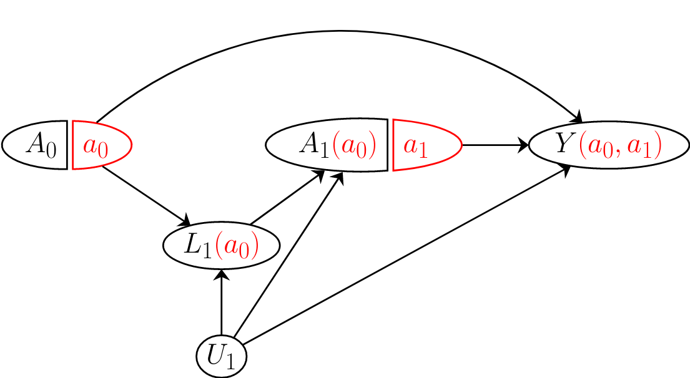
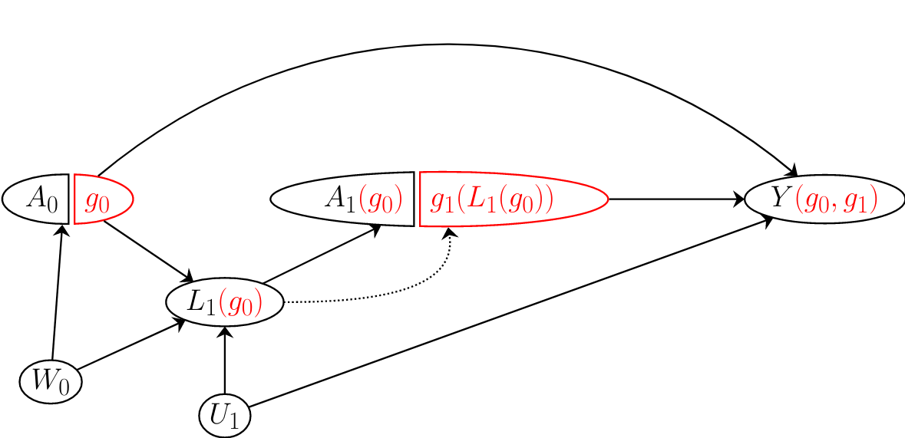

# Plan

1. Student question about propensity scores

2. Time Varying Treatments

$\newcommand{\ci}{\perp\!\!\!\perp}$

---
# Student Question

1. (paraphrased by Jean) "In a recent project some collaborators simply adjusted for quartiles of propensity score. How does this compare with the other methods we talked about? Is it a good method?"

2. (also paraphrased) "If we used this method, how does standardizing compare to not standardizing and simply reading the causal effect off of the coefficient on $A$?"

--

My interpretation of the proposed method: Fit the model

$$E[Y_i \vert A_i, L_i, \hat{\pi}_i] = \beta_0 + \beta_1 A_i + L_i^\top \beta_L + \sum_{j = 1}^{4} \alpha_j I(\hat{\pi}_i \in \hat{C}_j)$$
where $\hat{C}_j$ are quartiles of $\hat{\boldsymbol{\pi}}$ and $L$ are a set of $K$ covaraites. 


Estimate the coefficients by OLS and take $\hat{\beta}_1$ as an estimate of the ATE $E[Y(1)] - E[Y(0)]$.

---
# Going Back to Propensity Scores

- We know that the true propensity score $\pi(L)$ is a balancing score so $E[Y(a) \vert \pi(L)] = E[Y \vert A = a, \pi(L)]$.
  + This says that if we know the propensity score and we have an infinite amount of data, we could estimate $E[Y(a) \vert \pi(L)]$ from the data. 
  
- Staying non-parametric for now and assuming a dichotomous treatment, we could write
$$E[Y_i(0) \vert \pi_i] = \mu(\pi_i)\\\
E[Y_i(1) \vert \pi_i] = \mu(\pi_i) + \beta(\pi_i)\\\
E[Y_i \vert A_i, \pi_i] = \mu(\pi_i) + A_i \beta(\pi_i)$$
where $\mu$ and $\beta$ are unknown function. 

- The ATE is the $\int_0^1 \beta(\pi) dF(\pi)$. 

- Define $\tilde{\mu}(L_i) = \mu(g(L_i))$ where $g(L_i) = \pi(L_i) = \pi_i$, similarly for $\tilde{\beta}$.

---

# Subclassification Estimator

- Non-parametric model:
$$E[Y_i \vert A_i, \pi] = \mu(\pi) + A_i \beta(\pi)$$
- If we only care about the ATE, we only need to estimate $\beta$.

- The $\hat{\Delta}_S$ estimator stratifies the data by quantiles of $\hat{\pi}$ and computes the difference in means within each .

- $\hat{\Delta}_S$ is just approximating $\beta(\pi)$ with a step function. 
  + It is semi-parametric since we don't have to estimate $\mu(\pi)$. 

- As the interval size gets smaller, we get a better estimate of $\beta$. 

- We approximate $\int_{0}^1 \beta(\pi)dF(\pi)$ with $\sum_{i=1}^{N} \hat{\beta}(\hat{\pi}_i)$ (i.e. standardization).


---

# Subclassification Regression Estimator

- The subclassification regression estimator $\hat{\Delta}_{SR}$ estimator fits a separate regression within each quantile of  $\hat{\pi}$.

- For example

$$E[Y_i \vert A_i, L_i, \hat{\pi}_i] = \sum_{j = 1}^{K}\left(\beta_{0,j} + \beta_{1,j} A_{i} + L_i^\top \beta_{L,j} \right)I(\hat{\pi}_i \in C_j)$$
or 

$$E[Y_i \vert A_i, L_i, \hat{\pi}_i] = \sum_{j = 1}^{K}\left(\beta_{0,j} + \beta_{1,j} A_{i} + \beta_{2,j}A_i L_{1,i} + L_i^\top \beta_{L,j} \right)I(\hat{\pi}_i \in \hat{C}_j)$$
---

# Subclassification Regression Estimator

- In the model with no interactions, we have the following model:

$$\tilde{\mu}(L_i, \hat{\pi}_i) =  \sum_{j = 1}^{K}\left(\beta_{0,j} + L_i^\top \beta_{L,j} \right)I(\hat{\pi}_i \in \hat{C}_j)\\\
\tilde{\beta}( \hat{\pi}_i) = \sum_{j = 1}^{K}\beta_{1,j}I(\hat{\pi}_i \in \hat{C}_j)$$

- $\beta$ model is the same as $\hat{\Delta}_S$, but we added a flexible parametric model for $\mu.$ 

- In the model with an interaction, we model

$$\tilde{\beta}(L_{1,i}, \hat{\pi}_i) = \sum_{j = 1}^{K} \left(\beta_{1,j} + \beta_{2,j}L_{1,i}\right)I(\hat{\pi}_i \in \hat{C}_j)$$
---

# Subclassification Regression Estimator

$$\tilde{\mu}(L_i, \hat{\pi}_i) =  \sum_{j = 1}^{K}\left(\beta_{0,j} + L_i^\top \beta_{L,j} \right)I(\hat{\pi}_i \in \hat{C}_j)\\\
\tilde{\beta}( \hat{\pi}_i, L_i) =\sum_{j = 1}^{K} \left(\beta_{1,j} + \beta_{2,j}L_{1,i}\right)I(\hat{\pi}_i \in \hat{C}_j)$$

- If we had the correct outcome model, we would just be stratifying and then standardizing by an irrelevant variable $\hat{\pi}$. 

- If the $\pi$-model is correct, then we have just conditioned on a finer balancing score than we needed to. 
  
- If the $\pi$-model is correct, then in the limit as interval size decreases, we will get an accurate estimate of $\beta$. 


---

# Subclassification Regression Estimator


- In the modification of the subclassification regression estimator discussed in Stuart (2010), we share coefficients for confounders across strata

$$E[Y_i \vert A_i, L_i, \hat{\pi}_i] = \beta_{0} +  L_i^\top \beta_{L} + \sum_{j = 1}^{K}\left(\beta_{1,j} A_{i} + \beta_{2,j}A_i L_{1,i}\right)I(\hat{\pi}_i \in C_j)$$

- This stabilizes the estimate of $\mu$ if the model is correct, but leaves the estimate of $\beta$ flexible. 

---

# Back to the Question

- In the proposed method of adjusting for quartiles of the propensity score, we are fitting

$$E[Y_i \vert A_i, L_i, \hat{\pi}_i] = \beta_0 + \beta_1 A_i + L_i^\top \beta_L + \sum_{j = 1}^{4} \alpha_j I(\hat{\pi}_i \in C_j)$$
--

- In our previous framework, our model is $$\tilde{\mu}(L_i, \hat{\pi}_i) = \beta_0 + L_i^\top \beta_L + \sum_{j = 1}^{4} \alpha_j I(\hat{\pi}_i \in C_j)\\\ \beta(\hat{\pi}_i) = \beta_1$$

--

- By adding the propensity score, we have added flexibility to $\mu$. 

  + If $\beta$ is really constant, then in the limit as the size of strata decreases, $\hat{\beta}_1$ is consistent, even if the outcome model is wrong. 

- If $\beta$ is not constant, we will not get a consistent estimator. 

```{r, eval =FALSE, echo = FALSE}
sim1 <- function(n = 1000){
  p <- runif(n = n, min = 0.01, max = 0.99)
  mu <- 0.4*p + 0.6*p^2
  beta <- 1-p
  A <- rbinom(n = n, size = 1, prob = p)
  Y <- mu + A*beta + rnorm(n = 1000, sd = 0.5) # True average effect is close to 1/2, 0.49
  z <- log(p/(1-p))
  fp <- glm(A ~ z, family = binomial)
  #fp <- glm(A ~ p, family = binomial) #Logistic estimate stabilizes adj1 but introduces a bit of bias
  dat <- data.frame("A" = A, "Y"=Y, "EY1" = mu + beta, "EY0" = mu, "p" = p, "phat" = fp$fitted.values) %>%
        mutate(wt = A/phat + (1-A)/(1-phat), 
               w1 = A/phat, w2 = (1-A)/(1-phat), pinv = 1/phat, pm1inv = 1/(1-phat), 
               R = case_when(A == 1 ~ wt, TRUE ~ -1*wt))
  fhj <- lm(Y ~ A, weights = wt, data = dat)
  fadj1 <- lm(Y ~ A + w1+ w2 , data = dat)
  dat <- dat %>% mutate(y1 = fadj1$coefficients[1] + fadj1$coefficients[2] + fadj1$coefficients[3]*pinv,
                y0 = fadj1$coefficients[1] +  fadj1$coefficients[4]*pm1inv)
  badj1 <- mean(dat$y1) - mean(dat$y0)
  dat <- dat %>% mutate(m0 = mean(dat$Y[dat$A ==0]), m1 = mean(dat$Y[dat$A==1]))
  dat <- dat %>% mutate(v1 = (A*Y/p) - (m1*(A -p)/p), v0 = ((1-A)*Y/(1-p)) - (m0*(A - p)/(1-p)))
  bdr <- mean(dat$v1)-mean(dat$v0)

  
  fbr1 <- lm(Y ~ A + R , data = dat)
  dat <- dat %>% mutate(y1 = fbr1$coefficients[1] + fbr1$coefficients[2] + fbr1$coefficients[3]*pinv,
                y0 = fbr1$coefficients[1] -  fbr1$coefficients[3]*pm1inv)
  bbr1 <- mean(dat$y1) - mean(dat$y0)
  
  fbr2 <- lm(Y ~ A + wt , data = dat)
  dat <- dat %>% mutate(y1 = fbr2$coefficients[1] + fbr2$coefficients[2] + fbr2$coefficients[3]*pinv,
                y0 = fbr2$coefficients[1] +  fbr2$coefficients[3]*pm1inv)
  bbr2 <- mean(dat$y1) - mean(dat$y0)
  
  raw <- lm(Y ~ A, data = dat)$coefficients[2] %>% as.numeric()
  ests <- c("hj" = as.numeric(fhj$coefficients[2]), "bsc" = badj1, "bdr" = bdr, "bbr1" = bbr1,
            "bbr2" = bbr2, "raw" = raw, "sate" = mean(beta))
  return(ests)
}
res <- purrr::map_dfr(seq(200), function(x){sim1(1000)})


```

---
# A Better Alternative

- If we had added an interaction between $A$ and propensity score quartiles: 

$$E[Y_i \vert A_i, L_i, \hat{\pi}_i] = \beta_0 + \beta_1 A_i + L_i^\top \beta_L + \sum_{j = 1}^{4} (\alpha_{0,j} + \alpha_{1,j}A_i) I(\hat{\pi}_i \in C_j)$$
we would have flexible models for both $\mu$ and $\beta$.

- We would still have bias if the outcome model is wrong due to subclassification coarsness, but bias would improve with smaller intervals. 

- Since we have an interaction, we need to use standardization to estimate the ATE.

---
# Time-Varying Treatments


---
# Example 


- Patients are treated for a disease over time. 

- At each appointment, the treatment decision for the next period is made, possibly based on current or past symptoms. 

- We observe an outcome $Y$. 


<center>
```{r, echo = FALSE, fig.height = 3.5, warning=FALSE, message=FALSE}
library(DiagrammeR)
library(dplyr)
ndf2 <- create_node_df(n =5 , label = c("A@_{0}", "L@_{1}", "A@_{1}", "U", "Y"), 
                     fontname = "Helvetica", 
                     fontsize = 10, 
                     width = 0.3, 
                     fillcolor = "white", 
                     fontcolor = "black",
                     color = "black", 
                     x = c(0, 1, 2, 1, 3)*0.5, 
                     y = c(0, -1, 0, -2, 0)*0.6)
edf2 <- create_edge_df(from = c(1,  2, 3, 4, 4), to = c(2, 3, 5, 2, 5),
                          minlen = 1, 
                          color = "black" 
                          )
gr2 <- create_graph(nodes_df = ndf2, edges_df = edf2)

render_graph(gr2)
```
</center>

---
# Notation and Conventions

- Bar notation indicates the history of a variable $\bar{A}_k = (A_1, \dots, A_k)$.

- In statistical time, $A_k$ is the last variable at time $k$. 
  + Covariates $L_k$ are measuerments that are taken after treatment $A_{k-1}$ is given but before treatment $A_k$ is given. 
  
- Timing aligns for all units. 
  + We will often talk about time points as though they are evenly spaced (e.g. every month), but this is not required. 

- Time starts at 0. 

---
# Treatment Programs

- In this setting, we might be interested in the effect of the entire course of treatment $\bar{A} = (A_0, A_1)$. 
  - We are modeling a joint intervention. 
  
- With 2 time points, there are only four treatment strategies. 

- With $k$ time points there are $2^k$ treatment strategies. 

- How do we know which to compare?

---
# Treatment Strategies

- A treatment strategy is a rule for determining $A_k$ from a unit's past covariate values

$$g = (g_0(\bar{a}_{-1}, l_0), \dots, g_K(\bar{a}_{K-1}, \bar{l}_k))$$

- A treatment strategy is static if it does not depend on any covariates, only past treatments. 
  + In a static strategy, we could write out the entire program at the beginning of the study. 
  + Ex: Treat every other month
  + Ex: Treat for only the first two time points. 
  
- A treatment strategy is dynamic if it does depend on covariates. 
  + Ex: Treat if $L_{k-1}$ was high. 
  + Ex: If $L_{k-1}$ is high, switch treatment, so $A_{k} = 1-A_{k-1}$. Otherwise set $A_k = A_{k-1}$. 

---
# Sequentially Randomized Trials

- In a sequentially randomized trial, treatment $A_{k,i}$ is assigned randomly with $P[A_{k,i} = a]$ possibly depending on $\bar{A}_{k-1}$ and $\bar{L}_{k-1}$. 

--

- Example: Every patient starts on treatment 0. Every month a random set of patients are assigned to switch to treatment 1 and stay on that treatment for the rest of the study. 
      - Patients with high values of $L_{k}$ may have a higher probability of starting treatment. 
      
- Example: Treatment is assigned randomly at every time point. 
      - Patients with high values of $L_{k}$ have a higher probability of switching treatments. 

--

- A random strategy will never be as good as the optimal deterministic strategy.

  + We would never recommend a random strategy for general treatment of patients.
  + But random strategies are necessary when the optimal strategy is unknown. 

---
# Causal Contrasts

- The causal contrast we choose to look at will depend on the study. 

- We might be interested in comparing specific fixed programs, $E[Y(\bar{A} = \bar{a}_1)] - E[Y(\bar{A} = \bar{a}_2)]$ such as 
  + Always treat vs never treat: $\bar{a}_1 = (0, 0, \dots, 0)$, $\bar{a}_2 = (1, 1, \dots, 1)$
  + Treat early and continue vs begin treatment later and continue: $\bar{a}_1 = (1, 1, \dots, 1)$, $\bar{a}_2 = (0,\dots, 0, 1, \dots, 1)$.
  
- Or we could compare one or more dynamic strategies $g$, $E[Y(g)]$ such as:
  + Always treat vs treat only when symptoms are present. 

---
# DAG 1

- With your partner(s), draw a DAG for two time points for the following scenario:

- Patients are enrolled in a randomized trial of HIV medication. 

- At each time point CD4 count ( $L$ ) is measured. CD4 count is affected by the most recent treatment and the most recent past value of CD4 count.  

- Probability of receiving treatment 1 at time $k$ depends on CD4 count at time $k$, but not on past treatment or past CD4 count measurements.

- The outcome $Y$ depends on treatment at all time points but does not depend on CD4 count. 

---
# DAG 1


---
# DAG 2

- To your DAG add  an unmeasured variable $U$ which is also time-varying. 

  + $U$ represents disease progression. 
  
- $U$ at time $k$  is affected by the most recent treatment value and most recent past value of $U$. 
- $U$ at time $k$ affects CD4 count at time $k$, the next value of $U$, and $Y$.

- You can assume that $U_k$ is statistically before $L_k$. 


---
# DAG 3

- Draw the same scenario except that treatment $A_k$ does not depend on CD4 count but does depend on the most recent treatment $A_{k-1}$. 

---
# DAG 4

- Suppose that we now have an observational study. 

- Patients have checkups once a month. At each appointment, treatment is adjusted. 

- Doctors will take into account past treatment, current values of $L$, and other factors which are affected by $U$. 

---
# SWIGs for Static Strategies

- Draw a SWIG for the DAG below for the treatment strategy $(A_0 = a_0, A_1 = a_1).$

<center> 

```{r, echo=FALSE, out.width="55%"}
knitr::include_graphics("img/9_dag2s.png")
```

</center>

---
# SWIGs for Static Strategies

- Draw a SWIG for the DAG below for the treatment strategy $(A_0 = a_0, A_1 = a_1).$

<center> 

```{r, echo=FALSE, out.width="85%"}
knitr::include_graphics("img/9_swig2s.png")
```

</center>
---
# Sequential Exchangeability for Static Strategies

- Static sequential exchangeability says that

$$Y(\bar{a}) \ci A_k \vert\ \bar{A}_{k-1} = \bar{a}_{k-1}, \bar{L}_k\qquad k = 0, 1, \dots K$$
- Does static sequential exchangeability hold in our example?

<center> 
```{r, echo=FALSE, out.width="65%"}
knitr::include_graphics("img/9_swig2s.png")
```
</center>

---
# Sequential Exchangeability for Static Strategies

- We can see that $Y(a_0, a_1) \ci A_0$ ( $A_0$ is disconnected)

- In the SWIG we have $Y(a_0, a_1) \ci A_1(a_0) \vert A_0 = a_0, L_1(a_0)$. 
  + By consistency $A_0 = a_0 \Rightarrow A_1 = A_1(a_0)$ and 
  + $A_0 = a_0 \Rightarrow L_1 = L_1(a_0)$
  
- So $Y(a_0, a_1) \ci A_1 \vert A_0 = a_0, L_1$

<center> 
```{r, echo=FALSE, out.width="60%"}
knitr::include_graphics("img/9_swig2s.png")
```
</center>


---
# Static Sequential Exchangeability

- Does static sequential exchangeability hold in the SWIG below?

<center> 
```{r, echo=FALSE, out.width="80%"}
knitr::include_graphics("img/9_swig3.png")
```
</center>

---
# Static Sequential Exchangeability

- Does static sequential exchangeability hold in the SWIG below?

<center> 
```{r, echo=FALSE, out.width="80%"}

```
</center>

---
# Sequential Exchangeability for $g$

- Sequential exchangeability for a treatment strategy $g$ holds if 

$$Y(g) \ci A_k \vert \bar{A}_{k-1} = g(\bar{A}_{k-2}, \bar{L}_{k-1}), \bar{L}_k \qquad  k = 0, 1, \dots, K$$
- This definition applies if $g$ is static or dynamic, random or deterministic. 


---

# SWIGS for Dynamic Treatment Strategies

- Suppose that rather than comparing the strategies "always treat" and "never treat", we want to compare "always treat" with "treat only if $L_k = 1.$ " 

- The intervention "treat only if $L_k = 1$ " introduces an arrow from $L_1(g_0)$ to the value of $A_1$ under the intervention. 

- For the first time there is an arrow into an intervention node on a SWIG.

<center> 
```{r, echo=FALSE, out.width="75%"}
knitr::include_graphics("img/9_swig2dyn.png")
```
</center> 

---

# SWIGS for Dynamic Treatment Strategies

- The dotted arrow is created by the proposed intervention.

  + It is not a result of the experimental design or underlying causal structure. 

- The dotted arrow functions just like a solid arrow for computing d-separation. 

  + It is dotted so that we know it was introduced by the intervention.
  

<center> 
```{r, echo=FALSE, out.width="75%"}
knitr::include_graphics("img/9_swig2dyn.png")
```
</center> 

---

# Sequential Exchangeability for $g$

- Does sequential exchangeability hold for the dynamic intervention?

<center> 
```{r, echo=FALSE, out.width="75%"}
knitr::include_graphics("img/9_swig2dyn.png")
```
</center> 

--


- We can see that $Y(g) \ci A_0$ and $Y(g) \ci A_1(g_0) \vert\ L_1(g_0), A_0 = g_0$

- Using consistency $Y(g) \ci A_1 \vert L_1, A_0 = g_0$

---

# Sequential Exchangeability for $g$

<center> 
```{r, echo=FALSE, out.width="75%"}

```
</center> 

--

- We don't have $Y(g) \ci A_0$

  + They are connected by the $A_0 - W_0 - L_1(g_0) - g_1 - Y(g)$ path
  + $g_1$ is not fixed -- it depends on $L_1(g_0)$ -- so $g_1$ does not block the path.
  
---

# Positivity 

- Let $f_{\bar{A}_{k-1}, \bar{L}_k}$ be the joint pdf for the treatment history before point $k$ and the covariate history. 

- For time-varying treatment, positivity requires that

$$f_{\bar{A}_{k-1}, \bar{L}_k}(\bar{a}_{k-1}, \bar{l}_k) > 0 \Rightarrow f_{A_{k} \vert \bar{A}_{k-1}, \bar{L}_k}(a_k \vert \bar{a}_{k-1}, \bar{l}_k) > 0$$
- If we are interested in a particular strategy, $g$, the condition only needs to hold for treatment histories compatible with $g$ ( $a_k = g(\bar{a}_{k-1}, \bar{l}_k)$ ).

- This condition says that given past treatment history and covariates, any treatment consistent with the strategy should be possible.

---
# Consistency 

- For a point treatment, consistency requires that $A = a \Rightarrow Y(a) = Y$. 

- For a static strategy, the condition $\bar{A} = \bar{a} \Rightarrow Y(\bar{a}) = Y$ is sufficient.

- For dynamic strategies, if $A_k = g_k(\bar{A}_{k-1}, \bar{L}_k)$ for all $k$ then $Y(g) = Y$. 

---
# Estimation for Static Treatment Strategies

- Consider our previous example:

<center> 
```{r, echo=FALSE, out.width="55%"}
knitr::include_graphics("img/9_dag2sw.png")
```
</center> 

- In this example, we could estimate the average effect of $A_0$ or the average effect of $A_1$ using our previous techniques. 

- Suppose we want to compare the strategy always treat $Y(1, 1)$ with the strategy never treat $Y(0, 0)$.

<!-- - Can we use our previous strategies to estimate the joint counterfactuals $Y(1,1)$ and $Y(0,0)$? -->

---
# Example

- Data below were aggregated from a trial of 320,000 units.

  + The trial conforms to our previous DAG. 
  + Treatment at time 0 is random with probability 0.5. 
  + Treatment at time 1 depends only on $L_1$: $P[A_1 = 1 \vert L_1 = 1] = 0.8$, $P[A_1 = 1 \vert L_1 = 0] = 0.4$.
  + In these data, there is no effect of treatment on $Y$. 

```{r, echo = FALSE, warning=FALSE, message = FALSE}
library(knitr)
library(kableExtra)
dat <- data.frame(N = c(2400, 1600, 2400, 9600, 4800, 3200, 1600, 6400), 
                  A0 = rep(c(0, 1), each = 4), 
                  L1 = rep(rep(c(0, 1), each= 2), 2), 
                  A1 = rep(c(0, 1), 4), 
                  Y = rep(c(84, 52, 76, 44), each = 2))
dat1 <- dat[1:4,]
dat2 <- dat[5:8,]
knitr::kable(dat1, col.names = c("N", "\\(A_{0}\\)","\\(L_{1}\\)", "\\(A_{1}\\)", "\\(\\bar{Y}\\)"), format = 'html')  %>%
  kable_styling(position = "float_left", full_width = FALSE)
knitr::kable(dat2, col.names = c("N", "\\(A_{0}\\)","\\(L_{1}\\)", "\\(A_{1}\\)", "\\(\\bar{Y}\\)"), format = 'html', row.names = FALSE)  %>%
  kable_styling(position = "center", full_width = FALSE)
```

---
# Example
```{r, echo = FALSE, warning=FALSE, message = FALSE}
knitr::kable(dat1, col.names = c("N", "\\(A_{0}\\)","\\(L_{1}\\)", "\\(A_{1}\\)", "\\(\\bar{Y}\\)"), format = 'html')  %>%
  kable_styling(position = "float_left", full_width = FALSE)
knitr::kable(dat2, col.names = c("N", "\\(A_{0}\\)","\\(L_{1}\\)", "\\(A_{1}\\)", "\\(\\bar{Y}\\)"), format = 'html', row.names = FALSE)  %>%
  kable_styling(position = "center", full_width = FALSE)
```

+ Within each stratum of $(A_0, L_1)$, there is no treatment effect. 

+ There is also no average effect of $A_0$: 
  + $E[Y \vert A_0 = 0] = \frac{40\cdot 84 + 120 \cdot 52}{160} = 60$
  + $E[Y \vert A_0 = 1] = \frac{80\cdot 76 + 80 \cdot 44}{160} = 60$


---
# Example
```{r, echo = FALSE, warning=FALSE, message = FALSE}
knitr::kable(dat1, col.names = c("N", "\\(A_{0}\\)","\\(L_{1}\\)", "\\(A_{1}\\)", "\\(\\bar{Y}\\)"), format = 'html')  %>%
  kable_styling(position = "float_left", full_width = FALSE)
knitr::kable(dat2, col.names = c("N", "\\(A_{0}\\)","\\(L_{1}\\)", "\\(A_{1}\\)", "\\(\\bar{Y}\\)"), format = 'html', row.names = FALSE)  %>%
  kable_styling(position = "center", full_width = FALSE)
```

- We want to estimate $E[Y(1,1)] - E[Y(0, 0)]$

- We could try computing the associational difference $E[Y \vert A_0 = 1, A_1 = 1] - E[Y \vert A_0 = 0, A_1 = 0]$:

  + $E[Y \vert A_0 = 1, A_1 = 1] = \frac{32\cdot 76 + 64 \cdot 44}{96} = 54.67$ 
  + $E[Y \vert A_0 = 0, A_1 = 0] = \frac{24 \cdot 84 + 24 \cdot 52}{48} = 68$
  
--

- Problem: We have confounding from $L_1$. 

---
# Example
```{r, echo = FALSE, warning=FALSE, message = FALSE}
knitr::kable(dat1, col.names = c("N", "\\(A_{0}\\)","\\(L_{1}\\)", "\\(A_{1}\\)", "\\(\\bar{Y}\\)"), format = 'html')  %>%
  kable_styling(position = "float_left", full_width = FALSE)
knitr::kable(dat2, col.names = c("N", "\\(A_{0}\\)","\\(L_{1}\\)", "\\(A_{1}\\)", "\\(\\bar{Y}\\)"), format = 'html', row.names = FALSE)  %>%
  kable_styling(position = "center", full_width = FALSE)
```

- To account for confounding by $L_1$, we could try computing the associational difference within strata of $L_1$ and then standardizing. 

- Stratifying on $L_1$: 

$$E[Y \vert A_0 = 1, A_1 = 1, L_1 = 0]  - E[Y \vert A_0 = 0, A_1 = 0, L_1 = 0] = 76-84 = -8$$
$$E[Y \vert A_0 = 1, A_1 = 1, L_1 = 1]  - E[Y \vert A_0 = 0, A_1 = 0, L_1 = 1] = 44-52 = -8$$

--

- Problem: $L_1$ is a collider. Conditioning on $L_1$ induces an association between $A_0$ and $Y$. 


---
# G-Formula for Static Treatment Strategies

- The g-formula for point treatments has been the basis of IPW, standardization, and double robust methods we have seen so far:
$$E[Y(a)] = \sum_l E[Y \vert A = a, L = l]f_L(l)$$

--

- The extension of the g-formula for time-varying treatments is

$$E[Y(a_0, a_1)] = \sum_l E[Y \vert A_0 = a_0, A_1 = a_1, L_1 = l]f_{L_1 \vert A_0}(l \vert a_0)$$
- This formula holds if conditional exchangeability, positivity, and consistency hold.

---
# G-Formula for Our Example

```{r, echo = FALSE, warning=FALSE, message = FALSE}
knitr::kable(dat1, col.names = c("N", "\\(A_{0}\\)","\\(L_{1}\\)", "\\(A_{1}\\)", "\\(\\bar{Y}\\)"), format = 'html')  %>%
  kable_styling(position = "float_left", full_width = FALSE)
knitr::kable(dat2, col.names = c("N", "\\(A_{0}\\)","\\(L_{1}\\)", "\\(A_{1}\\)", "\\(\\bar{Y}\\)"), format = 'html', row.names = FALSE)  %>%
  kable_styling(position = "center", full_width = FALSE)
```

$$E[Y(a_0, a_1)] = \sum_l E[Y \vert A_0 = a_0, A_1 = a_1, L_1 = l]f_{L_1 \vert A_0}(l \vert a_0)$$

+ $E[Y \vert A_0 = 1, A_1 = 1, L_1 = 0]P[L_1 = 0 \vert A_0 = 1] = 76 \cdot \frac{1}{2} = 38$
+ $E[Y \vert A_0 = 1, A_1 = 1, L_1 = 1]P[L_1 = 1 \vert A_0 = 1] = 44 \cdot \frac{1}{2} = 22$
+ $E[Y(1, 1)] = 38 + 22 = 60$

+ $E[Y \vert A_0 = 0, A_1 = 0, L_1 = 0]P[L_1 = 0 \vert A_0 = 0] = 84 \cdot \frac{1}{4} = 21$
+ $E[Y \vert A_0 = 0, A_1 = 0, L_1 = 1]P[L_1 = 1 \vert A_0 = 0] = 52 \cdot \frac{3}{4} = 39$
+ $E[Y(1, 1)] = 21 + 39 = 60$

---

# G-Formula for General $K$

- The $G$-formula for a static treatment strategy generalizes to 

$$E[Y(\bar{a})] = \sum_\bar{l} E[Y \vert \bar{A} = \bar{a},\bar{L}= \bar{l}]\prod_{k = 0}^Kf(l_k \vert \bar{a}_{k-1}, \bar{l}_{k-1})$$
- In the case of continuous $L$ or continuous $A$, we replace the sum with an integral

$$\int f(y \vert \bar{a}, \bar{l}) \prod_{k = 0}^K dF (l_k \vert \bar{a}_{k-1}, \bar{l}_{k-1})$$

---
# G-Formula for Dynamic Treatment Strategies

- In a static deterministic strategy $a_k$ is completely determined by treatment and confounder history. 

- For dynamic or random strategies, this is the case and we need to add a term to the g-formula.

$$E[Y(\bar{a})] = \sum_\bar{l} E[Y \vert \bar{A} = \bar{a},\bar{L}= \bar{l}]\prod_{k = 0}^Kf(l_k \vert \bar{a}_{k-1}, \bar{l}_{k-1})\prod_{k=0}^K f^{int}(a_k \vert \bar{a}_{k-1}, \bar{l}_k)$$

- $f^{int}$ is the conditional probability of $a_k$ given the history *under the proposed intervention*.

---
# Next Time

- Using the g-formula to estimate treatment effects of time-varying treatments.
