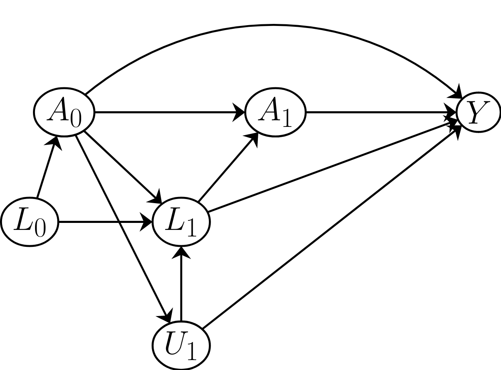

# Bang and Robins Estimator Correction

- You may have noticed that when HR describe the Bang and Robins (2005) estimator they say that we should add a new covariate to the regression which is equal to the PS weight for individuals with $A = 1$ and minus the propensity score weight for individuals with $A = 0$, i.e.
$$R_i = \frac{A_i}{\hat{\pi}_i} - \frac{1-A}{1-\hat{\pi}_i}$$

- If you read the Bang and Robins (2005) paper, the special covariate is given as 
$$R_i = \frac{A_i}{\hat{\pi}_i} + \frac{1-A}{1-\hat{\pi}_i}$$

- I have been telling you the second version. 


---
# Bang and Robins Estimator Correction

- You may have found in the homework that the version we have been using does not work well in the homework. 
  + This is because it is wrong. 
  
- As it turns out a correction was issued for the original paper. 
  + The correction is weirdly extremely hard to find (at least it was for me), but is now linked on the course website. 

---
# Review Exercise

- Write down the definition of sequential exchangeability for a static treatment strategy. 

---
# Review Exercise

- Does static sequential exchangeability hold in the DAG below? $L_0$ and $L_1$ are observed but $U_1$ is not.

<center> 

```{r, echo=FALSE, out.width="80%"}

```

</center>

---
# Review Exercise

- Write down the definition of sequential exchangeability for a dynamic strategy $g$. 

---
# Review Exercise

- Draw a SWIG for the DAG below under a dynamic strategy in which $g_k$ depends on $A_{k-1}$ and $L_{k-1}$. 

<center> 

```{r, echo=FALSE, out.width="80%"}
knitr::include_graphics("img/9misc_q4.png")
```

</center>

---
# Review Exercise

- Using your SWIG, does sequential exchangeability for $Y(g)$ hold for the DAG below and a dynamic strategy in which $g_k$ depends on $A_{k-1}$ and $L_{k-1}$?
