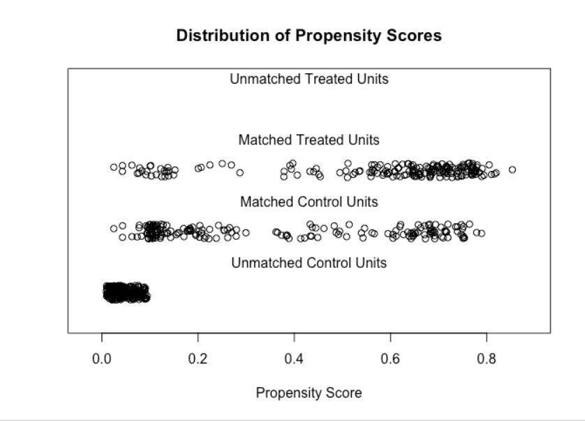

$\newcommand{\ci}{\perp\!\!\!\perp}$
```{r xaringanExtra, echo=FALSE}
xaringanExtra::use_tile_view()
xaringanExtra::use_search(show_icon = TRUE)
xaringanExtra::use_panelset()
```

```{r xaringanthemer, include=FALSE, warning=FALSE}
library(xaringanthemer)
style_mono_accent(
  link_color = "#ea8a1a",
  base_color = "#110566",
 # header_font_google = google_font("Josefin Sans"),
 # text_font_google   = google_font("Montserrat", "300", "300i"),
 # code_font_google   = google_font("Fira Mono")
)
```

```{r, echo = FALSE, message = FALSE, warning=FALSE}
library(tidyverse)
library(knitr)
library(kableExtra)
library(DiagrammeR)
library(ggplot2)
library(gridExtra)
library(viridis)
library(Matching)
library(MatchIt)
#source("stat_ecdf_weighted.R")
dat.u <- read_csv("../../data/nhefs.csv") 
dat <- dat.u %>%
       filter(!is.na(wt82))
```


## Lecture Plan 


1. Matching

Reference reading for this lecture:
- Stuart (2010) 
- King and Nielsen (2019).

---

## Matching


- In our discussion of the ATT, we mentioned that matching was one strategy for estimating the ATT. 

- Suppose that $Y(a) \ci A \vert L$ where $A$, $Y$ and $L$ are binary. 

- For each unit with $A = 1$, we select a unit with $A = 0$ and matching $L$ value. 

- We leave out any samples that cannot be matched. 

- The new matched sample has $2\cdot n_1$ units with half receiving $A =1$ and the other half receiving $A = 0$ . 

- In this sample we can estimate


$$\begin{split}
E[Y(1) | A = 1] = &\frac{1}{n_1}\sum_{i = 1}^{2n_1} A_i Y_i\\
E[Y(0) \vert A = 1] =& \frac{1}{n_1}\sum_{i = 1}^{2n_1}(1-A_i)Y_i
\end{split}$$


---
## Matching to Target the ATU or ATE

- The method we just described is called **exact pair** matching.
  + **Pair** because we created one pair for each treated unit.
  + **Exact** because the covariates match exactly within pairs. 
  
  
- If we want to estimate the ATU, we can switch the reference group and find one matching treated unit for each untreated unit. 

- As we have described the procedure so far, if we are targeting the ATT, we need to have $n_0 \geq n_1$. 
  + If we are targeting the ATU, we need $n_1 \geq n_0$.
  
- We haven't said what to do if there is no match for someone in the reference group. 

- Or what do do if we want to estimate the ATE. 

---

## Matching when $L$ is High Dimensional

- For high dimensional $L$, we probably cannot find exact matches. 

- Instead, we can define a distance measure and match treated units with close untreated units. 

- We could define our distance using the full vector of $L$
  + E.g the Mahalanobis distance $D_{i,j} = (L_i - L_j)^\top \Sigma^{-1} (L_i - L_j)$
  + $\Sigma$ is the sample covariance of $L$ in untreated units if matching to the treated. 

- Or we could define our distance based on the propensity score: 
  + Absolute difference $D_{i,j} = \vert \hat{\pi}_i - \hat{\pi}_j \vert$
  + Difference in logits $D_{i,j} = \vert logit(\hat{\pi}_i) - logit(\hat{\pi}_j )\vert$

---

## Nearest Neighbor Matching

- Without replacement: Match each treated unit to the **un-matched** untreated unit that is closest to it. 
  + Will depend on the order matches are assigned.

- With replacement: Match each treated unit to the untreated unit that is closest to it. 
  + We may re-use some untreated units. 
  
---

## Nearest Neighbor Matching

```{r, echo=FALSE, message = FALSE, warning=FALSE, fig.align='center', fig.width=9, fig.height=7}
set.seed(1)
n = 10
df <- data.frame(X1 = runif(n = 3*n), X2 = runif(n = 3*n), 
                 A = rep(c(0, 1),c(2*n, n)))
df %>% ggplot() + 
  geom_point(aes(x = X1, y  = X2, color = as.factor(A), shape = as.factor(A)), size = 3, stroke = 2.5) + 
  scale_shape_manual(values = c(1, 4), name = "A") + 
  scale_color_manual(values = c( viridis(3)[1], viridis(3)[2]),  name = "A") + 
  theme_bw() + 
  theme(axis.title = element_text(size = 20), 
        legend.title = element_text(size = 20), 
        legend.text = element_text(size = 14), 
        axis.text =  element_text(size = 14))
```

---

## Nearest Neighbor Matching

```{r, echo = FALSE, warning =FALSE, message = FALSE, fig.align='center', fig.width=9, fig.height=7}
m <- Match(X = dplyr::select(df, X1, X2), Tr = df$A, replace = FALSE)
df$keep <- rep("drop", nrow(df))
df$keep[m$index.control] <- "0"
df$keep[m$index.treated] <- "1"
dfM <- bind_cols(df[m$index.treated, c("X1", "X2")], df[m$index.control, c("X1", "X2")])
names(dfM) <- c("X1T", "X2T", "X1C", "X2C")

df %>% ggplot() + 
  geom_segment(aes(x = X1T, xend = X1C, y = X2T, yend = X2C ), data = dfM, color = "darkgrey", size = 1.3) + 
  geom_point(aes(x = X1, y  = X2, color = as.factor(keep), 
                 shape = as.factor(A)), size = 3, stroke = 2.5) + 
  xlab("X1") + ylab("X2") + 
  scale_shape_manual(values = c(1, 4), name = "A") + 
  scale_color_manual(values = c( viridis(3)[1], viridis(3)[2], "grey"),  name = "A", guide = "none")  + 
  theme_bw() + 
  theme(axis.title = element_text(size = 20), 
        legend.title = element_text(size = 20), 
        legend.text = element_text(size = 14), 
        axis.text =  element_text(size = 14))
```

---

## NN Matching with Replacement

```{r, echo = FALSE, warning =FALSE, message = FALSE, fig.align='center', fig.width=9, fig.height=7}
m <- Match(X = dplyr::select(df, X1, X2), Tr = df$A, replace = TRUE)
df$keep <- rep("drop", nrow(df))
df$keep[m$index.control] <- "0"
df$keep[m$index.treated] <- "1"
dfM <- bind_cols(df[m$index.treated, c("X1", "X2")], df[m$index.control, c("X1", "X2")])
names(dfM) <- c("X1T", "X2T", "X1C", "X2C")

df %>% ggplot() + 
  geom_segment(aes(x = X1T, xend = X1C, y = X2T, yend = X2C ), data = dfM, color = "darkgrey", size = 1.3) + 
  geom_point(aes(x = X1, y  = X2, color = as.factor(keep), 
                 shape = as.factor(A)), size = 3, stroke = 2.5) + 
  xlab("X1") + ylab("X2") + 
  scale_shape_manual(values = c(1, 4), name = "A") + 
  scale_color_manual(values = c( viridis(3)[1], viridis(3)[2], "grey"),  name = "A", guide = "none")  + 
  theme_bw() + 
  theme(axis.title = element_text(size = 20), 
        legend.title = element_text(size = 20), 
        legend.text = element_text(size = 14), 
        axis.text =  element_text(size = 14))
```

---
## Matching with Replacement

- Matching with replacement generally improves the quality of matches. 

- It is good to check that we are not relying on only a small number of untreated units. 

- If we match with replacement, we need to use weights in the analysis.
  + If one untreated unit is matched to two treated units, it should count as two untreated units. 
  
---
## Weighted Matching Estimators
  
- When there are matching weights, we will estimate the counterfactuals as weighted averages:

$$\begin{split}
E[Y(1) | A = 1] = &\frac{\sum_{i = 1}^{n} A_i Y_i W_i}{\sum_{i = 1}^n A_iW_i}\\
E[Y(0) \vert A = 1] =& \frac{\sum_{i = 1}^{n} (1-A_i) Y_i W_i}{\sum_{i = 1}^n (1-A_i)W_i}
\end{split}$$

- In our nearest neighbor with replacement example, there are 10 treated units who all receive weight 1 so $\sum_{i = 1}^n A_i W_i = 10$. 

- There are 8 untreated units in the matched sample. 6 of them are used once and get a weight of 1 and two are used twice and get a weight of 2, so $\sum_{i = 1}^n (1-A_i)W_i = 10$. 

- Note that the sum is over the matched sample, not the original sample.

- We don't have to keep track of the pairings to compute the estimates. 

---
## NN Matching with a Caliper

- Exclude matches that are farther apart than a set distance. 

---
## NN Matching with a Caliper

```{r, echo = FALSE, warning =FALSE, message = FALSE, fig.align='center', fig.width=9, fig.height=7}
m <- Match(X = dplyr::select(df, X1, X2), Tr = df$A, replace = TRUE, caliper = 0.5)
df$keep <- rep("drop", nrow(df))
df$keep[m$index.control] <- "0"
df$keep[m$index.treated] <- "1"
df$keep[df$keep=="drop" & df$A == 1] <- "drop1"
dfM <- bind_cols(df[m$index.treated, c("X1", "X2")], df[m$index.control, c("X1", "X2")])
names(dfM) <- c("X1T", "X2T", "X1C", "X2C")

df %>% ggplot() + 
  geom_segment(aes(x = X1T, xend = X1C, y = X2T, yend = X2C ), data = dfM, color = "darkgrey", size = 1.3) + 
  geom_point(aes(x = X1, y  = X2, color = as.factor(keep), 
                 shape = as.factor(A)), size = 3, stroke = 2.5) + 
  xlab("X1") + ylab("X2") + 
  scale_shape_manual(values = c(1, 4), name = "A") + 
  scale_color_manual(values = c( viridis(3)[1], viridis(3)[2], "grey", "red"),  name = "A", guide = "none")  + 
  theme_bw() + 
  theme(axis.title = element_text(size = 20), 
        legend.title = element_text(size = 20), 
        legend.text = element_text(size = 14), 
        axis.text =  element_text(size = 14))
```


---
## Nearest Neighbor Matching

- Nearest neighbor matching with no caliper can lead to bad matches. 

- Adding a caliper leads us to drop some treated units. 

- King, Lucas, and Nielsen (2017) use the terminology **feasible (F)** and **non-feasible (NF)** set. 

- Excluding the NF samples changes the estimand, we are no longer estimating the ATT (or the ATU).

- Greifer and Stuart describe the estimand estimated by the caliper matching esimator as the ATO: The average treatment effect in the **equipoise** set. 
  + The equipoise set is those who are in feasible regions of covariate space, i.e. those that are shared by both treated and untreated units. 
  
---

## 1:k Matching

- Match each treated unit with $k$ nearest untreated units, with or without replacement

---

## 1:k Matching with Replacement

```{r, echo = FALSE, warning =FALSE, message = FALSE, fig.align='center', fig.width=9, fig.height=7}
m <- Match(X = dplyr::select(df, X1, X2), Tr = df$A, replace = TRUE, M = 2)
df$keep <- rep("drop", nrow(df))
df$keep[m$index.control] <- "0"
df$keep[m$index.treated] <- "1"
dfM <- bind_cols(df[m$index.treated, c("X1", "X2")], df[m$index.control, c("X1", "X2")])
names(dfM) <- c("X1T", "X2T", "X1C", "X2C")

df %>% ggplot() + 
  geom_segment(aes(x = X1T, xend = X1C, y = X2T, yend = X2C ), data = dfM, color = "darkgrey", size = 1.3) + 
  geom_point(aes(x = X1, y  = X2, color = as.factor(keep), 
                 shape = as.factor(A)), size = 3, stroke = 2.5) + 
  xlab("X1") + ylab("X2") + 
  scale_shape_manual(values = c(1, 4), name = "A") + 
  scale_color_manual(values = c( viridis(3)[1], viridis(3)[2], "grey"),  name = "A", guide = "none")  + 
  theme_bw() + 
  theme(axis.title = element_text(size = 20), 
        legend.title = element_text(size = 20), 
        legend.text = element_text(size = 14), 
        axis.text =  element_text(size = 14))
```

---
## 1:k Matching 

- Increasing the number of matches will decrease the quality of matches. 

- But will increase the number of untreated units we retain in the analysis. 

- This results in a bias-variance trade-off:
  + Decreased match quality = increased bias
  + Increased number of untreated units = decreased variance

---
## Nearest Neighbor Variations

- Optimal matching: Rather than "greedily" choose the match closest to each treated unit one at a time, try to minimize a global distance measure. 

- Matching with replacement removes the need for optimal matching. 


- Variable ratio matching allows different individuals to have different numbers of matches. (Requires weighting in analysis)

---
## Coarsened Exact Matching 

- Divide continuous covariates into bins.

- Perform exact matching on binned values:

- Treated and untreated units in the same bin are weighted according to the frequency of treated/untreated units in that bin. 
  + If a bin contains two treated and three untreated units, each untreated unit receives weight $2/3$ and each treated receives weight 1.
  
- If there are bins with only treated or only control units, we have to throw those samples out.
  + We are again estimating a treatment effect in the equipoise set.

---

## Coarsened Exact Matching

```{r, echo = FALSE, warning =FALSE, message = FALSE, fig.align='center', fig.width=9, fig.height=7}

mm <- matchit(A ~ X1 + X2,data = df, method = "cem", cutpoints = list("X1" = c(0.2, 0.4, 0.6, 0.8), "X2" = c(0.25, 0.5, 0.75)))

df$keep <- as.character(df$A)
df$keep[mm$weights == 0] <- "drop"
df$weight <- mm$weights

df %>% ggplot() + 
  geom_hline(yintercept = c(0.25, 0.5, 0.75)) +
  geom_vline(xintercept = c(0.2, 0.4, 0.6, 0.8)) +
  geom_point(aes(x = X1, y  = X2, color = as.factor(keep), 
                 shape = as.factor(A), size = weight^2), stroke = 2.5) + 
  xlab("X1") + ylab("X2") + 
  scale_shape_manual(values = c(1, 4), name = "A") + 
  scale_color_manual(values = c( viridis(3)[1], viridis(3)[2], "grey"),  name = "A", guide = "none")  + 
  scale_size_continuous(guide = "none") + 
  theme_bw() + 
  theme(axis.title = element_text(size = 20), 
        legend.title = element_text(size = 20), 
        legend.text = element_text(size = 14), 
        axis.text =  element_text(size = 14))
```

---
## Subclassification

- The subclassification estimator $\hat{\Delta}_S$ is a coarsened exact matching estimator using the propensity score. 

- The only difference between the  $\hat{\Delta}_S$ we saw previously and a CEM estimator is the relative weight of treated units and untreated units. 

- The $\hat{\Delta}_S$ estimator weights the estimate within each stratum by the proportion of total individuals in that stratum.

- Weighting by the proportion of treated individuals gives an estimate of the ATT. 

---
## Full Matching


- Rather than pre-selecting the number of classes, use the maximum number that allow us to have at least one treated unit and one untreated unit in each class. 

- We identify subclasses such that:
  - Every subclass contains at least one treated unit and one untreated unit.
    + Can be 1:1, 1:many, or many:1
  - A measure of global distance is minimized over all possible full matches. 

- The full subclassification estimator is like a full matching estimator matching on the PS.

---
## Full Matching

```{r, echo = FALSE, warning =FALSE, message = FALSE, fig.align='center', fig.width=9, fig.height=7}
mm <- matchit(A ~ X1 + X2,data = df, method = "full", distance = "mahalanobis")

df$class <- as.factor(mm$subclass)

df$weight <- mm$weights

df %>% ggplot() +
  geom_point(aes(x = X1, y  = X2, color = class, 
                 shape = as.factor(A), size = weight), stroke = 2.5) + 
  xlab("X1") + ylab("X2") + 
  scale_shape_manual(values = c(1, 4), name = "A") + 
  scale_color_discrete(guide = "none")  + 
  scale_size_continuous(guide = "none") + 
  theme_bw() + 
  theme(axis.title = element_text(size = 20), 
        legend.title = element_text(size = 20), 
        legend.text = element_text(size = 14), 
        axis.text =  element_text(size = 14))
```


---
## Outcome Regression after Full Matching 

- Recall that in subclassification, we could fit an outcome regression within each subclass (the $\hat{\Delta}_{SR}$ estimator). 

- In full matching, we can't fit a regression within each subclass. 

- Instead we fit a model to all data with shared coefficients for covariates but subclass specific coefficients for treatment. 

$$E[Y_{i,k} \vert A, L] = \beta_{0,k} + \beta_{1,k}A_{i,k} + \gamma L_{i,k}$$
- We then average subclass effects to obtain 
$$\hat{\beta} = \frac{n_k}{N}\sum_{k} \hat{\beta}_{1,k}$$

---
## Variance Estimation

- Rubin and Thomas (1996) and Rubin and Stuart (2006) argue that, if we are matching on PS, we don't need to account for uncertainty in in estimating the PS because not doing so will be conservative. 

- The usual robust sandwich variance (`vcovHC`) will not be accurate, but we can use cluster robust sandwich estimation (e.g. using `gee` or `vcovCL`). 

- Another alternative is the bootstrap. 

- Abadie and Imbens (2006) provide a large sample estimator of the variance for 1:k matching with replacement. 

---
## Implementation 

- Unlike some of our other methods, matching is not trivial to implement. 

- The R package `Matching` implements NN matching strategies including a genetic algorithm to automatically find a balanced match. 
  + Includes Abadie and Imbens standard errors for treatment effects. 
  + Provides a function to generate balance statistics. 


- R package `MatchIt` includes more matching strategies than `Matching` including full matching, coarsened exact matching, and others. 


---
## Assessing Matches

- If matching is successful, then all variables in $L$ should be balanced between treated units and untreated units in the matched population. 

- To determine if matching is adequate to control confounding, we need to check for balance. 

- Ideally we could compare the full multivariate distribution of $L$ between treated units and untreated units in the matched sample, but this is too complicated. 

- Instead we look at each variable individually. 
  + Stuart (2010) says we should also look at products and squares. 
  
---
## Assessing Matches

- Rubin (2001) suggests three balance measures:

1. Standardized difference in means of the propensity score. (Should be  < 0.25)
1. Ratio of the variances of the propensity score in treated and untreated unit. (Should be between 0.5 and 2)
1. For each covariate, ratio of the variance after regressing out the propensity score. (Should be between 0.5 and 2)

---
## Visually Assessing Balance 

- Q-Q plots comparing quantiles in treated to quantiles in untreated. 

<center> 

```{r, echo=FALSE, out.width="80%"}
knitr::include_graphics("img/6_matchqq.png")
```

</center>

---
## Visually Assessing Balance 

- Distributions of propensity scores. 

<center> 

```{r, echo=FALSE, out.width="80%"}

```

</center>


---
## p-Values are Unsuitable to Assess Balance

- Balance is an in-sample property, it doesn't make sense to test a super-population hypothesis.

- The $p$-value may increase after matching simply because the power has decreased due to throwing out samples. 

---

## Assessing Match Quality

- Both `MatchIt` and `Matching` have built in functions for reporting various measures of balance.

- If balance is bad, we should try again with a different strategy. 

- As long as we don't consult the outcome, this isn't data dredging. 

- More balance will always reduce bias. 

---
## Balance vs Independence

- We sometimes treat the completely randomized trial as the "gold standard" for causal inference. 

  + In a randomized trial, everyone has the same propensity score. 
  + Treatment is independent of counfounders *on average*. 
  
- In any finite randomized trial, some important predictors of $Y$ might be imbalanced between treatment and untreated unit groups. 

- This imbalance will lead to confounding.
  + Recall that we saw this before, this is why it is better to estimate the propensity score than to use the true propensity score. 
  
  
---
## Balance vs Independence
  
- There is an even better design than the completely randomized trial -- the **fully blocked experiment**. 

- In the fully blocked experiment, participants are put into categories based on their values of predictors of $Y$. 

- Within each block, treatment is assigned randomly to half the participants. 

- This design guarantees balance for the variables defining blocks, eliminating bias if these variables explain most of the variance of $Y$ not due to treatment. 

---
## Balance vs Independence

- Matching is attempting to emulate the fully blocked design. 

- Inverse probability weighting is attempting to emulate the completely randomized design. 

- Exact matching on all confounders is exactly equivalent to using a fully saturated model for the propensity score or a fully saturated model for outcome regression. 

---
## Balance and Model Dependence

- With perfectly balanced data, the model we fit doesn't matter. 

- $X$ and $A$ are exactly orthogonal in sample. 

- **Any** outcome model plus standardization will give us the same estimate of the ATE as the difference in means estimator. 

```{r, echo = FALSE, fig.width=8, fig.height=4, fig.align='center'}
set.seed(1)
df <- data.frame(X = rep(runif(n  = 10), each = 2), A = rep(c(0, 1), 10))

df <- df %>% mutate(Y1  = X + X^2 + 0.2*A + rnorm(n = 20, sd = 0.1), 
             Y2 = X + 0.5*X*A + rnorm(n = 20, sd = 0.1))

df %>% ggplot() + 
  geom_vline(xintercept = unique(df$X), color = "grey") + 
  geom_point(aes(x = X, y = Y2, color = as.factor(A), shape = as.factor(A)), stroke = 2.5) + 
  xlab("X") + ylab("Y") + 
  scale_shape_manual(values = c(1, 4), name = "A") + 
  scale_color_manual(values = c( viridis(3)[1], viridis(3)[2], "grey"),  name = "A", guide = "none")  + 
  theme_bw() + 
  theme(axis.title = element_text(size = 20), 
        legend.title = element_text(size = 20), 
        legend.text = element_text(size = 14), 
        axis.text =  element_text(size = 14))

```
---
## Balance and Model Dependence

- The more imbalance in the data, the more our results will depend on modeling choices. 

- Estimates of the ATE in the data below using standardization are:
  + $E[Y \vert A, X] = \beta_0 + \beta_1 A + \beta_2 X$: 0.34
  + $E[Y \vert A, X] = \beta_0 + \beta_1 A + \beta_2 X + \beta_3 X^2$: 0.13
  + $E[Y \vert A, X] = \beta_0 + \beta_1 A + \beta_2 X + \beta_3 X^2 + \beta_4 X A + \beta_5 X^2A$: 0.22

```{r, echo = FALSE, fig.width=6, fig.height=4, fig.align='center'}
set.seed(1)
df <- data.frame(X = c(runif(n = 15, min = 0, max = 2), runif(n = 15, min = 0.7, max =1.5)), A = rep(c(0, 1), each = 15))

df <- df %>% mutate(Y  = 0.25 - (1-A)*((X-1)^2) + rnorm(n = 30, sd = 0.1))


p <- df %>% ggplot() + 
  geom_point(aes(x = X, y = Y, color = as.factor(A), shape = as.factor(A)), stroke = 2.5) + 
  xlab("X") + ylab("Y") + 
  scale_shape_manual(values = c(1, 4), name = "A") + 
  scale_color_manual(values = c( viridis(3)[1], viridis(3)[2], "grey"),  name = "A", guide = "none")  + 
  theme_bw() + 
  theme(axis.title = element_text(size = 20), 
        legend.title = element_text(size = 20), 
        legend.text = element_text(size = 14), 
        axis.text =  element_text(size = 14))

ft0 <- lm(Y ~ X + A, data = df)
df00 <- data.frame(X = seq(0, 2, length.out = 100), A = 0)
df01 <- data.frame(X = seq(0, 2, length.out = 100), A = 1)
df00$Y <- predict(ft0, newdata = df00, type = "response")
df01$Y <- predict(ft0, newdata = df01, type = "response")
p <- p + 
    geom_path(aes(x = X, y = Y), data = df00, color = viridis(3)[1], linetype = 3) + 
  geom_path(aes(x = X, y = Y), data = df01, color = viridis(3)[2], linetype = 3)
ft1 <- lm(Y ~ X + I(X^2) + A, data = df)
df10 <- data.frame(X = seq(0, 2, length.out = 100), A = 0)
df11 <- data.frame(X = seq(0, 2, length.out = 100), A = 1)
df10$Y <- predict(ft1, newdata = df00, type = "response")
df11$Y <- predict(ft1, newdata = df01, type = "response")
p <- p + 
    geom_path(aes(x = X, y = Y), data = df10, color = viridis(3)[1], linetype = 1) + 
  geom_path(aes(x = X, y = Y), data = df11, color = viridis(3)[2], linetype = 1)
ft2 <- lm(Y ~ X*A + I(X^2)*A, data = df)
df20 <- data.frame(X = seq(0, 2, length.out = 100), A = 0)
df21 <- data.frame(X = seq(0, 2, length.out = 100), A = 1)
df20$Y <- predict(ft2, newdata = df00, type = "response")
df21$Y <- predict(ft2, newdata = df01, type = "response")
p <- p + 
    geom_path(aes(x = X, y = Y), data = df20, color = viridis(3)[1], linetype = 4) + 
  geom_path(aes(x = X, y = Y), data = df21, color = viridis(3)[2], linetype = 4)
df0 <- df1 <- df
df0$A <- 0; df1$A <- 1
Y0 <- predict(ft2, newdata = df0, type = "response")
Y1 <- predict(ft2, newdata = df1, type = "response")
p
```
---
## Assessing Balance in NHEFS

- To keep things simple, we will focus on age, weight in 1971, and the estimated propensity score. 

- We will compute the empirical CDF (eCDF) of each variable and compare between quitters and non-quitters.

- The eCDF of a variable $X$ is
$$\hat{P}[ X \leq x] = \frac{1}{n}\sum_{i = 1}^n I(X_i \leq x)$$

---
## Assessing Balance in NHEFS

```{r, echo = FALSE, fig.width=12, fig.height=4, fig.align='center'}
fit <- glm(qsmk ~ sex + race + age + I(age ^ 2) +
as.factor(education) + smokeintensity +
I(smokeintensity ^ 2) + smokeyrs + I(smokeyrs ^ 2) +
as.factor(exercise) + as.factor(active) + wt71 + I(wt71 ^ 2),
family = binomial(), data = dat)

dat$ps <-predict(fit, type = "response")
dat <- dat %>% mutate(w = case_when(qsmk == 0 ~ 1/(1-ps), 
                                    TRUE ~ 1/ps))
p1 <- dat %>% 
  mutate(qsmk = as.factor(qsmk)) %>% 
  ggplot() + 
  stat_ecdf(aes(x = age, group = qsmk , color = qsmk), geom = "step") + ylab("Cumulative Density") + xlab("Age") + #ggtitle("Age Distribution") + 
  theme_bw() + 
  theme(axis.text = element_text(size = 14), 
        axis.title = element_text(size = 18), 
        legend.text = element_text(size = 14), 
        plot.title = element_text(size = 20), 
        legend.title = element_text(size = 14))

p2 <- dat %>% 
  mutate(qsmk = as.factor(qsmk)) %>% 
  ggplot() + 
  stat_ecdf(aes(x = wt71, group = qsmk , color = qsmk), geom = "step") + ylab("Cumulative Density") + xlab("Weight 1971") + #ggtitle("Weight Distribution") + 
  theme_bw() + 
  theme(axis.text = element_text(size = 14), 
        axis.title = element_text(size = 18), 
        legend.text = element_text(size = 14), 
        plot.title = element_text(size = 20), 
        legend.title = element_text(size = 14))

p3 <- dat %>% 
  mutate(qsmk = as.factor(qsmk)) %>% 
  ggplot() + 
  stat_ecdf(aes(x = ps, group = qsmk , color = qsmk), geom = "step") + ylab("Cumulative Density") + xlab("Propensity Score") + #ggtitle("PS Distribution") + 
  theme_bw() + 
  theme(axis.text = element_text(size = 14), 
        axis.title = element_text(size = 18), 
        legend.text = element_text(size = 14), 
        plot.title = element_text(size = 20), 
        legend.title = element_text(size = 14))

grid.arrange(p1, p2, p3, ncol = 3)
```


---
## IP Weighted Cumulative Densities

- To compare balance in a weighted sample, we need to compute a weighted eCDF

 $$\hat{P}[ X \leq x] = \frac{1}{\sum_{i = 1}^n W_i}\sum_{i = 1}^n I(X_i \leq x)W_i$$

---
## IP Weighted Cumulative Densities

- Inverse probability weighting is effective at achieving balance for these variables. 

```{r, echo = FALSE, fig.width=12, fig.height=4, fig.align='center', warning = FALSE}
p1 <- dat %>% 
  mutate(qsmk = as.factor(qsmk)) %>% 
  ggplot(weight = w) + 
  stat_ecdf(aes(x = age, group = qsmk , color = qsmk),  geom = "step") + ylab("Cumulative Density") + xlab("Age") + #ggtitle("Age Distribution") + 
  theme_bw() + 
  theme(axis.text = element_text(size = 14), 
        axis.title = element_text(size = 18), 
        legend.text = element_text(size = 14), 
        plot.title = element_text(size = 20), 
        legend.title = element_text(size = 14))

p2 <- dat %>% 
  mutate(qsmk = as.factor(qsmk)) %>% 
  ggplot(aes(weight = w)) + 
  stat_ecdf(aes(x = wt71, group = qsmk , color = qsmk), geom = "step") + ylab("Cumulative Density") + xlab("Weight 1971") + #ggtitle("Weight Distribution") + 
  theme_bw() + 
  theme(axis.text = element_text(size = 14), 
        axis.title = element_text(size = 18), 
        legend.text = element_text(size = 14), 
        plot.title = element_text(size = 20), 
        legend.title = element_text(size = 14))

p3 <- dat %>% 
  mutate(qsmk = as.factor(qsmk)) %>% 
  ggplot(aes(weight = w)) + 
  stat_ecdf(aes(x = ps, group = qsmk , color = qsmk), geom = "step") + ylab("Cumulative Density") + xlab("Propensity Score") + #ggtitle("PS Distribution") + 
  theme_bw() + 
  theme(axis.text = element_text(size = 14), 
        axis.title = element_text(size = 18), 
        legend.text = element_text(size = 14), 
        plot.title = element_text(size = 20), 
        legend.title = element_text(size = 14))

grid.arrange(p1, p2, p3, ncol = 3)
```


---
## NHEFS Matching

```{r}
library(geepack)
a_form <- formula(qsmk ~ sex + race + age +
                      as.factor(education) + smokeintensity + smokeyrs +
                      as.factor(exercise) + as.factor(active) + wt71 )

nhefs_match <- matchit(formula = a_form,  data = dat, method = "full", distance = "mahalanobis", estimand = "ATE" )
md <- match.data(nhefs_match)
## Compute weighted difference in means 
y1 <- with(md, sum(qsmk*wt82_71*weights)/sum(qsmk*weights)) 
y0 <- with(md, sum((1-qsmk)*wt82_71*weights)/sum((1-qsmk)*weights)) 
round(y1 - y0, digits = 2)

## Cluster robust standard errors
f1 <- geeglm(wt82_71 ~ qsmk, weights = weights, id = subclass, corstr = "independence", data = md)
ci <- round(f1$coefficients[2] + c(-1, 1)*qnorm(0.975)*sqrt(vcov(f1)[2,2]), digits = 2)
cat(round(f1$coefficients[2], digits = 2), " (", ci, ")")
```


---
## Balance After Matching

- To me it looks like IP weighting achieved slightly better balance in these three variables than full matching with Mahalanobis distance. 

- Use `summary(nhefs_match)` to see a summary of all variables. 

- We could try different matching methods until we were satisfied with the balance. 

```{r, echo = FALSE, fig.width=12, fig.height=4, fig.align='center', warning = FALSE}
p1 <- md %>% 
  mutate(qsmk = as.factor(qsmk)) %>% 
  ggplot(aes(weight = weights)) + 
  stat_ecdf(aes(x = age, group = qsmk , color = qsmk), geom = "step") + ylab("Cumulative Density") + xlab("Age") + #ggtitle("Age Distribution") + 
  theme_bw() + 
  theme(axis.text = element_text(size = 14), 
        axis.title = element_text(size = 18), 
        legend.text = element_text(size = 14), 
        plot.title = element_text(size = 20), 
        legend.title = element_text(size = 14))

p2 <- md %>% 
  mutate(qsmk = as.factor(qsmk)) %>% 
  ggplot(aes(weight = weights)) + 
  stat_ecdf(aes(x = wt71, group = qsmk , color = qsmk), geom = "step") + ylab("Cumulative Density") + xlab("Weight 1971") + #ggtitle("Weight Distribution") + 
  theme_bw() + 
  theme(axis.text = element_text(size = 14), 
        axis.title = element_text(size = 18), 
        legend.text = element_text(size = 14), 
        plot.title = element_text(size = 20), 
        legend.title = element_text(size = 14))

p3 <- md %>% 
  mutate(qsmk = as.factor(qsmk)) %>% 
  ggplot(aes(weight = weights)) + 
  stat_ecdf(aes(x = ps, group = qsmk , color = qsmk), geom = "step") + ylab("Cumulative Density") + xlab("Propensity Score") + #ggtitle("PS Distribution") + 
  theme_bw() + 
  theme(axis.text = element_text(size = 14), 
        axis.title = element_text(size = 18), 
        legend.text = element_text(size = 14), 
        plot.title = element_text(size = 20), 
        legend.title = element_text(size = 14))

grid.arrange(p1, p2, p3, ncol = 3)
```


---
## The Propensity Score Paradox

- King and Nielsen (2019) point out that the propensity score is insufficient for optimizing on balance. 

- Even exact matching on the propensity score would only leave us with a completely randomized study. 

- The propensity score can't get us to the equivalent of a fully blocked design, but matching on the full covariate vector can. 


---

## The Propensity Score Paradox 

- Suppose we perform 1:1 matching on the propensity score and then begin to prune observations - the equivalent of imposing a caliper on our matches. 

- We would think that as the caliper gets smaller, balance would improve. 

- This is correct but only up to a point. After we have removed all points that are not in shared covariate space we have arrived at the fully randomized trial.

- If we keep narrowing the caliper, we will remove points about at random. Balance will not improve but the sample will get smaller. 


<center> 

```{r, echo=FALSE, out.width="70%"}
knitr::include_graphics("img/6_knfig2b.png")
```

</center>

---
## Bias Caused by Imbalance

- Theory tells us that completely randomized trials are unbiased *on average*. 

- So propensity score matched analyses should be unbiased on average if the propensity score model is correct.

- However, King and Nielsen (2019) argue that lack of balance creates model dependency. 

- In practice, researchers never fit just one model. 

- Even researchers with the best intentions may harbor subconscious biases about the outcome they expect that guide their modeling choices. 


---
## Imbalance Leads to Model Dependence


- Graph on the right shows the largest coefficient we could get by fitting 512 different models. 

- Using Mahalanobis distance match eventually results in a very balanced data set as the caliper shrinks. 

- When there is perfect balance, there is no model dependency. PS Matching cannot achieve this. 


<center> 

```{r, echo=FALSE, out.width="75%"}
knitr::include_graphics("img/6_knfig2a.png")
```

</center>

---

## Summary of Methods So Far

- IP Weighting:
  + Asymptotically unbiased if $\pi$ model is correct. 
  + Can have high variance if weights are large. 
  
- Standardization/G-Computation:
  + Asymptotically unbiased if outcome model is correct. 
  + Sometimes more efficient than IP weighting if both methods use correct model.
  


---

## Summary of Methods So Far

- Subclassification:
  + More robust than IP weighting and with lower variance. 
  + Biased asymptotically. 

- Subclassification regression
  + Includes robustness by incorporating outcome regression.
  + Technically not doubly robust, not consistent if $b$ model misspecified. 
  
---
## Summary of Propensity Score Methods

- Doubly robust methods:
  + Consistent if either $\pi$ or outcome models are correct. 
  + Many assymptotically equivalent DR estimators. 
  + Can have big performance differences in finite samples. 
  
- Matching:
  + May or may not use propensity score. 
  + Seeks to create perfect balance, emulating a fully matched block design. 
  + Better balance = lower bias


