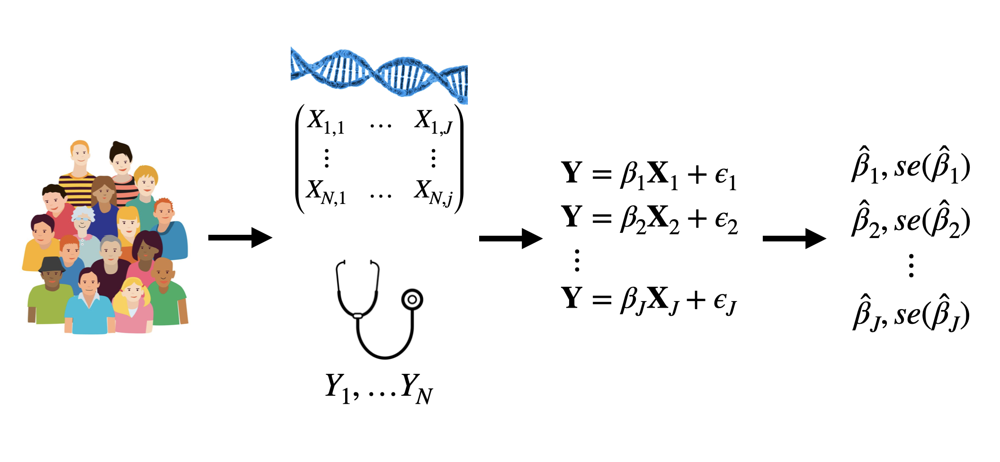
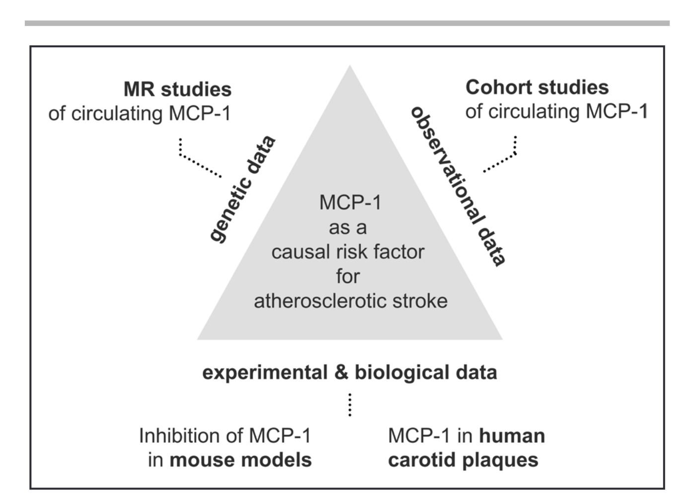
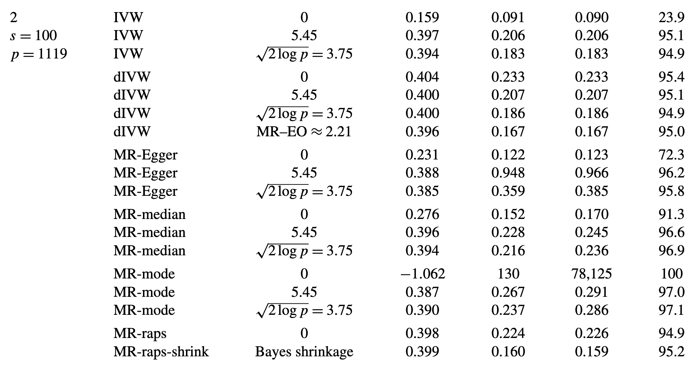
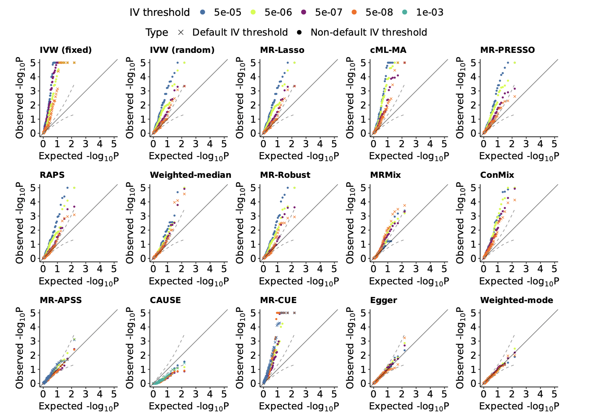
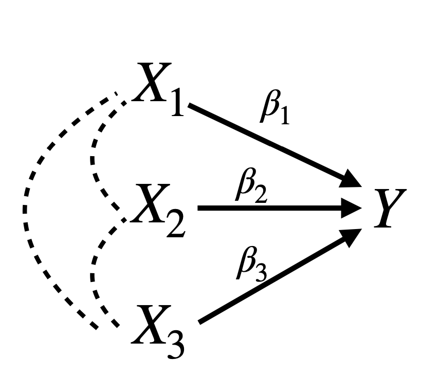
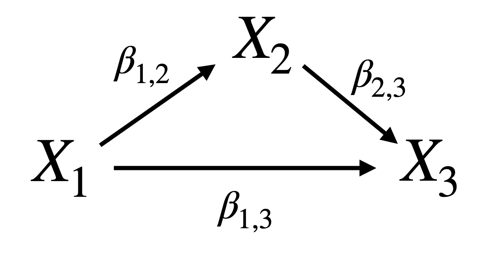
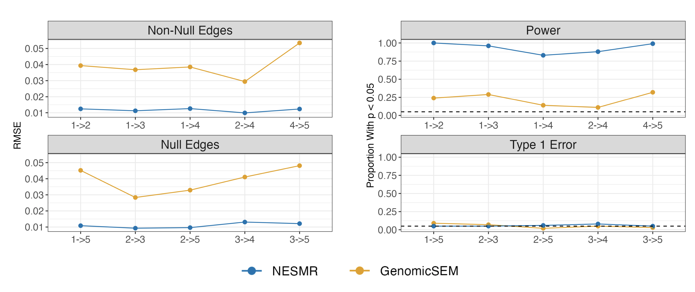
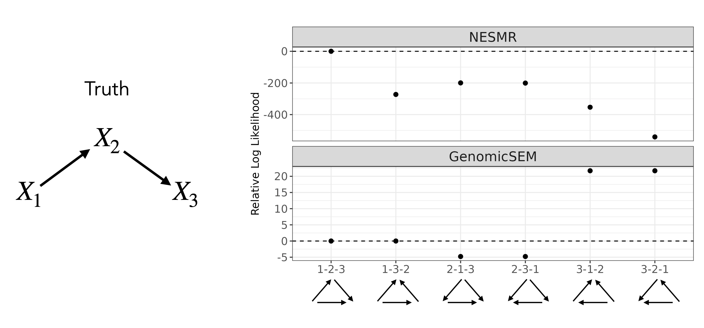

$\newcommand{\ci}{\perp\!\!\!\perp}$
```{r xaringanthemer, include=FALSE, warning=FALSE, echo = FALSE }
library(xaringanthemer)
style_mono_accent(
  link_color = "#ea8a1a",
  base_color = "#110566",
 # header_font_google = google_font("Josefin Sans"),
 # text_font_google   = google_font("Montserrat", "300", "300i"),
 # code_font_google   = google_font("Fira Mono")
)
xaringanExtra::use_tile_view()
xaringanExtra::use_search(show_icon = TRUE)
xaringanExtra::use_panelset()
library(tidyverse)
library(DiagrammeR)
```

## Lecture Outline

1. Structural Equation Motivation for IVW
1. Distribution of Single IV Estimator
1. Multiple IV Estimators
1. Mendelian Randomization

---
# 1. Structural Equation Motivation for IVW


---
## Structural Equation Model Approach

- Consider the set of linear structural models:

$$A_i(z)  = \beta_{A0} + \beta_{AZ} z + \epsilon_{A,i} \\\
Y_i(a)  = \beta_{Y0} + \gamma a + \epsilon_{Y,i}$$

- $\gamma$ is the causal effect we want to identify. 

- In this model, both the effect of $Z$ on $A$ and the effect of $A$ on $Y$ are homogeneous (the same for everyone).

- $\epsilon_{A,i}$ and $\epsilon_{Y,i}$ are mean zero deviations, which may depend on other variables.

- If there is confounding between $A$ and $Y$, then $\epsilon_A$ and $\epsilon_Y$ are correlated.

- Using consistency, we can substitute $A_i$ for $A_i(z)$ and $Z_i$ for $z$ in both equations.

---
## IV Assumptions Impose Constraints

$$A_i  = \beta_{A0} + \beta_{AZ} Z_i + \epsilon_{A,i} \\\
Y_i  = \beta_{Y0} + \gamma A_i + \epsilon_{Y,i}$$


- The relevance assumption means that $\beta_{AZ} \neq 0$. 


- The exclusion restriction requires that $Y$ is independent of $Z$ given $A$.  This is satisfied by conditions:
    - $Z_i$ is not in the second equation and 
    - $Cov(Z, \epsilon_{Y}) = 0$
    


- Exchangeability requires that there is no confounding between $Z$ and $Y$. 
    - This is also satisfied by $Cov(Z, \epsilon_{Y}) = 0$ 


- We need an additional condition to identify $\gamma$:  $Cov(Z_i, \epsilon_{A, i}) = 0$.
  + This is equivalent to assuming that the true association between $Z$ and $A$ is linear.  
   
---
## Structural Equation Model Approach

Starting with our system of structural equations:
$$A_i  = \beta_{A0} + \beta_{AZ} Z_i + \epsilon_{A,i} \\\
Y_i  = \beta_{Y0} + \gamma A_i + \epsilon_{Y,i}$$

Plug the first equation into the second. 
$$Y_i  = \beta_{Y0} + \gamma \left(\beta_{A0} + \beta_{AZ} Z_i + \epsilon_{A,i} \right) + \epsilon_{Y,i}\\\
 = \beta_{Y0}^\prime + \gamma \beta_{AZ} Z_i + \epsilon_{Y,i}^\prime$$

---
## Structural Equation Model Approach

$$A_i  = \beta_{A0} + \beta_{AZ} Z_i + \epsilon_{A,i} \\\
Y_i  = \beta_{Y0}^\prime + \gamma \beta_{AZ} Z_i + \epsilon_{Y,i}^\prime$$


This result suggests two estimation strategies: 

--

1. Two stage least squares:

  - Regress $Z$ on $A$ to obtain $\hat{\beta}_{AZ}$. 
  - Regress $Y$ on $\hat{\beta}_{AZ}Z$ to estimate $\gamma$. 

--

2. Ratio estimator: 

  - Regress $A$ on $Z$ to obtain $\hat{\beta}_{AZ}$.
  - Regress $Y$ on $Z$ to obtain $\hat{\beta}_{YZ}$, an estimate of $\gamma\beta_{AZ}$. 
  - Estimate $\gamma$ by $\hat{\beta}_{YZ}/\hat{\beta}_{AZ}$
  
- We will show that these estimates are identical, and for binary $Z$ and $A$, equal to the version of $\beta_{IV}$ we have already seen.
  

---
## Two Stage Least Squares

- Suppose we have $N$ observations of $(Z, A, Y)$. 

- Let $\mathbf{Z}$, $\mathbf{A}$, and $\mathbf{Y}$ be $N\times 1$ vectors. 

- For simplicity, assume that $\mathbf{A}$ and $\mathbf{Y}$ are centered (mean 0). 

- Then in the first stage we obtain 
$$\hat{\beta}_{AZ} = (\mathbf{Z}^\top \mathbf{Z})^{-1}\mathbf{Z}^\top\mathbf{A}$$

- In the second stage we regress $\hat{\beta}_{AZ}\mathbf{Z}$ on $Y$. 

$$\hat{\gamma} = \hat{\beta}_{2SLS} =  (\hat{\beta}_{AZ}^2\mathbf{Z}^\top \mathbf{Z})^{-1}\hat{\beta}_{AZ}\mathbf{Z}^\top\mathbf{Y}\\\
\frac{(\mathbf{Z}^\top \mathbf{Z})^{-1}\mathbf{Z}^\top\mathbf{Y}}{\hat{\beta}_{AZ}}
= \frac{\hat{\beta}_{YZ}}{\hat{\beta}_{AZ}}$$


---
## Ratio Estimator


- If $Z$ is binary then the OLS estimate of $\hat{\beta}_{AZ}$ is $E[A \vert Z =1]-E[A \vert Z = 0]$. 

- Similarly, the OLS estimate of $\hat{\beta}_{YZ}$ is $E[Y \vert Z = 1] - E[Y \vert Z = 0]$. 

- So $\hat{\beta}_{IV}$ introduced previously is a special case of the ratio estimator. 

---
## Two Sample IVA


- Both the 2SLS framework and the ratio estimator framework suggest that we don't need to measure $Z$, $A$ and $Y$ in the same sample. 

- We could instead have two samples, 
  + Sample 1: data for $Z$ and $A$ and 
  + Sample 2: data for $Z$ and $Y$. 

- In 2SLS, we conduct the first stage regression of $A$ on $Z$ in Sample 1. 

- We then use $\hat{\beta}_{AZ}$ to compute $\hat{\beta}_{AZ}Z$ in Sample 2. We then regress $Y$ on this new variable. 
  + $\hat{\beta}_{AZ}Z$ is like an imputed unconfounded version of $A$.
  
- Using the ratio framework, we use Sample 1 to estimate $\hat{\beta}_{AZ}$ and $\hat{\beta}_{YZ}$ and then compute the ratio. 

- These two strategies give identical results. 

---
## Two Sample IVA

- Being able to estimate the effect of $A$ on $Y$ without observing $A$ and $Y$ in the same data set is extremely powerful. 

- It makes it possible to address causal questions that would be otherwise impossible to study. 

Examples:

- $A$ and $Y$ might occur very far apart in time making it impractical to measure them in the same units. 
  + E.g Do exposures during pregnancy increase risks of late in life diseases. 
  
- One of $A$ or $Y$ might be challenging to measure while the other is easy. We can have a larger sample size for one stage than the other.
  
- Data have already been collected for either $Z$ and $A$ or $Z$ and $Y$ in a sample that cannot be recontacted. 


```{r, echo = FALSE, eval = FALSE}
n <- 1000
set.seed(1)
Z <- rbinom(n = n, size =1, prob = 0.5)
U <- rbinom(n = n, size = 1, prob = 0.5)
A <- rbinom(n =n, size = 1, prob = 0.2 + 0.5*Z-0.3*U)
Y <- 2*A + rnorm(n = n)
df <- data.frame(Z = Z, U = U, A = A, Y = Y)
S1 <- df[1:500,]
#S2 <- df[501:1000,]
S2 <- df[1:500,]

#2SLS
f1 <- lm(A ~ Z, data = S1)
S2 <- S2 %>% mutate(Ahat = f1$coefficients[2]*Z)
f2 <- lm(Y ~ Ahat, data = S2)
bhat2 <- f2$coefficients[2]
# Ratio
f2z <- lm(Y ~ Z, data = S2)
bhatR <- f2z$coefficients[2]/f1$coefficients[2]

```


---
## Adjusting for $Z-Y$ Confounding

- Our instrument does not have to perfectly satisfy the exchangeability condition, as long as we have measured any variables confounding $Z$ and $A$. 

- Hernan and Robins suggest that g-methods can be used to estimate the causal effect of $Z$ on $A$ accounting for confounders. 
  - The most common strategy is to simply add confounders to the regression of $A$ on $Z$. 

- In the education example, age is a potential confounder between quarter of birth and wages. 
  + Men born in the first quarter are older than their peers who started school the same year. 
  + Age is also associated with earnings. 
  + Angrist and Kruger adjust for age and age squared in the first stage of the 2SLS regression. 

---
# 2. Distribution of Single IV Estimator

---
## Distribution of the IV Estimator

- The standard IV estimator for a single IV is a ratio of random variables. 
$$\hat{\gamma} = \hat{\beta}_{IV} = \frac{\hat{\beta}_{YZ}}{\hat{\beta}_{AZ}}$$

- If $\hat{\beta}_{YZ}$ and $\hat{\beta}_{AZ}$ are estimated in different samples then 
the numerator and denominator are independent. Otherwise, they are dependent. 

- Inconveniently, none of the moments of $\hat{\beta}_{IV}$ exist and it is not normally distributed. 
  + This occurs because some of the mass of the distribution of $\hat{\beta}_{IV}$ is very close to 0. 
  
- For instruments with large effects on $A$, the portion of the distribution of $\hat{\beta}_{AZ}$ close to zero is very small, so a normal approximation to $\hat{\beta}_{IV}$ works reasonably well. 

---
## Distribution of the IV Estimator

- Write $\hat{\beta}_{AZ} = \mu + \sigma_{AZ} T_{AZ}$ where $T_{AZ}$ has mean 0 and variance 1, and $\sigma^2_{AZ} = Var(\hat{\beta}_{AZ})$.

- If all of our IV assumptions hold then $\hat{\beta}_{YZ} = \gamma \mu + \sigma_{YZ} T_{YZ}$, with  $\sigma^2_{YZ} = Var(\hat{\beta}_{YZ})$.

- This means that,

$$\hat{\beta}_{IV} = \frac{\gamma \mu + \sigma_{YZ} T_Y}{\mu + \sigma_{AZ} T_A} = \gamma \frac{1}{1 + (\sigma_{AZ}/\mu) T_{AZ}} + \frac{\sigma_{YZ} T_{YZ}}{\mu + \sigma_{AZ} T_{AZ}}$$
---
## Distribution of the IV Estimator


$$\hat{\beta}_{IV} = \frac{\gamma \mu + \sigma_{YZ} T_Y}{\mu + \sigma_{AZ} T_A} = \gamma \frac{1}{1 + (\sigma_{AZ}/\mu) T_{AZ}} + \frac{\sigma_{YZ} T_{YZ}}{\mu + \sigma_{AZ} T_{AZ}}$$

- If $T_{YZ}$ and $T_{AZ}$ are independent, then the expectation of the last term is 0. This occurs in two sample IVA.

- If $T_{AZ}$ is normally distributed, then $E[1/(1 + \sigma_{AZ} T_A/\mu)]$ does not have a defined expectation. 

- However, we can see that if $\mu/\sigma_{AZ}$ is large, then $\frac{1}{1 + (\sigma_{AZ}/\mu) T_{AZ}} \approx 1$. 

- As the sample size used to estimate $\hat{\beta}_{AZ}$ increases, $\sigma_{AZ}$, goes to zero, so $\hat{\beta}_{IV} \to \gamma$ . 

---
## Distribution of the IV Estimator

- We can approximate the mean and variance of $\hat{\beta}_{IV}$ from a first order Taylor expansion around $\gamma$.

- Recall that $\hat{\beta}_{IV}$ does not actually have either first or second moments.


- Define $f(\hat{\beta}_{YZ}, \hat{\beta}_{AZ}) = \hat{\beta}_{YZ}/\hat{\beta}_{AZ} = \hat{\beta}_{IV}$. Then for any two-dimensional point $\boldsymbol{\theta}$, 

$$f(\hat{\beta}_{YZ}, \hat{\beta}_{AZ}) = f(\boldsymbol{\theta}) + \nabla f(\boldsymbol{\theta})^\top \begin{pmatrix} \hat{\beta}_{YZ} - \theta_1 \\ \hat{\beta}_{AZ} - \theta_2 \end{pmatrix} + \text{Rem}$$
---
## Distribution of the IV Estimator

- If we plug in $\boldsymbol{\theta} = (E[\hat{\beta}_{YZ}], E[\hat{\beta}_{AZ}]) = (\gamma \mu , \mu)$ we obtain 

$$\begin{split}
E[f(\hat{\beta}_{YZ}, \hat{\beta}_{AZ})] \approx & \gamma\\
Var(f(\hat{\beta}_{YZ}, \hat{\beta}_{AZ})) \approx &  \gamma^2 \left(\frac{\sigma^2_{AZ}}{ \mu^2} + \frac{\sigma^2_{YZ}}{\gamma^2 \mu^2} - 2 \frac{Cov(\hat{\beta}_{YZ}, \hat{\beta}_{AZ})}{\gamma \mu ^2} \right) \\ 
\approx & \hat{\gamma}^2 \left(\frac{\hat{\sigma}^2_{AZ}}{ \hat{\beta}_{AZ}^2} + \frac{\hat{\sigma}^2_{YZ}}{\hat{\beta}_{YZ}^2} - 2 \frac{Cov(\hat{\beta}_{YZ}, \hat{\beta}_{AZ})}{\hat{\beta}_{AZ}\hat{\beta}_{YZ}} \right)
\end{split}$$

- In the last step we replace all unknowns with estimates. 

---
## Distribution of the IV Estimator

- To see how good the normal approximation is, we simulate some data. 

- Simulate $\hat{\beta}_{YZ} \sim N(\gamma \mu_x, 1)$ and $\hat{\beta}_{AZ} \sim N(\mu_x, 1)$, independent. 

- Calculate $(\hat{\beta}_{IV} - \gamma)/\sqrt{\hat{V}}$ using the formula from the previous slide to estimate the variance of $\hat{\beta}_{IV}$ 

- Compare these values to a standard normal distribution. 

- We consider values of $\gamma = 0$ or $\gamma = 1$ and $\mu = 1, 2, 5, 10$. 

---
## Distribution of the IV Estimator

<center>
```{r chunk2, echo = FALSE, fig.align='center', out.width="95%", warning=FALSE, message = FALSE, fig.height=10, fig.width=20}
set.seed(1)

df1 <- purrr::map_dfr(c(1, 2,5, 10), function(m){
num <- rnorm(mean = 0, n = 1000)
denom <- rnorm(n = 1000, mean = m)
ghat <- num/denom

vhat <- ghat^2 *(1/denom^2 + 1/num^2)
res <- data.frame(m = paste0("mu = ", m), g = "gamma = 0", z = ghat/sqrt(vhat))
return(res)
})

df2 <- purrr::map_dfr(c(1, 2, 5, 10), function(m){
num <- rnorm(mean = m, n = 1000)
denom <- rnorm(n = 1000, mean = m)
ghat <- num/denom

vhat <- ghat^2 *(1/denom^2 + 1/num^2)
res <- data.frame(m = paste0("mu = ", m), g = "gamma = 1", z = (ghat-1)/sqrt(vhat))
return(res)
})
df <- bind_rows(df1, df2) %>% mutate(m = factor(m, levels = paste0("mu = ", c(1, 2, 5, 10))))
  
ggplot(df) + geom_histogram(aes(x = z, y = ..density.. ), 
                            colour = "black", fill = "white") + 
  stat_function(fun = dnorm, args = list(mean = 0, sd = 1)) + 
  theme_bw() + 
  theme(axis.title = element_text(size = 30), 
        strip.text = element_text(size = 30), 
        axis.text = element_text(size = 20)) +
  facet_wrap(~g + m, nrow = 2)  


```

</center>
---
## Distribution of the IV Estimator

- The approximation is better when $\mu$ is larger. 

- When $\mu$ is small and $\gamma \neq 0$, $\hat{\beta}_{IV}- \gamma$ is, on average, lower than expected under the normal approximation. We are underestimating the causal effect. 

- This is called **weak instrument bias** because it occurs when the effect of the instrument on the exposure is small compared to the estimation error of $\hat{\beta}_{AZ}$.

---
# 3. Multiple IV Estimators

---
## Multiple Instruments

- Both the 2SLS estimation strategy and the ratio strategy extend to multiple instruments. 

- Let $\mathbf{Z}_i$ be a $k$-vector of instruments.

- For 2SLS, we extend our set of linear models.

$$A_i  = \beta_{A0} + \boldsymbol{\beta}_{AZ}^\top \mathbf{Z}_i + \epsilon_{A,i} \\\
Y_i  = \beta_{Y0} + \gamma A_i + \epsilon_{Y,i}$$

- In the first stage, we estimate $\hat{\boldsymbol{\beta}}_{AZ}$. 

- In the second stage regress $Y$ on $\hat{A} = \hat{\boldsymbol{\beta}}_{AZ}^\top Z$. 

- Angrist and Kruger (1991) also examine the problem using quarter of birth interacted with year-of-birth. 
  + This gives multiple instruments that could affect total years of education differently. 


---
## Inverse Variance Weighted Regression

- The extension of the ratio estimator to multiple instruments is called **inverse variance weighted regression** or IVW regression.

- For each instrument, we can construct a ratio estimate

$$\hat{\beta}_{IV,1}  = \frac{\hat{\beta}_{YZ_1}}{\hat\beta_{AZ_1}}, \dots, \hat{\beta}_{IV,K}  = \frac{\hat{\beta}_{YZ_K}}{\hat\beta_{AZ_K}}$$
- We then construct an overall estimate as a weighted average $$\hat{\beta}_{IVW} = \frac{\sum_{k=1}^K w_k \hat{\beta}_{IV,k}}{\sum_{k =1}^K w_k}$$ where $w_k$ is the inverse of the (approximate) variance of $\hat{\beta}_{IV,k}$.

- $\hat{\beta}_{IVW}$ is asymptotically equivalent (but not numerically identical) to the  2SLS estimate.


---
## Inverse Variance Weighted Regression

- IVW regression is often used when only the estimates $\hat{\beta}_{YZ_k}$ and $\hat{\beta}_{AZ_k}$ are available, but the individual level data is not. 
  - This is often the case in Mendelian randomization. 

- In MR, $\hat{\beta}_{YZ_k}$ and $\hat{\beta}_{AZ_k}$ are obtained from marginal regressions on each instrument separately (GWAS), so our instruments need to be marginally approximately independent. 

- If we use dependent instruments, we will under-estimate the variance of $\hat{\beta}_{IVW}$. 


---
## IVW Regression


- For IVW regression, we need to choose the weights $w_j$. 

- The most common approach is to use

$$w_k^{-1} = \frac{\sigma_{Y,Z_k}^2}{\hat{\beta}_{A,Z_k}^2} \approx Var(\hat{\beta}_{IV,k})$$  

- This is the estimate of $Var(\hat{\beta}_{IV,k})$ we would get using our previous formula but assuming that $\gamma = 0$.


- Plugging in these weights gives us

$$\hat{\beta}_{IVW} =   \frac{\sum_{k=1}^K \hat{\beta}_{YZ_k}\hat{\beta}_{AZ_k}\sigma^{-2}_{YZk}}{\sum_{k=1}^K \hat{\beta}^2_{AZ_k}\sigma^{-2}_{YZ_k}}$$


---

## IVW as Regression of Summary Statistics

- The estimator $$\hat{\beta}_{IVW} = \sum_{k=1}^K   \frac{\hat{\beta}_{YZ_k}\hat{\beta}_{A,Z_k}\sigma^{-2}_{Y,Zk}}{\hat{\beta}^2_{A,Z_k}\sigma^{-2}_{Y,Zk}}$$
is exactly the estimate we would get from regressing  $(\hat{\beta}_{Y,Z_1}, \dots, \hat{\beta}_{Y, Z_K})$ on $(\hat{\beta}_{A,Z_1}, \dots, \hat{\beta}_{A, Z_K})$ with no intercept.

- This makes sense: our linear model implies that 

$$E[\hat{\beta}_{A, Z_k}] = \beta_{A, Z_k} \qquad\text{and}\qquad
E[\hat{\beta}_{Y, Z_k}] = \gamma\beta_{A,Z_k}$$

- Based on these equations, we might estimate $\gamma$ by substituting $\hat{\beta}_{A, Z_k}$ for $\beta_{A, Z_k}$ in the second equation and fitting a regression.

---

## IVW as Regression of Summary Statistics

<center> 
```{r chunk3, echo=FALSE, out.width="70%"}
knitr::include_graphics("img/10_ldl_cad.jpg")
```
</center>

Ference et al, Journal of American College of Cardiology (2012)

---
## Expectation of IVW Estimator

- With $K$ IVs, the moments of the 2SLS and IVW estimators exist up $K-1$. 

- Zhao et al (2019) (and others) calculate an approximation of $E\left[\hat{\beta}_{IVW}\right]$ for independent samples. 

- For simplicity, assume that $\sigma^2_{AZ_k} = \sigma^2_{A}$ and $\hat{\sigma}^2_{YZ_k} = \sigma^2_{Y}$ are constant over instruments.

- Write $\hat{\beta}_{YZ_k} = \gamma \mu_k + \epsilon_{Y,k}$ and $\hat{\beta}_{AZ_k} = \mu_k + \epsilon_{A,k}$.

- With independent samples, $\epsilon_{Y,k}$ and $\epsilon_{A,k}$ are independent.


---
## Expectation of IVW Estimator

$$\begin{split}
E[\hat{\beta}_{IVW}] =& E\left[\frac{\sum_{k=1}^K \hat{\beta}_{Y,Z_k}\hat{\beta}_{A,Z_k}\sigma^{-2}_{Y,Z_k}}{\sum_{k=1}^K \hat{\beta}^2_{A,Z_k}\sigma^{-2}_{Y,Zk}}\right]\\
=& E\left[\frac{\sum_{k=1}^K \hat{\beta}_{YZ_k}\hat{\beta}_{A,Z_k}}{\sum_{k=1}^K \hat{\beta}^2_{A,Z_k}}\right] \approx \frac{E\left[\sum_{k=1}^K \hat{\beta}_{YZ_k}\hat{\beta}_{A,Z_k}\right]}{E\left[\sum_{k=1}^K \hat{\beta}^2_{A,Z_k}\right]}\\
\approx &\frac{\gamma \sum_{k = 1}^K \mu_k^2}{\sum_{k = 1}^K \mu_k^2 + \sum_{k = 1}^K E[\epsilon_{A,k}^2]} = \frac{\gamma}{1 + (p\sigma^2_{A})/\sum_{k = 1}^K \mu_k^2}\\
=& \frac{\gamma}{1 + 1/\kappa}&
\end{split}$$

where $\kappa = \frac{1}{p}\sum_{k = 1}^K \frac{\mu_k^2}{\sigma^2_{AZ_k}}$ represents the average instrument strength. 
---
## Expectation of IVW Estimator

- Solving the expression from the previous slide, we find that 

$$E[\hat{\beta}_{IVW} - \gamma] \approx \frac{-\gamma}{\kappa}$$
- $\kappa = \frac{1}{K} \sum_{k = 1}^K \frac{E[\hat{\beta}_{AZ_k}]^2}{\sigma^2_{A,k}}$ represents average instrument strength. This can be estimated as the average chi-squared statistic minus 1.

- Weak instrument bias is pushing the estimate closer to zero. 

- This is the same pattern we saw in the single instrument case. 


---
## Expectation of IVW Estimator

- When there is sample overlap, $\epsilon_{A,k}$ and $\epsilon_{Z_k}$ are not independent and there is an additional term in the expression for the expected bias.

- In the numerator of the expression for $E[\hat{\beta}_{IVW}]$ we have
$$E\left[\sum_{k=1}^K \hat{\beta}_{YZ_k}\hat{\beta}_{A,Z_k}\right] = \gamma \sum_{k = 1}^K \mu_k^2 + Cov(\epsilon_{A,k},\epsilon_{Z_k})$$
- Rearranging terms and combining with the previous expression we have

$$E[\hat{\beta}_{IVW} - \gamma] \approx \frac{-\gamma + \rho c}{\kappa}$$
- Where $\rho = Cor(\epsilon_{A,k},\epsilon_{Z_k})$ and $c = \sigma_{Y}/\sigma_{A}$.

---
## Bias of the OLS Estimate


- Let $\rho_{pop}$ be the population correlation of $A$ and $Y$. 

- The expectation of the OLS estimate regressing $A$ on $Y$ is 

$$
\begin{split}
&E\left[ \hat{\beta}_{OLS} \right] =  \frac{Cov(A, Y)}{Var(A)} = \rho_{pop}\sqrt{\frac{Var(Y)}{Var(A)}} \equiv \rho_{pop} c_{pop}\\
&E\left[ \hat{\beta}_{OLS} -\gamma \right] = \rho_{pop}c_{pop} - \gamma
\end{split}
$$ where $Var(Y)$ is the residual variance of $Y$. 

---
## Bias of the IVW Estimator

- If each instrument explains a small amount of the variance of $A$ and there is complete sample overlap then $\rho \approx \rho_{pop}$ and $c \approx c_{pop}$.

- So the bias of the IVW estimate is approximately equal to the bias of the OLS estimate divided by $\kappa$. 

-  Weak instrument bias is in the direction of the unadjusted (confounded) OLS estimate. 

- We have derived these expressions for the IVW estimator but the same results can be found for the 2SLS estimator. 


```{r, echo = FALSE, eval = FALSE}
run1 <- function(n = 1000, p = 10, ba = rep(0.02, 10), 
                 gamma = 0, bua = 0.2, buy = -0.2){
  Z <- matrix(rnorm(n = n*p), nrow = n)
  
  U <- rnorm(n = n)
  s <- sqrt(1 - bua^2 - sum(ba^2) )
  eps <- rnorm(n = n, sd = s)
  A <- matrix(rowSums(t(t(Z)*ba)) + bua*U + eps, nrow = n)
  sy <- sqrt(1 - buy^2)
  nu <- rnorm(n = n, sd = sy)
  Y <- matrix(gamma*A + buy*U + nu, nrow = n)
  Pz <- Z %*% solve(t(Z) %*% Z) %*% t(Z)
  bhat_2sls <- (t(A) %*% Pz %*% Y)/(t(A) %*% Pz %*% A)
  
  by <- sapply(1:p, function(i){
    fy <- lm(Y ~ Z[,i])
    c(fy$coefficients[2], vcov(fy)[2,2])
  })
  bx <- sapply(1:p, function(i){
    fx <- lm(A ~ Z[,i])
    c(fx$coefficients[2], vcov(fx)[2,2])
  })
  bj <- by[1,]/bx[1,]
  wj <- 1/(by[2,]^2/bx[1,]^2)
  f_ivw <- lm(by[1,] ~ bx[1,]-1, weights = 1/by[2,]^2)
  bhat_ivw <- f_ivw$coefficients[1]
  s_ivw <- sqrt(vcov(f_ivw)[1,1])
  
  bhat_ols <- lm(Y ~ A)$coefficients[2]
  return(c(bhat_ols, bhat_ivw, bhat_2sls))
}


res1 <- purrr::map_dfr(c(0.01, 0.05, 0.1, 0.2), function(a){
  x <- replicate(n = 100, run1(ba = rep(a, 10)))
  return(rowMeans(x))
})

res2 <- purrr::map_dfr(c(0.01, 0.05, 0.1, 0.2), function(a){
  x <- replicate(n = 100, run1(ba = rep(a, 10), buy = 0.2))
  return(rowMeans(x))
})

res3 <- purrr::map_dfr(c(0.01, 0.05, 0.1, 0.2), function(a){
  x <- replicate(n = 100, run1(ba = rep(a, 10), gamma = 0.1))
  return(rowMeans(x))
})

res4 <- purrr::map_dfr(c(0.01, 0.05, 0.1, 0.2), function(a){
  x <- replicate(n = 100, run1(ba = rep(a, 10), buy = 0.2, gamma = 0.1))
  return(rowMeans(x))
})
```


---
## Weak Instrument Bias


- The table below shows simulation results from Burgess and Thompson (2011). 

- Relative bias is comparing the OLS and the IV estimate.

- We can see that as predicted, relative bias depends on $1/F$ (approximately $1/\kappa$ in our notation). 

<center> 
```{r, echo=FALSE, out.width="80%"}
knitr::include_graphics("img/10_bandt_tab2.png")
```
</center>


---
## Weak Instrument Bias in the Education Example

- Bound, Jaeger, and Baker (1993 and 1995) point out that after adjusting for age, age squared, and year of birth the F-statistic for the quarter of birth IVs is actually quite small. 

- A small amount of confounding between years of education and wages or slight violations of the exclusion restriction, could account for the results observed by Angrist and Kruger. 

---
## Weak Instrument Bias in the Education Example

<center> 
```{r, echo=FALSE, out.width="90%"}
knitr::include_graphics("img/10_bound_tab1.png")
```
</center>

---
## Weak Instrument Bias as Regression Dilution

- Recall that the IVW estimator is a regression of $\boldsymbol{\hat{\beta}}_Y$ on $\boldsymbol{\hat{\beta}}_A$.

- However, our equation was $E[\hat{\beta}_{YZ_k}] = \gamma \beta_{AZ_k}$. We substituted the hat value for $\beta_{AZ_k}$.

- Bias arises because $\hat{\beta}_{AZ_k}$ are measured with error. 

- Measurement error in a predictor will attenuate the estimated coefficient. 


---
## Regression Dilution

- Uncertainty in $\hat{\beta}_{AZ}$ leads to regression dilution, causal estimate biased towards the null. 

<center> 
```{r,  echo=FALSE, out.width="70%", fig.show='animate', ffmpeg.format='gif'}
knitr::include_graphics("img/10_regression_dilution.gif")
```
</center>

Animation from Robert Östling


---
## Bias in the IV Estimate

<center> 
```{r, echo=FALSE, out.width="115%"}
knitr::include_graphics("img/10_bdt_fig1.png")
```
</center>

---
## Selection Bias


- If we test our potential instrument and find that our estimated F statistic is small, we will probably reject it as an instrument. 

- This means that on average, our estimate of $\hat{\beta}_{AZ}$ will tend to be too extreme (far from 0). 

- Overestimating the magnitude of $\hat{\beta}_{AZ}$ will lead us to understimate the magnitude of $\gamma$, biasing results towards the null.  

---
## Selection Bias

- This problem is bigger in settings where there are many possible instruments to choose from and selection is required. 
  + In these circumstances, three sample IV is sometimes suggested. 
  + We use one sample with measurements of $Z$ and $A$ to select instruments, and a second sample with measurements of $Z$ and $A$ to estimate $\hat{\beta}_{AZ}$. 
  
- Bias due to winner's curse tends to be small relative to weak instrument bias and is smaller for more stringent significance cutoffs.

---
## Bias in IV Estimates Summary

- Using 2SLS or IVW in a single sample, bias due to weak instruments will be towards the confounded population correlation. 

- In estimates from separate samples, weak instrument bias will bias the estimate towards the null. 

- Selection bias will bias results towards the null but is smaller than weak instrument bias. 

- This is all bias that occurs *when all of the assumptions are satisfied*. 

- Violations of exchangeability or the exclusion restriction introduce correlation between $Z$ and $\epsilon_{Y}$. If this occurs, bias could be in any direction but will most often be similar to the observational bias. 

---
## Pros and Cons of Using Multiple Instruments

Pros: 
- We have seen that our estimators do not have finite moments for single instruments. 
  - This makes it appealing to use multiple instruments whenever possible. 

- Combining multiple instruments into a single instrument can increase the total F statistic, decreasing bias. 

Cons:
- The more instruments we include, the more chances we have to vioalte one of the IV assumptions. 
   + Valid inference depends on all instruments being valid. 
   
- In more non-parametric settings, using multiple instruments can make interpretation hard. 


---
## Multiple Instrument Interpretation

- Each of the ratio estimates is an estimate of the complier average causal effect. 

- However, different instruments have different complier groups. 
  - In Angrist and Kruger, all instruments related to quarter of birth so plausibly, the "complier" group associated with each instrument represent similar populations. 

- If we are not willing to accept a model in which the effect is homogeneous, or there are no non-compliers, we are now estimating a weighted average of LATEs applying to different sub-groups. 

- However, if we believe that the sign of the causal effect is the same in all complier groups, we still have a valid test of the strict null and the sign of the estimated effect is meaningful. 


---
# 4. Mendelian Randomization


---
## Genetic Variation

- DNA is a long molecule that encodes instructions for building and regulating the proteins that make up an organism. 

- DNA is arranged in chromosomes. Each cell nucleus in the human body contains two non-identical copies of each of 22 chromosomes plus two sex chromosomes. 

- For our purposes, think of each chromosome as a very long series of letters ("bases" or "base-pairs"). At each position there can be an A, C, T, or G. 

<center> 
```{r, echo=FALSE, out.width="50%"}
knitr::include_graphics("img/12_chromosomes.jpg")
```
</center>


---
## Genetic Variation

- Any two people have nearly identical DNA, with differences at a small fraction of locations. 

- However, there are many places in the genome that are variable in the population. 
  - Different variants of a DNA sequence are called alleles. 
  - The identity of the alleles a person has at a variable position is that persons genotype at that variant.

---
## Genetic Variation

- Today, we will only think about genetic variants that are one base long and where there are two possible values in the population. 
  - These are diallelic single nucleotide polymorphisms (SNPs).

- Suppose we have a SNP that could be A or G. Because each person has two copies of their genome, they could have A/A, A/G, or G/G genotypes. 

- All of our genetic variants can be represented as three level variables that can be coded as 0, 1, or 2.


---
## Mendelian Inheritance

- The rationale for MR comes from the principle of Mendelian inheritance. 

- An offspring will receive one copy of each chromosome from each parent.

- Which of their mothers/fathers two chromosomes they inherit is random with equal probability. 

- Example: If an offspring has one parent with A/A genotype and another with A/G genotype, they have a 50% chance of being A/A and a 50% chance of being A/G.

- Example: If an offspring has two parents with A/G genotypes they have a 50% chance of being A/G, a 25% chance of being A/A, and a 25% chance of being G/G.

---
## Mendelian Inheritance


<center> 
```{r, echo=FALSE, out.width="90%"}
knitr::include_graphics("img/12_inheritance.png")
```
</center>


---
## Mendelian Randomization


- In Mendelian randomization, genetic variants are used as instruments. 

- Suppose we have a genetic variant that we know know affects the value of our exposure, $A$, such as blood pressure. 

- Each person is randomized to have slightly lower or slightly higher value of $A$, with randomization probability conditional on their parent's genotypes. 


---
## Mendelian Randomization

- MR is appealing because two of the MR assumptions are easy to justify.

+ The principle of Mendelian inheritance rules out arrows going into $Z$, so we can justify the exchangeability assumption
  
+ Many decades of genetic association studies have established that almost all traits have some heritable component, meaning that there are variants that affect them.
  + This means it is possible to satisfy relevance. 

--

+ The exclusion restriction is harder to guarantee in MR. This has lead to a lot of MR methods development.

---
## Population vs Family-Based MR


- The Mendelian inheritance argument suggests that we should condition on parental genotypes when we use variants as instrumental varialbes.

- However, this approach is quite uncommon becuase it is hard to obtain large samples of genetic trio data. 

- Instead, we usually use unconditional (marginal) genetic associations.

- The justification for this practice relies on an assumption of random partner choice (called random mating). 
  + This assumption says that the probability that two people have a child together does not depend on their genotype at our instrumental variable. 


---
## Population vs Family-Based MR

- Non-random mating leads to violations exchangeability. 
  
- Two ways this can fail: 
  - Population structure: people with similar ancestry tend to have children together and have shared environmental exposures. 
  - Assortative mating: people tend to prefer partners with similar physical or behavioral traits. 

- We can account for population structure in our analyses, but assortative mating is usually ignored.

<center> 
```{r, echo=FALSE, out.width="45%"}
knitr::include_graphics("img/12_pop_structure.png")
```
</center>


---
## Genome-Wide Association Studies

- GWAS are studies of genetic associations with diseases.


<center> 
```{r, echo=FALSE, out.width="90%"}

```
</center>


---
## Genome-Wide Association Studies

- We have been conducting large-scale GWAS for about 20 years. 

- We have learned from these studies that nearly every trait has some hertiable component, including behavioral traits like coffee drinking preference, and physical traits like height. 

- Usually, each causal variant has a very very small effect on the measured trait, but with large sample sizes we can easure these accurately. 

- Importantly for MR, summary variant-trait associations are publicly available for free for a huge number of traits. 
  + The NIH has required that GWAS funded by the NIH make summary statistics available. 

---
## Basic MR Pipeline

- MR using GWAS summary statistics is incredibly simple to perform and requires almost no subject-matter knowledge. 
  + This is a strong contrast with the G-formula methos we learned earlier in this class. 

- Formula:
  + Identify a GWAS for the exposure.
  + Identify a set of independent variants associated with the exposure in that study. 
  + Identify a GWAS for the outcome. 
  + Extraxt summary statistics for your chosen instruments for the outcome. Harmonize the data.
  + Compute the MR estimate using a method like IVW regression. 

---
## Interpretation Limitations in MR

- Complier groups are unknown and hard to define. We generally don't know the mechanism of most variants. 

- We generally assume that everyone is a complier for all instruments. 

- The exposure can be ill-defined.
- We don't know *when* a variant affects a trait so we cannot differentiate short and long term exposure. 
  + We may know that genetic changes altering $A$ increase disease risk $Y,$ but does that mean that if we pharmaceutically alter $A$ later in life we can prevent $Y$?

- Variants may be affecting different components of an overly broad exposure, e.g. very large LDLs vs large LDLs. 
  

---
## Mendelian Randomization Popularity Boom

- Because MR is so easy to perform, there has been a boom in MR and MR-related papers. 

- Some of these have been quite useful. 

- For example, early in the Covid-19 pandemic, vitamin D was suggested as a protective factor based on country level and patient level observational data. 

- Multiple MR studies have subsequently found no relationship between genetically predicted vitamin D levels and Covid-19 infection or hospitalization. 

- This does not rule out the possibility that acute changes in vitamin D levels near the time of exposure affect infection risk. 

- But it does suggest that resources may be better spent looking at other interventions. 

---
## Common Problems in MR Studies

- In the recent boom, there have also been papers that range from useless to negligent. 

- In my view, there are three categories of ways that an MR paper can be bad.

- Lack of scientific reasoning: Some studies examine exposures such as air pollution, for which any genetic associations are highly likely to be a result of failures of exchangeability.  

- Lack of attention potential violations of the exclusion restriction. Studies that ignore that the ER is likely violated by at least some instruments are unreliable. 

- Lack of a so-what: MR is so trivial to perform that MR papers need to provide some additional insight or corroboration to be worth either reading or writing. 

---
## Drug Target Discovery for Stroke, a Positive Story

- A large number of MR studies have been done examining potentially modifiable risk factors for stroke. 

- A benefit of MR is that it can be applied with large numbers of outcomes ("phenome-wide"), which provide an opportunity to identify potential side-effects before conducting clinical trials. 


---
## Stroke and Iron

- MR studies show protective effects of higher serum iron levels for coronary artery disease but risk increasing effects for ischemic stroke. 
  + This may appear surprising because ischemic stroke and CAD share many risk factors. 
  
- Researchers were able to provide deeper explanations by looking at stroke sub-types and secondary features of carotid artery plaque and venous thromboembolism (blood clot). 

- MR results show that higher lifelong levels of iron reduce carotid plaque but increase bloodclot risk. 

- Recent MR studies have also shown negative effects of iron levels on overall life expectancy. 


---
## Stroke and MCP-1

- MCP-1 is a factor related to inflamation that was identified as potentially risk increasing for cardiometabolic stroke in an agnostic analysis looking at several inflammation related metabolites. 

- These results were then supported by analyses in observational data, in animal models, and by looking at MR with related traits for evidence to support they hypothesized mechanism. 


<center> 
```{r, echo=FALSE, out.width="50%"}

```
</center>


---
## Statistical Fronteirs in MR

- There are several interesting areas of statistical methods development in MR:

- Better estimators: Estimators that resolve the problem of finite sample (weak instrument) bias in IVW regression, estimators that account for winner's curse, estimators that are more efficient. 

- Accounting for failures of the exclusion restriction (horizontal pleiotropy):
  + It is generally unreasonable to assume that the ER holds for all of your chosen instruments. 
  
- Multivariable and Network MR:
  + Multivariable and Network MR are used to measure effects of multiple exposures simultaneously. 
  + These can have applications in mediation analysis, can be used for accounting for ER violations, and can be used for causal structure discovery. 

---
## De-Biased IVW

- We saw previously that when IVW regression is performed with data from two different samples, the estimate is shrunk towards zero. 

- The debiased IVW (dIVW) method introduced by Ye et al. (2021) addresses this by multiplying the IVW estimator by a correction factor.

$$\hat{\beta}_{dIVW} = \hat{\beta}_{IVW} \frac{\sum_k \hat{w}_k}{\sum_k (\hat{w}_k - \hat{v}_k)}$$

$$\hat{w}_k = \frac{\hat{\beta}^2_{A,k}}{\hat{\sigma}^2_{A,k}} \qquad \hat{v}_k = \frac{\hat{\sigma}^2_{A,k}}{\hat{\sigma}^2_{Z_k}}$$

---
## De-Biased IVW

- Ye at al. prove that the dIVW estimator is consistent and asymptotically normal under weaker conditions than regular IVW.

- The original IVW estimator requires that $\kappa/p \to \infty$, where $\kappa = \frac{1}{p}\sum_{k} \frac{\beta_{A,k}^2}{\sigma^2_{A,k}}$ is the average instrument strength. 

- dIVW is consistent and AN under the condition $\kappa/\sqrt{p} \to \infty$ and $max(\beta_{A,k}^2/\sigma^2_{A,k})/(\kappa p. + p) \to 0$. 

---
## Likelihood-Based Estimation

- IVW regression has finite sample bias because it ignores measurement error in $\hat{\beta}_{A,k}$. 

- My group and several other groups have proposed likelihood-based methods that involve modeling $\hat{\beta}_{A,k}$ and $\hat{\beta}_{Y,k}$ as jointly normally distributed. 


$$\begin{split}
\begin{pmatrix}
\hat{\beta}_{A,k} \\
\hat{\beta}_{Y,k} \end{pmatrix} \sim N\left(\begin{pmatrix} \mu_k \\
\gamma \mu_k + \alpha_k \end{pmatrix}, \Sigma_k\right)
\end{split}$$

- The $\alpha_k$ term allows for some violation of the exclusion restriction.

- The challenge in this approach is that $\mu_k$ and $\alpha_k$ are nuisance parameters.

---
## Likelihood-Based Estimation

- Different approaches using this strategy take different approaches to modeling the nuisance parameters. 

- MR-RAPS usess a profile approach. They first maximize the likelihood in $\mu_k$ assuming $\alpha_k$ are zero. Then they maximize the profile likelihood in $\gamma$.

- We (ESMR) and others (MR-APSS) have taken empirical Bayes approaches. We assume $\mu_k$ and $\alpha_k$ follow an unknown distribution from a known distributional family. 

- We then maximize the likelihood in $\gamma$ and parameters of the nuisance distribution. 


---
## Accounting for Violations of the Exclusion Restriction

- A simple extension of the SEM we have been working with allows for some violations of the ER. 

$$A_i  = \beta_{A0} + \boldsymbol{\beta}_{AZ}^\top \mathbf{Z}_i + \epsilon_{A,i}$$
$$Y_i  = \beta_{Y0} + \gamma A_i + \boldsymbol{\alpha}^\top Z_i + \epsilon_{Y,i}$$ 

- The presence of the $\boldsymbol{\alpha}^\top Z_i$ term in the second equation is a violation of the exclusion restriction. 

- As written, the parameters in this new model are not identifiable. We have to make some restrictions on $\boldsymbol{\alpha}$. 

---
## Egger Regression

- Our extended model implies that, if $Z_1, \dots, Z_K$ are independent,  
$$E[\hat{\beta}_{YZ,k}] = \alpha_k + \gamma \beta_{AZ,k}$$

- IVW regression, regresses $\hat{\beta}_{YZ}$ on $\hat{\beta}_{AZ}$ with no intercept.

- Egger regression extends this strategy to add an intercept, fitting
$$E[\hat{\beta}_Y] = \alpha_0 + \gamma \hat{\beta}_A$$
---
## Egger Regression

- Egger regression is valid if, either $\boldsymbol{\alpha} = \alpha_0 \mathbf{1}_{K}$ or $\sum_{k = 1}^K \alpha_k \beta_{AZ,k}  = 0$
  
- The second condition occurs if there are a large number of instruments and we think of $\beta_{AZ,k}$ and $\alpha_k$ as random with $Cov(\beta_{AZ}, \alpha) = 0$. 
  
- This assumption says that effects of instruments not mediated by $A$ are independent of the effects of instruments on $A$. 
  + This is called the Instrument Strength Independent of the Direct Effect (InSIDE) assumption

---
## Egger Regression

- Egger regression performs consistently poorly in both real applications and simulation experiments. 

- It has high variance due to estimation of the intercept term. 

- It is not much more robust to violations of the ER than IVW regression. 
  + Egger is only better than IVW violations of the ER occur consistently in one direction, which is not a biologically plausible scenario. 


---
## Violations of InSIDE

- Violations of the InSIDE assumption occur when some instruments affect $A$ *through* a confounder of the exposure and the outcome. 

<center> 
```{r, echo=FALSE, out.width="95%"}
knitr::include_graphics("img/10_scatter2.png")
```
</center>

---
## Majority Valid

- Without any additional information, about the source of violations of the ER, we can make a "majority valid" assumption. 

- This assumption says that the majority of IVs are valid, or for some methods, satisfy the InSIDE assumption. 


---
## Median Regression 

- Median regression, proposed by Bowden et al (2016) is one of many methods making the majority valid assumption. 

- Rather than use the IVW estimator which averages the $K$ ratio estimates, we take the median of the ratio estimates.

<center> 
```{r, echo=FALSE, out.width="95%"}
knitr::include_graphics("img/10_median.png")
```
</center>

---
## Outlier Robust Regression

- There are several variations of this strategy.

- Modal regression: use the mode of the ratio estimates. 

- Outlier detection: use a strategy to identify outliers and discard them. 

- Robust regression: Use an alternative loss function such as Huber loss to fit the regression. 

<center> 
```{r, echo=FALSE, out.width="45%"}
knitr::include_graphics("img/10_mrpresso.png")
```
</center>

---
## Mixture Models

- Another strategy is to assume that there are two or more groups of instruments. 

- Instruments are grouped by their latent mechanistic relationship to $A$. 

- We assume that the largest group of instruments are valid. 

- I developed a Bayesian version of this strategy as a postdoc called CAUSE in 2020.

<center> 
```{r, echo=FALSE, out.width="45%"}
knitr::include_graphics("img/10_mrpath.png")
```
</center>

---
## Simulation Results with No HP

- Simulation results from Ye et al. dIVW paper with no violations of the exclusion restriction.

- Columns show mean estimate, SD across simulations, mean estimated SE, and coverage. 

<center> 
```{r, echo=FALSE, out.width="85%"}

```
</center>


---
## Benchmarking Results with HP

- Hu et al. (authors of MR-APSS method) evaluated many MR methods with real trait pairs they thought were negative controls but where violations of the ER are expected. 

- They use trait pairs where the exposure trait happens in adulthood or during aging and the outcome happens in childhood. 

- However, some of the pairs of traits have genetic correlation. This means that they share some causal variants, so we expect violations of the exclusion restriction.

---
## Benchmarking Results with HP
<center> 
```{r, echo=FALSE, out.width="85%"}

```
</center>


---
## Multivariable and Network MR

- Multivariable MR (MVMR) and network MR are extensions of MR for estimating multiple effects in a system of linear structural equation models.

- The simplest approach is an extension of IVW with multiple exposures rather than just one.

- MVMR is another strategy for accounting for violations of the exclusion restriction. 

- If variables mediating the violations ("heritable confounders") are included, the bias is removed.


<center> 
```{r, echo=FALSE, out.width="35%"}


```
```{r, echo=FALSE, out.width="35%"}

```
</center>

---
## Multviariable MR in Action: Lifecourse MR

- Richardson et al. use MVMR to distinguish effects of childhood and adult BMI on risk of CHD, T2D, and breast cancer. 

- They choose variants associated with childhood BMI, adult BMI, or both as instruments and use multivariable IVW regression.

- Results suggest no direct effect effect of childhood BMI (i.e. not mediated by adult BMI) on risks of CHD and T2D.

- They do find a direct protective effect of higher childhood BMI on risk of breast cancer. 

---
## MVMR Estimation Challenges

- MVMR and network MR are both research topics in my group. 

- The MV-IVW estimation procedure has increasing finite sample bias for larger numbers of exposures, while GRAPPLE, the multivariable extension of MR-RAPS can be extremely slow. 

- Empirical Bayes methods are hard to adapt to the multivariable setting due to estimation challenges. 
  + We use variational approximation which provides speed at a cost of some accuracy.

<center> 
```{r, echo=FALSE, out.width="70%"}
knitr::include_graphics("img/12_esmr1.png")
```
<center> 

---
## Network Estimation Challenges

- There are very few existing methods that estimate effects in a network simultaneously. 

- The GenomicSEM method can estimate effects in known networks but is based on genetic correlation so cannot identify effect direction. 

- A few other methods try to approximate an unknown DAG by first estimating all pairwise total effects. 
  + This approach is unsatisfying because it doesn't provide a measure of confidence about the network structure, or a measure of model fit. 
  

---
## Empirical Bayes Network Estimation

- Our empricial Bayes estimation procedure adapts straight forwardly to network estimation, for networks corresponding to linear SEMs.

- The idea is that the previous likelihood can be extended for network structures. 

$$\begin{split}
\begin{pmatrix}
\hat{\beta}_{X_1,k} \\
\vdots \\
\hat{\beta}_{X_p,k}\end{pmatrix} \sim N\left((B^{tot})^T \begin{pmatrix} \mu_1 \\ \vdots \\
\mu_p \end{pmatrix}, \Sigma_k\right)
\end{split}$$

- $B^{tot}$ is the matrix of total effects.

- The idea is to use the same strategy we used for univariable and multivariable effects to estimate the elements of $B^{tot}$ and then convert total to direct effects, which is possible for linear SEMs with no interactions.

---
## Network Estimation Simulation Results

<center> 
```{r, echo=FALSE, out.width="85%"}

```
<center> 


---
## Network Structure Learning

- Learning the structure of a network is harder than estimating the effects in a known network structure. 

- The problem is that the number of networks grows super exponentially, so we can't simply compare all of them.

- We are currently focused on developing an efficient algorithm to approximate posterior probabilities of candidate network structures.

<center> 
```{r, echo=FALSE, out.width="85%"}

```
<center> 


