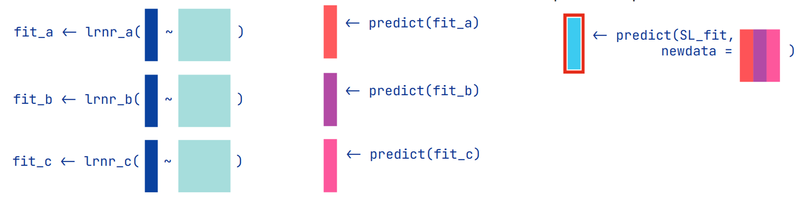

$\newcommand{\ci}{\perp\!\!\!\perp}$
```{r xaringanthemer, include=FALSE, warning=FALSE, echo = FALSE}
library(xaringanthemer)
style_mono_accent(
  link_color = "#ea8a1a",
  base_color = "#110566",
 # header_font_google = google_font("Josefin Sans"),
 # text_font_google   = google_font("Montserrat", "300", "300i"),
 # code_font_google   = google_font("Fira Mono")
)
xaringanExtra::use_tile_view()
xaringanExtra::use_search(show_icon = TRUE)
xaringanExtra::use_panelset()
library(tidyverse)
library(DiagrammeR)
```


## Introduction

- So far, we have learned parametric causal estimation methods. 
  + Generally, good performance (i.e. consistency) of these methods requires getting a parametric model correct.

- Getting parametric models correct is hard. 

- Sometimes there are more covariates than we know what to do with, or maybe even more covariates than data points. 

---
## Introduction

- It would be great if we could use non-parametric or semi-parametric methods to estimate outcome or propensity score models. 
  + These methods are sometimes called **machine learning**.

- The issue with plugging ML methods into our existing G-formula methods is that we won't necessarily get out consistent, asymptotically normal estimates of the causal effects.

- ML methods generally converge "too slowly". 
  + Classical parametric estimators generally have $\sqrt{n}$-convergence (we will define this later). 
  + ML methods often have slower than $\sqrt{n}$-convergence. 
  

---
## Introduction

- In this lecture, we will learn one more double robust estimator for the ATE, targeted minimum loss estimation. 

- We will also learn how the convergence rates of the estimators of the outcome and propensity score model influence the convergence rates of estimators of the ATE. 

- We will see how targeting can be used build estimators that have good convergence rates, even when we use machine learning estimates of the outcome model and propensity score. 

- We will end with some discussion of the super learner and other machine learning methods. 

---

## Lecture Outline

1. Brief introduction of machine learning estimation methods. 
1. Convergence rates
1. Targeted Minimum Loss Estimation (TMLE)
1. Super-Learning (a kind of machine learning)


---
# 1. ML Introduction

---
## Statistical Models Approximate Distributions

- Statistical models are approximations of joint or conditional probability distributions of observed data. 

--

- For example, if we have observations $(x_1, y_1), \dots, (x_n, y_n)$ and we fit a simple linear regression of $Y$ on $X$, we are using the model
$$y_i = \beta_0  + \beta_1 x_i + \epsilon_i\\\ \epsilon_i \sim N(0, \sigma_y^2)$$
  + We are approximating the conditional distribution of $Y \vert X$ as normal with mean $\beta_0 + \beta_1X$ and variance $\sigma_y^2$. 
 
--

- The linear model is a *class of distributions* parametrized by a finite set of parameters (three in our case).

- The OLS procedure identifies the single distribution within the model that best approximates the distribution of the observed data. 

$\newcommand{\ci}{\perp\!\!\!\perp}$
$\newcommand{\nci}{\not\!\perp\!\!\!\perp}$

---
## Machine Learning Methods Search Large Model Spaces

- In classical parametric methods, models can be parameterized by a small number of parameters.
  + When we think about the asymptotic behavior of classical methods, we assume that the number of parameters stays fixed as the sample size grows.

- ML methods usually search larger, more flexible model spaces. 

- Often the number of parameters used to describe a model is allowed to grow as the number of observations increases. 


---
## Machine Learning Methods Search Large Model Spaces


- ML methods typically privilege some type of smoothness. 

- A common way to achieve this is to over-parameterize a model and then penalize some or all of the parameters.

- The penalty, controlling the effective number of parameters and degree of smoothness, can be learned from the data via cross-validation. 

- As the number of observations grows, the model can become more complex "automatically".


---
## Example: Splines

- As an alternative to the linear model, we can add a fixed number parameters to the regression, for example fitting piece-wise functions. 

<center> 
```{r, echo=FALSE, out.width="85%"}
knitr::include_graphics("img/11_spline1.png")
```
</center>

- With fixed knots, these models are only a little more flexible than the linear regression. 

---
## Example: Smoothing Splines

- An alternative is to approximate the conditional mean of $Y$ given $X$ as a smooth function of $X$. 

$$y_i = h(x_i) + \epsilon_i \qquad h \in \mathcal{H}\\\ \epsilon_i \sim N(0, \sigma_y^2)$$ where $\mathcal{H}$ is a class of smooth functions. 

--

- Smoothness can be defined by a constraint, for example on the second derivative
$$\int (h^{\prime \prime}(x))^2 dx < C$$
  
  
- This class of models does not have a finite parametrization
  - However, it is possible to approximate functions in $\mathcal{H}$ using a finite number of terms. 
  
---
## Example: Smoothing Splines

- We can define a spline basis, an infinite set of functions $g_1(x), g_2(x), \dots$ that allows us to approximate any smooth function well. 
  + Given any smooth $h$ and error tolerance $\varepsilon$, we can find a finite $K$ and a set of coefficients $\beta_1, \dots, \beta_{K}$ such that 

$$\vert h(x) - \sum_{k = 1}^K\beta_k g_k(x) \vert < \varepsilon \ \ \forall x$$

--

- Using our spline basis, we replace the previous model with
$$y_i = \sum_{k = 1}^{K(n)}\beta_k g_k(x_i) + \epsilon$$  
  + Often $K(n) = n$
  + We then estimate the coefficients $\beta_1, \dots, \beta_K$ via *penalized likelihood*. 
  + The penalty controls the degree of smoothness or the *effective number of parameters*. 
  

---
## Example: Smoothing Splines

<center> 
```{r, echo=FALSE, out.width="80%"}
knitr::include_graphics("img/11_spline2.png")
```
</center>

---
## Bias-Variance Trade-Off

- With no penalization, we could perfectly interpolate the data.

- With an infinite penalty, the problem reduces to simple linear regession. 

- Too little smoothing:
  + The estimate will have a high variance because very little data contributes to the estimate at each point.
  
  
- Too much smoothing: 
  + The estimate has low variance but high bias. 
  
- In practice, we try to learn the amount of smoothing that best fits the data via cross-validation. 

---
## Bias-Variance Trade-Off

<center> 
```{r, echo=FALSE, out.width="58%"}
knitr::include_graphics("img/11_splines.png")
```
</center>

---
## Example: Smoothing Splines

- Smoothing splines allow us to expand the class of models we can use to approximate the conditional mean $E[Y \vert X]$ compared to simple linear regression.

- The model increases in complexity with sample size, since $K$ increases with $n$. 


 
  
---
## ML Methods are Good at Approximating Data

- There are numerous ML methods that allow us to approximate distributions with higher complexity than classical regressions. 

- These include 
  + variable selection methods like LASSO or stepwise selection. 
  + random forests
  + neural networks
  + empirical Bayes methods (learn the prior from the data)
  
- These are often described as prediction methods but we can also think of them as methods for approximating distributions of data.


---
# 2. Convergence Rate Preliminaries


---
## Some Formal Definitions

- Let $P_0$ be a probability distribution from which we can observe data.  

- A model $\mathcal{M}$ is a set of models $\lbrace P_\theta \vert \theta \in \mathbb{R}^d \rbrace$. 

- A model is correctly specified if $P_0 \in \mathcal{M}$. A model is misspecified if $P_0 \not\in \mathcal{M}$. 

- We can define a *statistical target parameter* $\Psi$ which is a mapping from $\mathcal{M}$ to $\mathbb{R}$
  + For example, $\Psi$ might be the mean. 
  + $\Psi$ need not be one of the elements of $\theta$
  
- The target estimand (the thing we want to estimate) is $\Psi(P_0)$

---
## Empirical Probability Measures 

- Let $O_1, \dots, O_n$ be iid draws from $P_0$.

- We define the empirical probability measure $P_n$
$$P_n(X) = \frac{1}{n}\sum_{i = 1}^n I(O_i \in X)$$
- This defines a measure over sets $X$ and therefore an empirical CDF. 

- $P_n$ is the "histogram" measure. It contains all of the information about $O_1, \dots, O_n$. 

- $P_n$ is an approximation of the true probability measure $P_0$. 

---
## Estimators

- We would like to find a function of the data ( i.e. a function of $P_n$) that is a good estimate of $\Psi(P_0)$. 

- An estimator is a rule for turning an empirical distribution into an estimate. 

- That is, an estimator is a function $\hat{\Psi}: \mathcal{M}_{NP} \to \mathbb{R}$ where $\mathcal{M}_{NP}$ is a non-parametric class of possible empirical distributions. 

- The *estimate* is $\hat{\Psi}(P_n)$. 

- $\hat{\Psi}(P_n)$ is a random variable because it is a function of the random empirical distribution. 
  + Sometimes we might write $\hat{\Psi}_n$ to mean $\hat{\Psi}(P_n)$. 

---
## Convergence Rates

- Suppose that $X_1, X_2, \dots$ is an infinite series. **Big Oh** and **little oh** notation are two ways to describe what happens to the series as $n \to \infty$. 

- **little oh** notation: $X_n$ is $o_p(1)$ if $X_n \to 0$ as $n \to \infty$. 
  + $X_n$ is $o_p(r_n)$ if $X_n/r_n \to 0$ as $n \to \infty$. 
  + For example, $X_n$ is $o_p\left(n^{-1/2}\right)$ if $\sqrt{n}X_n \to 0$ as $n \to \infty$. 
  
- **Big Oh** notation: $X_n$ is $O_p(1)$ if $X_n$ stays bounded as $n \to \infty$, 
$$P[\vert X_n \vert > M ] < \epsilon$$ for any $\epsilon$ and $n$ large enough. 
  + $X_n$ is $O_p(r_n)$ if $X_n/r_n$ is $O_p(1)$.
  
- An estimator $\hat{\Psi}_n$ has a rate of convergence $r_n \to \infty$ if $r_n(\hat{\Psi}_n - \Psi)$ is $O_p(1)$ (i.e. $\hat{\Psi}_n - \Psi$ is $O_p(1/r_n)$).

---
## Convergence Rates

<center> 
```{r, echo=FALSE, out.width="55%"}
knitr::include_graphics("img/14_ek_convergence_rates.png")
```
</center>

Figure from [Edward Kennedy](https://www.ehkennedy.com/uploads/5/8/4/5/58450265/tutorial.pdf)

---
## Convergence Rates

- $1/\sqrt{n}$ is generally the fastest possible rate for an estimator. 

- Estimates from a correctly specified parametric model usually converge at rate $1/\sqrt{n}$. 

- Machine learning estimators generally have slower convergence rates due to the *curse of dimensionality*. 

- ML estimators add parameters as the sample size grows, thereby "using up" some of the information. 

- In many cases, the convergence rate of a ML estimator depends on the smoothness of the true distributions we are estimating. If the distributions are smooth and the estimator takes advantage of that, convergence is faster. 


---
## Asymptotic Linearity

- An estimator $\hat{\Psi}(P_n)$ is asymptotically linear if

$$\hat{\Psi}(P_n)- \Psi(P_0) = \frac{1}{n}\sum_{i = 1}^n IC(O_i; \nu) + o_p(n^{-1/2})$$


- $\hat{\Psi}(P_n)-\Psi(P_0)$ looks like an empirical average plus a remainder that goes to zero, even if blown up by $\sqrt{n}$. 

- The function $IC$ is the influence function, or influence curve. 


---
## Asymptotic Linearity and the CLT

- If $\hat{\Psi}(P_n)$ is asymptotically linear then a consequence of the central limit theorem is that

$$\sqrt{n}(\hat{\Psi}(P_n) - \Psi(P_0)) \overset{d}{\to} N(\mu_{IC}, \sigma^2_{IC})$$ where $\mu_{IC} = E[IC(O_i; \nu)]$ and $\sigma^2_{IC} = Var(IC(O_i; \nu)$. 

- If $\mu_{IC} = 0$, the estimator is unbiased. 

- Asymptotic linearity implies consistent, asymptotically normal estimators. 
  + These are nice estimators that we can create Wald-type confidence intervals for. 
  
  $$\hat{\Psi} \pm Z_{1-\frac{\alpha}{2}}\hat{\sigma}_{IC}/\sqrt{n}$$

---
## Efficient Influence Functions

- The influence function is the most important (asymptotic) thing to know about an asymptotically linear estimator. 
  + It tells us the asymptotic mean and variance of the estimator. 
  
- Recall that an estimator is *efficient* if it has equal or lower asymptotic variance than every other estimator in its class. 

- Two asymptotically linear estimators are **asymptotically equivalent** if they have the same influence function.
  
---
## Efficient Influence Functions

- The influence function of an efficient estimator is called the *efficient influence function* (EIF). 
  + An important result is that the EIF is unique, every efficient estimator in the class will have the same EIF.

- The EIF can be derived, making it possible to reverse engineer efficient estimators. 

- Note that the EIF is model specific. An estimator that is efficient within one model may not be efficient in a larger model. 
  + The maximum likelihood linear regression estimate is the efficient estimator in the simple linear model that we saw earlier. 
  + In the larger class of models with $E[Y \vert X]$ a smooth function of $X$, we can do much better. 
  

---
# 3. Machine Learning in Causal Estimation

---
## Causal Effects


- Causal effects are functions of counterfactual parameters, e.g. $E[Y(1)]$.

- The quantity $E[Y(1)]$ is a parameter of the counterfactual distribution of $Y$ under the action setting $A$ to 1. 

- Neither ML methods nor classical statistical methods can learn counterfactual distributions. They can only learn distributions of observed data. 

- We need to express our counterfactual quantity $E[Y(1)]$ in terms of the probability distribution of data we can actually observe.


---
## Back to the G-Formula

- To link the probability distribution of the observed data and the counterfactual parameters we are interested in we need a DAG and the g-formula


$$
\begin{split}
E[Y(a)] =& \int E[Y \vert A = a, L = l]dF_l(l)\\
 =& E\left[ E[Y \vert A = a, L] \right]
\end{split}
$$

- The DAG is necessary to identify a sufficient set of confounding variables.
  + The data cannot tell us what the correct DAG is. 
  + In some cases it can help. 
  
  
- For this reason, there cannot be any purely automated causal inference. 
  + Job security for statisticians. 

---
## g-Formula Methods

- We saw two ways to use the g-formula. 

- Option 1: Estimate $E[Y \vert A = a, L = l]$
  - G-computation/Outcome modeling/plug-in g-formula. 
  - Let $b(a, l) = E[Y \vert A=a, L=l]$
  
- Option 2: Estimate $P[A = a \vert L = l]$
  - Inverse probability weighting or treatment modeling
  - Let $\pi(a, l) = P[A = a \vert L = l]$
  
- Combo: Double robust methods combine both options. 
  - We saw that the expected bias of some DR methods is less than the bias of either of the other two options, even if both models are wrong. 
  
  
---
## Machine Learning in g-Formula Methods

- We can use ML methods to estimate $\pi$ or $b$, **however**, we need to be careful!

--

- Neither G-computation or IP weighting will yield a consistent, asymptotically normal estimate when ML methods are used. 

- Both G-computation and IP weighting will converge at the rate of the estimator of $b$ or $\pi$. 

- If we use an ML estimator that converges more slowly than $1/\sqrt{n}$, the estimate of $E[Y(1)]$ will also converge slowly.

- The estimate might be consistent but Wald type confidence intervals will be too narrow, leading to poor coverage.


---
## Double Robust Estimation

- Suppose that $b(a, l)$ and $\pi(a, l)$ are the true conditional mean of $Y$ and propensity functions respectively.

- The efficient influence function for 

$$\Psi_a(P_0) \equiv E[Y(a)] =  E\left[ E[Y \vert A = a, L] \right]$$
is

$$EIF(O_i) = \frac{1_{A_i = a}}{\pi(a, L_i )}\left(Y_i - b(a, L_i) \right) + b(a, L_i) -  \Psi_a(P_0)$$
---
## Double Robust Estimation

- This means that if $\hat{\Psi}(P_n)$ is an asmyptotically linear, efficient estimator of $E[Y(a)]$, then 

$$
\begin{split}
\hat{\Psi}(P_n) - \Psi(P_0) =& \frac{1}{n}\sum_{i = 1}^n EIF(O_i) + o_p(n^{-1/2})\\
\hat{\Psi}(P_n)  =& \frac{1}{n}\sum_{i = 1}^n EIF(O_i) + o_p(n^{-1/2})\\
 \hat{\Psi}(P_n) = & \sum_{i = 1}^n \frac{1_{A_i = a}}{\pi(a, L_i )}\left(Y_i - b(a, L_i) \right) + b(a, L_i) + o_p(n^{-1/2})
\end{split}
$$

- All of the asymptotically equivalent DR estimators we have seen (e.g. AIPW, Bang and Robins) differ in what is in the remainder term but have the same influence curve. 

---
## Double Robust Estimation

- If we want an estimator that has the efficient influence function, one possibility is the plug in estimator.

- Plugging in $\hat{b}$ and $\hat{\pi}$ into the formula for the previous slide we get:

$$\hat{\Psi}^*(P_n) = \frac{1}{n}\sum_{i = 1}^n \frac{1_{A_i = a}}{\hat{\pi}(a, L_i )}\left(Y_i - \hat{b}(a, L_i) \right) + \hat{b}(a, L_i)$$

- This is the AIPW estimator (Robins, Rotnitzky, and Zhao) that we saw previously. 

- For this estimator, the remainder term $$R_n = \hat{\Psi}(P_n) - \Psi(P_0) - \frac{1}{n}\sum_{i = 1}^n EIF(O_i)$$ is proportional to $(b(a, L_i)-\hat{b}(a, L_i))(\pi(a, L_i) - \hat{\pi}(a, L_i))$, the product of the error in $\hat{b}$ and the error in $\hat{\pi}$.


---
## Substitution Estimators

- A substitution estimator is an estimator that has the form $\hat{\Psi}(P_n) = \Psi(Q_n)$ where $Q_n$ is an estimator of (the relevant part of) $P_0$.
  - G-computation is a substitution estimator. We estimate $E[Y \vert A = a, L]$, the relevant aspect of $P_0$ and then compute the expected value with respect to the empirical distribution of $L$. 

- Substitution estimators respect the statistical model space and the global constraints on the data.
  + E.g. a substitution estimator for the risk difference will always be between 0 and 1. 
  
- The AIPW estimator is not a substitution estimator, and may perform poorly in finite samples when there are large weights.
  + IPW is also not a substitution estimator. 


---
## Targeted Minimum Loss Estimation (TMLE)

- TMLE is an alternative double robust estimation strategy, similar to other DR estimators we have seen so far. 
  
- However, TMLE is a substitution estimator, giving it good finite sample performance. 
  

---
## TMLE Initialization

The following steps produce the TMLE for a binary outcome and binary exposure. 

Step 1: Generate an initial estimate $\hat{b}_0(a, L)$ of $E[Y \vert A = a, L]$. 

Step 2: Estimate the propensity score, $\hat{\pi}(a, L) = \hat{P}[A = a \vert L]$. 
 

---
## TMLE One-Step Update


Step 3: Update the model of $E[Y \vert A, L]$. To do this we employ the "special covariate" strategy. Define
$$H(A, L) = \frac{A}{\hat{\pi}(1, L)} - \frac{1-A}{\hat{\pi}(0, L)}$$
Fit the model 

$$logit(E[Y \vert A, L]) = logit(\hat{b}_0(A, L)) + \epsilon_a H(A,L)$$ using only the units with $A = a$. 
Note that the coefficient on the first term is fixed at 1. 

We get out an estimate, $\hat{\epsilon}_a$, called the fluctuation parameter. 


---
## TMLE One-Step Update

Having estimated $\epsilon_a$, we now have a new outcome estimate,

$$\hat{b}(A, L) = expit\left( logit(\hat{b}_0(A, L)) + \hat{\epsilon}_aH(A, L)\right)$$

--

The lest step is to use standardization to estimate $E[Y(a)]$

$$\hat{E}[Y(a)] = \frac{1}{n}\sum_{i=1}^n \hat{b}(a, L_i)$$

---
## TMLE Intuition

- The one step update uses the propensity score to fix potential inaccuracy in the initial estimator $\hat{b}_0$. 

- Consider a linear version of the one step update

$$E[Y \vert A, L] = \hat{b}_0(A, L) + \epsilon_a H(A,L)$$

- If $\hat{b}_0$ is a great estimator of $Y$, then $\epsilon$ will be very small. If $\hat{b}_0$ is terrible, $\epsilon_a$ will be larger.
  + This intuition also holds for the logistic form.

- The linear form looks a lot like the Bang and Robins estimator. The only difference is that in Bang and Robins, we fit $\epsilon_a$ and $\hat{b}_0$ simultaneously.

---
## Why The Logistic Scale

- The logistic version of the one step update guarantees an estimate of $E[Y(a)]$ that is between 0 and 1. 

- For a continuous outcome, we can use the same trick to guarantee an estimate within the range of the data. 


- With a continuous outcome we can use exactly the same procedure *except*, before we begin, we transform $Y$ into the range $[0, 1]$. 

- At the end we need to undo our transformation. 

- Forcing our estimator to be in the range of the data improves the estimate when PS estimates are small or the outcome regression is poor. 


---
## Confidence Intervals

- We can obtain the variance of the treatment effect estimated by TMLE by directly computing the influence function. 


- We can estimate the variance of the ATE estimate as $$\frac{V(\hat{IC})}{n}$$ where $V(\hat{IC})$ is the sample variance of the estimated influence function for each unit. 


- Let $\hat{\psi}$ be the TMLE estimate of the ATE. The influence function for each unit is

$$\hat{IC}(O_i) = (Y_i - \hat{b}(A_i, L_i))H(A_i, L_i) + (\hat{b}(1, L_i)- \hat{b}(0, L_i))- \hat{\psi}$$


---
## TMLE vs AIPW


- Both TMLE and AIPW have the same influence function, they are asymptotically equivalent.

- TMLE is guaranteed to yield an estimate of $E[Y(a)]$ that is within the range of the original outcome data, while AIPW is not. 
  
- TMLE is also more stable than AIPW when $\hat{\pi}(a, L_i)$ are very small for some units. 

- TMLE generally has better finite sample properties than AIPW, especially when PS weights are large.


---
## Double Roubst Estimation Properties

- TMLE and AIPW have similar asymptotic properties.

- For both AIPW and TMLE, $R_n$, the remainder term is proportional to $(b(a, L_i)-\hat{b}(a, L_i))(\pi(a, L_i) - \hat{\pi}(a, L_i))$.
 
- Both estimators are consistent if either the outcome or the propensity score estimator is consistent. 

- Both estimators are asymptotically linear if
  + Either the outcome or propensity estimator is $\sqrt{n}$-consistent (estimated from a correct parametric model). 
  + Both estimators are $n^{-1/4}$-consistent (happens for some but not all ML estimators).
  
---
## Multi-Step TMLE

- Benkeser et al. (2017) and van der Laan (2014) propose an extension of TMLE that is $\sqrt{n}$-consistent if either the outcome model estimator or the PS estimator are consistent, DR-TMLE. 
  + The idea is to use an iterative procedure to target the $\hat{\pi}$ and $\hat{b}$ estimators as well. 

- DR-TMLE is asymptotically linear when 
  + One of the models is inconsistent. 
  + The other model is estimated with a ML estimator (convergence slower than $\sqrt{n}$).

- Under this circumstance, "regular" TMLE is consistent but not $\sqrt{n}$-consistent.

---
## Multi-Step TMLE

- Simulations from Benkeser et al. (2017). 
  - Only the outcome regression is estimated consistently. 
  - $\hat{b}$ has slower than $1/\sqrt{n}$ convergence.
  
- Squares show performance of regular TMLE and AIPW ("One-Step").

- Circles and triangles show performance with iterative correction.

<center> 
```{r, echo=FALSE, out.width="45%"}
knitr::include_graphics("img/14_benkesser1.png")
```
```{r, echo=FALSE, out.width="45%"}
knitr::include_graphics("img/14_benkesser2.png")
```
</center>  


---
## TMLE Extensions

Extensions of TMLE have been developed for

- [Time-varying exposures](https://philipclare.github.io/tmletutorial/), 

- [Identifying optimal treatment regimes](https://github.com/tlverse/tmle3mopttx)

- [Survival data](https://www.ncbi.nlm.nih.gov/pmc/articles/PMC4912008/)

- [Mediation analysis](https://tlverse.org/tmle3mediate/)

---
## TMLE for NHEFS Data

- As before, our first steps are to fit a propensity and outcome model.
  + Here we first transform the outcome to have range $[0, 1]$.

```{r, echo = FALSE, message = FALSE, warning=FALSE}
library(tidyverse)
library(knitr)
library(kableExtra)
dat.u <- read_csv("../../data/nhefs.csv") 
dat <- dat.u %>%
       filter(!is.na(wt82))
```

```{r}
## transform outcome to range [0, 1]
r <- range(dat$wt82_71)
dat$wt82_71_transformed <- (dat$wt82_71 - r[1])/(r[2]-r[1])
##

fit_ps <- glm(qsmk ~ sex + race + age + I(age ^ 2) +
    as.factor(education) + smokeintensity +
    I(smokeintensity ^ 2) + smokeyrs + I(smokeyrs ^ 2) +
    as.factor(exercise) + as.factor(active) + wt71 + I(wt71 ^ 2),
    family = binomial(), data = dat)


fit_or <-glm( wt82_71_transformed ~ qsmk + sex + race + age + 
                  I(age^2) + as.factor(education) + 
                  smokeintensity + I(smokeintensity^2) + smokeyrs + I(smokeyrs^2) + 
                  as.factor(exercise) + as.factor(active) + wt71 + I(wt71 * wt71) +
                  qsmk * smokeintensity, 
                  data = dat)
```

---
## TMLE for NHEFS Data

- Next we fit the fluctuation parameter

```{r}
logit <- function(x){log(x)- log(1-x)}
dat$logitbhat0 <- logit(predict(fit_or))
dat$pihat <- predict(fit_ps, type = "response")
dat <- mutate(dat, H = as.numeric(qsmk ==1)/pihat,
                        -as.numeric(qsmk==0)/(1-pihat))
fit_fluctuation <- glm(wt82_71_transformed ~ H -1, 
                       offset = logitbhat0, 
                       data = dat, family = "binomial")
summary(fit_fluctuation)$coefficients

```

---
## TMLE for NHEFS Data

- Finally we compute the standardized means.

```{r}
dat0 <- dat1 <- dat
dat0$qsmk <- 0
dat1$qsmk <- 1
### Important! Make sure bhat and H are correct
dat0$logitbhat0 <- logit(predict(fit_or, newdata = dat0))
dat1$logitbhat0 <- logit(predict(fit_or, newdata = dat1))
dat0$H <- -1/(1-dat0$pihat)
dat1$H <-  1/dat1$pihat
EY0 <- predict(fit_fluctuation, newdata = dat0, type ="response") %>% mean()
EY1 <- predict(fit_fluctuation, newdata = dat1, type ="response") %>% mean()

## Transform back to original scale
EY0 <- EY0*(r[2]-r[1]) + r[1]
EY1 <- EY1*(r[2]-r[1]) + r[1]
cat(round(EY0, digits =2), " ", round(EY1, digits = 2), "ATE: ", round(EY1-EY0, digits = 2))
```


---
# 1. Super Learning

---
## One Learner to Rule them All

- We need to decide what estimators to use to get $\hat{b}_0$ and $\hat{\pi}$ in the TMLE algorithm. 

- It may be hard to know which of many possible options will give the best results. 

- In super learning, we combine many candidate learners. The result is at least as good as the **best** candidate.
  

<center> 
```{r, echo=FALSE, out.width="35%"}
knitr::include_graphics("img/11_ring.png")
```
</center>

---
## Cross-Validation

- Cross validation is a general procedure for selecting among estimation procedures. 
- Suppose we have $K$ estimators of a parameter
$$\Psi_1, \dots, \Psi_{K(n)}$$
- We use $K(n)$ to indicate that the number of candidate estimators could depend on sample size. 

---
## Loss

- To talk about cross-validation we need a loss function $L: (O, \phi) \to \mathbb{R}$. 
  + The loss-function measures how well a parameter $\phi$ fits the observed data $O$. 
  + For example, this could be the negative log-likelihood of $O$ given $\phi$ or the mean-squared error. 
  
- The true parameter value is the value that minimizes the loss in the true data distribution 

$$\psi_0 = \underset{\psi}{\text{argmin}} \int L(o, \psi) dP_0(o)$$
- The risk difference for $\psi$ is the expected difference in loss between $\psi$ and the true parameter $\psi_0$

$$d_0(\psi, \psi_0) = E_{P_0}\left[L(O, \psi)-L(O, \psi_0) \right]$$
---
## Cross-Validation

- In cross-validation, we break our data into $V$ random, equally sized groups ("folds"). 
- For $k$ in $1, \dots, V$: 
  + Hold out fold $i$ to be the validation set. The remaining data are the training set. 
  + Let $P_{n,-i}$ be the empirical distribution of the training data. 
  + Fit each estimator on the training data to obtain 
  $\hat{\Psi}_k(P_{n, -1})$.
  + Compute the loss of each estimate in the the held out fold $L(O_{[i]}, \hat{\Psi}_k(P_{n, -1}))$.

<center> 
```{r, echo=FALSE, out.width="85%"}
knitr::include_graphics("img/11_cv1.png")
```
</center>

---
## Cross-Validation

- For each estimator, compute the *cross-validation loss* as the average loss across folds
$$L_{CV}(\Psi_k) = \frac{1}{V}\sum_{i = 1}^V L(O_{[i]}, \hat{\Psi}_k(P_{n, -i}))$$
- Choose the estimator that minimizes the cross-validation loss loss.

$$\tilde{K}(n) = \underset{k \in 1, \dots, K(n)}{\text{argmin}} L_{CV}(\Psi_k)$$

- Re-fit the selected estimator, $\Psi_{\tilde{K}(n)}$ on the full data. 

---
## Cross-Validation Loss Estimates Out of Sample Loss

- The cross-validation loss of $\Psi_k$ is a good estimate of the expected loss of each estimator in new data. 
$$E_{P_0}[L(O, \hat{\Psi}_k)]$$

- It is almost unbiased, bias comes from the fact that the training data are a little smaller than the data we fit the final estimator on. 

-  If the estimator gets much better when we fit it to the full data, the cross-validation error will over-estimate the expected loss. 
  + i.e. If we have caught the estimator in a steep portion of its "learning rate". 

- The larger the number of folds we use, the larger this bias is. More folds also leads to higher variance. 

- Bias goes away asymptotically if $K(n)$ does not grow too fast. 

---
## Cross-Validation Error vs Out of Sample Error

<center> 
```{r, echo=FALSE, out.width="85%"}
knitr::include_graphics("img/11_cv2.png")
```
</center>

---
## Cross-Validation Optimality Result 

- There are results that relate the expected error of our cross-validation estimator, $\Psi_{\tilde{K}(n)}$ to the expected error of the best estimator in our starting collection. 

- The expected loss of the cross-validation selected estimator is only slightly worse than the expected loss of the best estimator in the bunch. 

  + The difference is on the order of $\frac{log(K(n))}{np}$ where $p$ is the proportion of the data used in the validation set. 
  + This result is not for n-fold cross validation, $p$ must be bounded away from 0 and 1. 
  

---
## Consequences of CV Results

- We often see CV used to select parameters in machine learning methods (e.g penalty parameter in LASSO).

- The optimality result justifies why we are doing this. Asymptotically, the best CV estimator will do almost as well as we would have done if we knew the best parameter to begin with. 

- We could also use cross-validation to choose among many estimators of different types. 

- For example we might consider a parametric regression model, LASSO, ridge regression, and a regression tree approach.
  + The best choice of these depends on $P_0$. 

- Choosing among them using cross-validation allows us to get close to optimal results without knowing the best choice ahead of time. 


---
## Super Learner 

- It turns out, we can do even better than simply selecting one of several candidate machine learning methods. 

- We can use weights to achieve a learner that is better than any of the candidate learners. 

---
## Super Learner 

- The super learner starts out like typical V-fold cross-validation. 

- Data are divided into folds. We proceed as usual to obtain predictions from all of the candidate learners on each block. 

- Pictures from [Katherine Hoffman's illustrated guide](https://www.khstats.com/art/illustrations_viz.html#superlearning).

<center> 
```{r, echo=FALSE, out.width="95%"}
knitr::include_graphics("img/11_slsteps234.png")
```
</center>

---
## Super Learner Idea

- The next step is different. 

- Rather than computing the loss based on the predictions, we use the predictions themselves to predict $Y$. 

- For example, if our target parameter is $E[Y \vert X]$ and $Z_1, \dots, Z_K$ are base learner predictions, we now fit a new model for $E[Y \vert Z_1, \dots, Z_K]$ (e.g. using linear regression).

- van der Laan et al (2007) call this the minimum cross-validated risk predictor $\tilde{\Psi}.$ K. Hoffman calls this the "meta learner". 

<center> 
```{r, echo=FALSE, out.width="65%"}
knitr::include_graphics("img/11_slstep5b.png")
```
</center>

---
## Super Learner Idea

- The meta-learner, $\tilde{\Psi}$ is a mapping from the predicted values of the base-learners to a new estimate, $\tilde{\psi},$ of the target parameter. 

- We now refit each base-learner on the whole data and then use $\tilde{\Psi}$ to get the final best estimate of $\psi$. 

- If the meta-learner is linear regression, we are taking a weighted average of the predictions from all of the base-learners. 
  + But the meta-learner could be any learning algorithm. 
  + It could even be another super-learner...

<center> 
```{r, echo=FALSE, out.width="95%"}

```
</center>

---
## Super Learner

<center> 
```{r, echo=FALSE, out.width="95%"}
knitr::include_graphics("img/11_slfig1.png")
```
</center>

---
## Super Learner Asymptotics

- Asymptotically, the super learner will perform as well as the best estimator in the class defined by the meta-learner (as long as the number of folds does not grow too quickly with $n$). 

- It follows that the super learner is at least as good as any of the base learners. 
  + Sometimes much better. 
  
---
## Super Learner in Action

- We should not try to interpret the parameters of the meta-learner.

- The predictions from the base-learners could be highly colinear so the coefficients don't give a good measure of the comparative quality of each learner. 

<center> 
```{r, echo=FALSE, out.width="75%"}
knitr::include_graphics("img/11_sltab3.png")
```
</center>

---
## Super Learner in Action

<center> 
```{r, echo=FALSE, out.width="95%"}
knitr::include_graphics("img/11_sltab4.png")
```
</center>

---
## Super Learner in R

- There are a few implementations of Super Learner in R. We will look at `SuperLearner`

```{r, warning = FALSE, message = FALSE}
library(SuperLearner)
listWrappers()
```

---
## Super Learner in R

- We will use `SuperLearner` to search for the best predictor of `wt82_71` in the NHEFS data.

- For the sake of comparison, as one of our models, we will use exactly the linear regression we used in our parametric analysis. 

- We will also use random forest (`SL.ranger`), XGboost (`SL.xgboost`), LASSO (`SL.glmnet`), and the simple mean (`SL.mean`).

- Including the mean gives a nice reference point.

---
## Super Learner in R


```{r, cache = TRUE, message = FALSE}
myX <- data.frame(model.matrix(fit_or))
sl_result <- SuperLearner(Y = dat$wt82_71, 
                          X = myX, 
                          SL.library = c("SL.mean", "SL.glm", 
                                         "SL.glmnet", "SL.xgboost", 
                                         "SL.ranger"))
```

---
## Super Learner in R

- Our original linear model and LASSO have the lowest cross-validated risk. XGBoost is doing poorly on this data.

- Super Learner splits most of its weight between the linear model and LASSO.


```{r}
sl_result
```


---
## Super Learner in R

- The `SuperLearner` function also gives us predictions from each model and from the Super Learner weighted model.

```{r}
head(sl_result$library.predict)
head(sl_result$SL.predict)
```

---
## Super Learner in R

- If we want an estimate of how well Super Learner is doing, we need an external layer of cross-validation.
  + Split data into folds. In each fold, fit SuperLearner, predict in the held out fold.
  
```{r, cache = TRUE}
cv.sl_result <- CV.SuperLearner(Y = dat$wt82_71, 
                          X = myX, 
                          V = 5, # five-folds
                          SL.library = c("SL.mean", "SL.glm", 
                                         "SL.glmnet", "SL.xgboost", 
                                         "SL.ranger"))
```

---
## Super Learner in R

- In this case, the original linear regression and Super Learner have very similar performance.

- Discrete SL is the learner that just picks the single learner with best CV-error.

```{r}
summary(cv.sl_result)$Table
```


---
##  TMLE with Super Learner

- The super learner is an ML method -- it could be used for any sort of prediction task. 

- The TMLE is a causal inference method.

  + We don't have to use ML methods to estimate $\hat{b}$ and $\hat{\pi}$ in TMLE. 

- TMLE has the nice property that if we do use an ML method *and* one of $\hat{\pi}$ or $\hat{b}$ are consistent, then the estimator is consistent and (sometimes) asymptotically normal. 
  + Not true for IPW or outcome regression + standardization. 
  + We do really need to get at least one model right. 
  + Using the super learner for at least one gives us the best shot at achieving this. 

- So super learner and TMLE are complimentary approaches. 

---
## TMLE with Super Learner

<center> 
```{r, echo=FALSE, out.width="85%"}
knitr::include_graphics("img/11_tmle.png")
```
</center>


---
## TMLE with SuperLearner in R

- There are several R packages which implement TMLE and the super learner. 
  - tmle, tmle3, drtmle
  - SuperLearner, sl3
  
Tutorials:

[Targeted Learning in R Handbook (tlverse)](https://tlverse.org/tlverse-handbook/index.html)


[Illustrated Guide to TMLE by Katherine Hoffman](https://www.khstats.com/blog/tmle/tutorial/)

[Estimation Tutorial by Miguel Angel Luque Fernandez](https://migariane.github.io/TMLE.nb.html#1_introduction)

---
## TMLE with SuperLearner in R

- I will use the `drtmle` package because it computes multiple estimators:
  + Regular TMLE, as we saw before
  + DR-TMLE: TMLE with iterative updates, provides double robustness with ML estimators.
  + AIPW
  + AIPW with iterative updates
  + G-computation

---
## TMLE with Parametric Models

- First, we will use `drtmle` to fit TMLE with the same parametric models we were using previously.

```{r, message = FALSE}
library(drtmle)
## note use A for the exposure in the outcome formula
outcome_formula <- "A + sex + race + age + 
                  I(age^2) + 
                  as.factor(education) + 
                  smokeintensity + I(smokeintensity^2) + smokeyrs + I(smokeyrs^2) + 
                  as.factor(exercise) + 
                  as.factor(active) + wt71 + I(wt71 * wt71) +
                  A * smokeintensity"
exposure_formula <- "sex + race + age + I(age ^ 2) +
    as.factor(education) +
    smokeintensity +
    I(smokeintensity ^ 2) + smokeyrs + I(smokeyrs ^ 2) +
    as.factor(exercise)  + as.factor(active) + wt71 + I(wt71 ^ 2)"
```

---
## TMLE with Parametric Models

- All estimates are very similar for these data.

```{r}
mydat <- dat[, c("sex", "race", 
                 "age", "education", "smokeintensity", 
                 "smokeyrs", "exercise", "active", "wt71")]
tmle_fit_parametric <- drtmle(Y = dat$wt82_71, 
                              A = dat$qsmk, 
                              W = mydat,
                              glm_Q = outcome_formula,
                              glm_g = exposure_formula, 
                              SL_Qr = "SL.glm", 
                              SL_gr = "SL.glm")

tmle_fit_parametric$tmle
```


---
## TMLE with SuperLearner in R

- Rather than specifying models, we can use Super Learner. 

- We will apply Super Learner to the raw matrix of covariates.

- `SL_Qr` and `SL_gr` specify super learner libraries for secondary update steps.

```{r}
tmle_fit_SL <- drtmle(Y = dat$wt82_71, 
                        A = dat$qsmk, 
                        W = mydat,
                        SL_Q = c("SL.glm", "SL.mean", "SL.glm.interaction"),
                        SL_g = c("SL.glm", "SL.mean", "SL.glm.interaction"), 
                        SL_Qr = "SL.glm", 
                        SL_gr = "SL.glm", 
                        returnModels = TRUE)
```

---
## TMLE with SuperLearner in R

```{r}
tmle_fit_SL$drtmle
```

---
## Limits of Variable Selection

- Our results for TMLE suggest that it is ok to do variable selection (e.g. using LASSO) in our estimates of either the propensity score or the outcome model. 

- All we need is asymptotic consistency, which we do get (under some circumstances) from LASSO as well as AIC based model selection schemes like forward-backward selection. 

- However, we have to be careful about what we put in as candidate variables to select among. 

- Some variables, if put into the model can induce confounding, so that none of our estimators are consistent, even if we use the super learner. 

---
## Poisoned Covariates

- Even with a great bag of candidate learners, we have to put in the right ingredients. 

- These ingredients will be determined by the DAG. 

- There are two ways we can go wrong: 

1. Leaving out confounders. 

2. Putting in variables that induce confounding. 
  + Colliders
  + Children of the outcome (sneaky colliders)
  + Parents of the exposure that are not confounders can magnify bias from unmeasured confounding. 
  
---
## Summary

- ML methods can be very complimentary to causal inference methods. 

- Double robust methods perform better with ML estimators than G-computation or IP weighting and are asymptotically linear under weaker conditions. 

- TMLE is a new DR method introduced in this lecture. 

- TMLE can have better finite sample properties than some other DR estimators we have seen. 

- TMLE and some of its extensions pair very nicely with ML estimators. 


